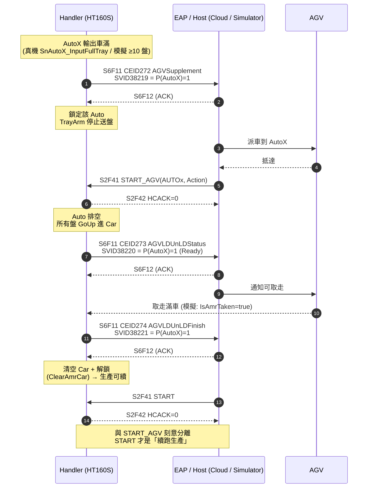
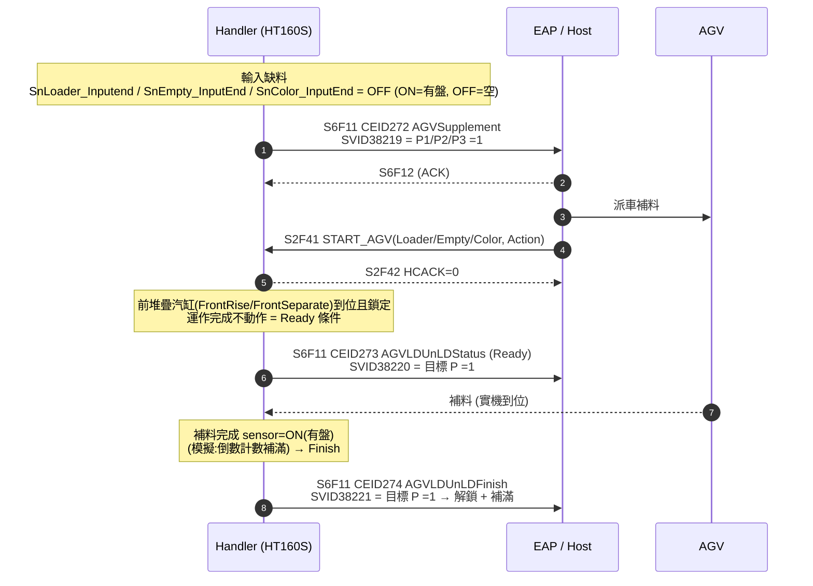

# HT160S E87 / AGV SECS 對接操作手冊

文件狀態：操作手冊（v1）｜日期：2026/06/15｜範圍：HT160S（Equipment）與 host/EAP（SECS 模擬器或客戶雲端）之 E87/AGV 交接對接與驗證
適用版本：`HT160S_Program_BCB_V1.0.0.0`
對應規格：`docs/AGV/HT160S_E87_AGV_Communication_Draft_20260527.md`

---

## 0. 這份手冊能做到什麼

帶你把 **模擬中的 HT160S** 接上一個 SECS host（本地 `HT160S_SECS_Simulator`，或客戶雲端 SECS），
跑完整條 **E87/AGV 滿盤/缺料 → 叫車 → Ready → Finish** 的 SECS 對話並驗證。

> **可閉環範圍（模擬 DUMMY 模式）**：叫車（CEID272）→ `START_AGV` → Ready（CEID273）→ Finish（CEID274）全程自動完成。
> **真機限制**：實機 Finish 需「車輛取走」IO 感測點（尚未配點）；配點前真機握手會停在 Ready。模擬模式不受此限。

---

## 1. 前置條件（缺一不可）

| # | 條件 | 如何確認 / 設定 |
|---|------|------------------|
| 1 | **SECS/GEM 付費功能已啟用**（`CosFunction.bUseSecsGem`，由 build 的 CUSTOMER_CODE 決定）| 主畫面出現 **SECS** badge（未啟用則整個 GEM 堆疊不會啟動）|
| 2 | **AMR/AGV 模式開啟**（`GeneralSetting.bUseAMR`）| 主畫面 **AMR** badge 顯示綠色 **ON**（見 §2）|
| 3 | **機台為 Dummy（模擬）模式** | 主畫面 Real/Dummy 切換設為 **Dummy**（`system\lastset.ini [System] RealDummy`）。模擬下滿盤門檻=10 盤、Finish 自動完成 |
| 4 | **SECS 連線設定正確** | `system\General.ini [SECS]`，見 §2 |
| 5 | **一個 SECS host** | 本地：`D:\AI_Area\Tool\HT160S_SECS_Simulator`；或客戶雲端 SECS endpoint |

---

## 2. 設定（`system\General.ini`）

### 2.1 `[SECS]` — SECS/HSMS 連線

| 鍵 | 預設 | 說明 |
|----|------|------|
| `Enable` | `0` | **1 = 啟用** GEM 堆疊（0 則完全不啟動 SECS）|
| `Address` | `127.0.0.1` | 對端 IP。Active 模式時 = host/雲端 IP |
| `Port` | `5098` | HSMS 埠 |
| `DeviceID` | （依客戶指定）| HSMS Device ID |
| `ActiveMode` | `0` | **0 = passive**（設備監聽，等 host 連入）；**1 = active**（主動撥號到 host/雲端）|
| `ReconnectInterval` | （秒）| 斷線自動重連間隔，0=關 |
| `LinktestInterval` | （秒）| SELECTED 後心跳間隔，0=關 |
| `T6Timeout` | （秒）| 等 Linktest.rsp 逾時 |
| `LogToFile` | `0` | 1 = SECS 訊息寫檔（`D:\HT160S_Log\SECS_GEM\yyyy_mm_dd\`）|
| `LogLinktest` | `0` | 1 = 連心跳訊息都記錄（預設關，避免洗版）|

### 2.2 `[HardwareInstall]` — AMR/AGV 開關

```ini
[HardwareInstall]
UseAMR=1
```

> 也可由維修頁設定後存檔；重開程式後主畫面 AMR badge 應顯示 **ON**。

---

## 3. 連線拓撲（兩種情境）

### 3.1 本地模擬器對測（建議先做）

HT160S 當 **設備（passive，監聽）**，模擬器當 **host（active，連入）**：

```
[General.ini] Enable=1  ActiveMode=0  Address=127.0.0.1  Port=5098
        HT160S (Equipment, passive listen :5098)
                         ▲  HSMS-SS / SECS-II
                         │  (simulator Active connect + Select.req)
        HT160S_SECS_Simulator (Host, Active)  Host=127.0.0.1 Port=5098
```

### 3.2 客戶雲端 SECS

雲端是 host（公開 endpoint），HT160S 改 **active 主動撥號**：

```
[General.ini] Enable=1  ActiveMode=1  Address=<雲端IP>  Port=<雲端Port>  DeviceID=<客戶指定>
        HT160S (Equipment, active dial-out) ───► 客戶雲端 SECS Host (passive server)
```

> 協議與訊息**完全相同**；雲端與本地模擬器差別只在「連線方向（ActiveMode）+ Address/Port」。
> 先用 §3.1 把訊息/握手驗到綠燈，再換 §3.2 的雲端參數即可。

---

## 4. 啟動步驟

### 4.1 啟動 HT160S（設備端）

1. 確認 §1 前置條件、§2 設定。
2. 啟動 `EXE\ht160s.exe`，切到 **Dummy** 模式。
3. 看主畫面 badge：**AMR = ON**、**SECS** 由 `OFF` → `CONNECT` → **`ONLINE`**（= HSMS SELECTED）。
4. 點 **SECS** badge 開啟 SECS/GEM Log 視窗（看 `[TX]/[RX]` 訊息）。

### 4.2 啟動模擬器（host 端，本地情境）

```
cd D:\AI_Area\Tool\HT160S_SECS_Simulator\code
start.bat          (或 python secs_host_simulator.py)
```

1. 填 `Host=127.0.0.1`、`Port=5098`、`Device=<同 160 DeviceID>`。
2. 按 **Connect**（自動送 Select.req 建立 HSMS）。
3. 勾選 **Auto-AGV**：host 會自動扮演 EAP 跑完整條泳道（見 §5）。
   - 不勾則用 `START_AGV` / `START` 按鈕手動逐步驗。

---

## 5. 泳道圖（Swimlane）— AutoBin 滿盤交接（主流程）

> Handler = HT160S（設備）；EAP = host/雲端（模擬器）；AGV = 自動搬運車（模擬模式下由 host 邏輯/機台自動代理）。



### 5.1 泳道（表格版，供不支援 mermaid 的檢視器）

| 步 | Handler (HT160S) | EAP / Host | AGV |
|---:|------------------|------------|-----|
| 1 | AutoX 車滿 → 送 `S6F11 CEID272`（SVID38219 目標 P=1）| 收叫車需求 | |
| 2 | **鎖定 Auto，TrayArm 停止送盤** | 派車 | 抵達 AutoX |
| 3 | 收 `START_AGV(AUTOx)` → 回 `S2F42 HCACK=0` | 送 `S2F41 START_AGV` | |
| 4 | Auto 排空（盤 GoUp）→ 送 `S6F11 CEID273`（SVID38220 Ready）| 收 Ready | 開始取走 |
| 5 | Sensor/模擬確認取走 → 送 `S6F11 CEID274`（SVID38221）→ **清車解鎖** | 收 Finish | 離開 |
| 6 | 收 `START` → 回 `S2F42 HCACK=0`，續跑生產 | 送 `S2F41 START` | |

### 5.2 缺料補料泳道（P1–P3，Loader/Empty/Color）



---

## 6. 訊息 / 代碼對照

### 6.1 事件（Handler → Host，S6F11）

| CEID | 事件 | 載 SVID | 意義 |
|-----:|------|---------|------|
| 272 | AGVSupplement | 38219 | 叫車：缺料(P1–P3) 或 Auto 滿盤(P4–P9)，bitmap 標目標站 |
| 273 | AGVLDUnLDStatus | 38220 | Ready：機構到位 / Auto 已排空，AGV 可動作 |
| 274 | AGVLDUnLDFinish | 38221 | Finish：上/下料完成（模擬自動；真機待 IO 點）|
| 275 | AGVLdID | 38202–38210 | Carrier ID（目前不自動上報；host 可用 S1F3 讀對應 SVID）|

### 6.2 站點 P mapping（`PIndex = AutoNo + 3`）

| P | 站點 | P | 站點 | P | 站點 |
|--:|------|--:|------|--:|------|
| P1 | Loader | P4 | AUTO1 | P7 | AUTO4 |
| P2 | EmptyTray | P5 | AUTO2 | P8 | AUTO5 |
| P3 | ColorTray | P6 | AUTO3 | P9 | AUTO6 |

bitmap payload（ASCII）：`P1:0,P2:0,...,Px:1,...,P9:0`（單站 P=1）。

### 6.3 遠端命令（Host → Handler，S2F41 → S2F42）

| RCMD | CP | HCACK=0 行為 |
|------|----|--------------|
| `START_AGV` | `Loader/Empty/Color/AUTO1..6` = `Action`；`LoaderTrayCount` = 整數 | 記錄該站交接 prep + 鎖 Auto |
| `START` | — | 開始/續跑生產（與 START_AGV 分離）|

> HCACK：`0`=OK；`1`=命令不存在/格式錯；`2`=參數錯；`4`=生產中/有料拒絕。

---

## 7. 驗證檢查表（看到這些 = 對接成功）

- [ ] HT160S 主畫面 **SECS badge = ONLINE**、**AMR badge = ON**。
- [ ] SECS Log 出現 `[TX] S6F11 ... CEID=272`（跑料讓某 Auto 達 10 盤後）。
- [ ] 模擬器收到 **CEID272** 並可讀化 P-bitmap（目標站正確）。
- [ ] 模擬器送 `START_AGV` 後，HT160S Log 出現 `[RX] S2F42 ... HCACK=0`。
- [ ] 該 Auto **不再被 TrayArm 送盤**（鎖定生效）。
- [ ] Auto 排空後出現 `[TX] S6F11 ... CEID=273`（Ready）。
- [ ] （模擬）隨即 `[TX] S6F11 ... CEID=274`（Finish），且該 Auto 的車被清空、恢復收盤。
- [ ] 勾 Auto-AGV 時，模擬器在收到 274 後自動送 `START`，生產續跑。
- [ ] 斷開 host → 滿車行為 fallback 回操作員 modal（離線安全網）。

---

## 8. 限制與已知事項

1. **真機 Finish 需 IO 點**：模擬 `IsAmrTaken=true` 自動完成；真機目前回 false，握手會停在 **Ready**，直到「車輛取走」IO 點配上（`aAuto1To6.cpp::IsAmrTaken`）。
2. **Device Count SVID = 0**（38231 等）：目前不報真實顆數（備用欄位）。
3. **P1–P3 實體前置機構**：目前只做缺料通知 + 命令受理；實體補料前置動作（若有）待硬體定義。
4. **CEID275 AGVLdID** 不自動上報；host 以 S1F3 讀 carrier id SVID（38202–38210）。
5. **AGV 接管條件 = SECS 連線**：`bUseAMR` 且 HSMS **SELECTED** 時，滿車交由 AGV 握手（不彈操作員 modal）；**斷線即 fallback** 回原本 modal + 手動換車。

---

## 9. 疑難排解

| 症狀 | 可能原因 / 處理 |
|------|------------------|
| 主畫面沒有 SECS badge | `CosFunction.bUseSecsGem` 未啟用（build/CUSTOMER_CODE）|
| SECS badge 停在 `OFF`/`CONNECT` 不到 `ONLINE` | 連線/Select 未完成：檢查 `[SECS] Enable=1`、Address/Port、ActiveMode 與 host 相對（一端 active 一端 passive）、防火牆 |
| 跑料但不送 CEID272 | AMR 未開（AMR badge=OFF）、非 Dummy 模式但未達真機 full sensor、或非 Run_Normal、或未 SELECTED |
| `START_AGV` 回 `HCACK=1` | 命令字串/格式不符（須 `START_AGV` + `L[2]{CPNAME,CPVAL}` 清單）；確認站名 Loader/Empty/Color/AUTO1..6 |
| 一直不出 CEID273 | Auto 尚未排空（仍有工作盤/後位盤/滿盤待退）；或未先收到 `START_AGV`（須先 PREP）|
| 真機卡在 CEID273 不出 274 | 預期行為：真機「車輛取走」IO 點尚未配（見 §8.1）；模擬模式不會卡 |
| AMR badge 改了設定沒更新 | `UseAMR` 於啟動讀取；改維修設定後重開程式，或呼叫 `UpdateAmrFeatureBadge()` |

---

## 附錄 A：相關程式位置（維護參考）

| 功能 | 檔案 |
|------|------|
| AGV 協調器（站點表 / 握手 / 叫車） | `SecsGem/uAgvStation.cpp/.h` |
| SVID/CEID/Report 註冊、S2F41 START_AGV | `SecsGem/uHGemHT160.cpp` |
| HSMS 傳輸 / EventReport / 1s tick | `SecsGem/uHGemEquipment.cpp` |
| AMR 鎖 / 滿盤 / 排空 / 清車 | `aAuto1To6.cpp`（`SetAmrLock`/`IsOutputCarFullForAmr`/`IsDrainedForAmr`/`IsAmrTaken`/`ClearAmrCar`）|
| SECS 啟動設定讀取 | `SecsGem/UsecegemMainFrom.cpp::GemInitial`（`General.ini [SECS]`）|
| AMR 開關 | `GeneralSetting.cpp`（`General.ini [HardwareInstall] UseAMR`）|
| 主畫面 AMR/SECS badge | `main.cpp`（`UpdateAmrFeatureBadge` / `UpdateSecsFeatureBadge`）|
| Host 模擬器 | `D:\AI_Area\Tool\HT160S_SECS_Simulator`（`docs\README.md`）|
