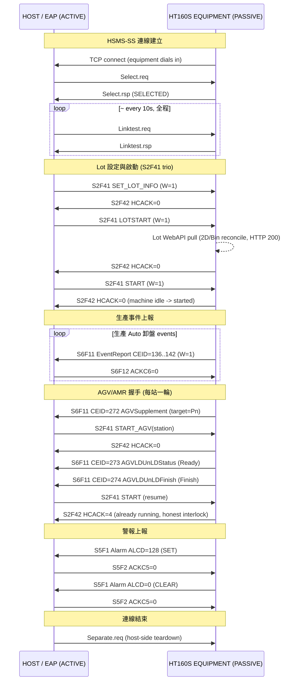

# HT160S SECS/GEM 通訊範例與格式參考手冊

> **文件用途**：本文件為 HT160S 與客戶端 Host/EAP（京元電子 KYEC）整合時的 **SECS 通訊範例與格式參考**。內容針對每一個 message family 結合「處理流程 + 實際 case log 節錄（逐字引用）+ 模擬輸入資料／格式 + 逐欄 FIELD TABLE（item / SECS-II type / 意義 / 範例值）」，供 host/EAP 整合工程師作為對接依據。本手冊可直接當作 **介面合約（integration contract）** 使用。
>
> **閱讀對象**：本手冊假設讀者是 **第一次接觸 HT160S** 的 host/EAP 整合工程師。為了讓沒看過本機台的人也能讀懂，文中會在容易混淆處補充「**為什麼**」的背景說明（例如：為什麼設備是被動端、為什麼 START 與 START_AGV 要分開、為什麼 resume-START 回 HCACK=4、為什麼本 run 沒有 Color cycle）。
>
> **本文件定位**：這是 **通訊範例／格式參考**，**非** 缺陷報告。所有回覆碼（含 HCACK=4、WinError 10038）都已驗證為「正常／設計行為」，文中會逐一解釋其用意。

| 項目 | 內容 |
|---|---|
| 來源 Run | State Record `2026-06-26 00_01_18`（已驗證的乾淨量產 lot run） |
| 時間窗 | Start Lot `2026/06/25 23:59:27` → Clean Out 結束 `00:01:11` |
| 文件日期 | 2026-06-26 |
| Conformance 結果 | 50/50 checkpoints PASS，0 real defects |
| Protocol Stack | HSMS-SS (SEMI E37) over TCP + SECS-II (SEMI E5) + GEM (SEMI E30) |
| 裝置版本 | HT160S 1.0.0.0 |
| 設備角色 | EQUIPMENT，PASSIVE（`ActiveMode=0`），等待 Host 連入 |
| Host 角色 | HOST/EAP（本範例為 SECS Host Simulator），ACTIVE，發出 Select.req |

> **如何閱讀本手冊**：
> - 想快速掌握全貌 → 先看 **第 2 章** 的 Mermaid 序列圖（一張圖看完整個 lot run 的訊息往返）。
> - 想對接某一類訊息 → 直接跳到 **第 3 章** 對應小節（每節都有「用途 / 格式 / 實際 log / 欄位 FIELD TABLE」四段式結構）。
> - 想查回覆碼 → 看 **第 5 章** 的 ACK/HCACK 速查表。
> - 想實際重現 → 看 **第 7 章** 的逐步操作。
> - 看到不懂的縮寫 → 查 **附錄** 的名詞對照表（所有縮寫第一次出現時也會就地展開）。

---

## 1. 系統與通訊架構

本章先交代 HT160S 在通訊上的「身分」與「站位」：它說哪種協定、扮演什麼角色、跟誰連、log 寫在哪裡。理解這幾點後，後面每一則訊息的方向（誰送、誰收）就不會搞錯。

### 1.1 Protocol Stack（協定堆疊）

HT160S 採用半導體業界標準的三層 SECS/GEM 堆疊。由下而上分別負責「怎麼傳」「怎麼編碼」「代表什麼意思」：

- **傳輸層**：**HSMS-SS**（High-Speed SECS Message Services – Single Session，SEMI E37）over TCP/IP。負責建立並維持一條 TCP 連線通道。
- **編碼層**：**SECS-II**（SEMI Equipment Communications Standard part 2，SEMI E5）。定義訊息（Stream/Function，如 S2F41）的位元組編碼格式。
- **語意層**：**GEM**（Generic Equipment Model，SEMI E30）。定義設備行為的語意（事件上報、警報、Host Command 等）。

> **為什麼分三層？** 對 host 整合而言，這三層各有對應的對接點：HSMS-SS 決定「連線怎麼建（誰 Active、誰 Passive、用哪個 port）」；SECS-II 決定「body 怎麼拆解」；GEM 決定「收到某個 CEID／RCMD 該怎麼反應」。本手冊第 3 章即按此分層逐一說明。

### 1.2 連線拓撲（Topology）

| 角色 | 裝置 | 連線模式 | 說明 |
|---|---|---|---|
| EQUIPMENT | HT160S | **PASSIVE**（`ActiveMode=0`） | 監聽，等待 Host 連入；DeviceID=0 |
| HOST / EAP | SECS Host Simulator | **ACTIVE** | 主動送出 `Select.req` |

- **Port**：`5098`
- **DeviceID**：`0`（equipment 端）
- **連線方向**：本範例中模擬器於 `127.0.0.1:5098` 監聽（device=1），由設備（equipment）主動撥入（dial in）。

> **為什麼設備是 PASSIVE（被動）？** 在標準 GEM 模型中，設備（EQUIPMENT）被定位為「資源」，由 Host/EAP（廠端自動化系統，通常是工廠 MES 的派工端）主動發起連線與下命令；設備只負責回應與上報。因此在實際產線中，HT160S 開機後即進入 PASSIVE 監聽狀態、等待 Host 連入並送出 `Select.req`，**不會** 主動去連 Host。
>
> **本範例的特例**：因為本範例改用 SECS Host Simulator 當對端來重現流程，模擬器設定成監聽方（device=1），由設備這端撥入，所以下方設備 log 會看到 `mode=active`。這只是「重現環境的連線方向」與正式產線相反；**訊息層的角色（誰下命令、誰上報）完全相同**，不影響本手冊任何範例的對接邏輯。

### 1.3 Log 檔案位置

整合對接時，兩端 log 是最重要的比對依據（可用 timestamp 與 sys 序號交叉核對）：

| 端 | 路徑 |
|---|---|
| 設備端（Equipment） | `D:\HT160S_Log\SECS_GEM\YYYY_MM_DD\SECSGEM_TextLog_HH.txt`（每小時一檔） |
| Host 端（Simulator） | `secs_host_YYYYMMDD.log` |

---

## 2. 通訊流程總覽

在逐則拆解訊息之前，先用一張圖看完整個故事。一個完整 lot run 的訊息走向，是一條清楚的時間線：

**連線（connect）→ 設定 lot（set lot）→ 啟動生產（production）→ AGV 補料握手（AGV）→ 警報上報（alarm）→ 結束連線（teardown）**。

下圖即依此順序呈現 host ↔ equipment 的訊息序列，涵蓋：TCP+Select → SET_LOT_INFO → LOTSTART（含 WebAPI pull）→ START → 生產事件迴圈（S6F11；AGV 272→START_AGV→273→274→resume START）→ 警報 S5F1 → Separate。讀完此圖，再進第 3 章看每一步的 body 格式與實際 log，會更容易對位。



> **看圖重點**：
> - 連線是 **設備撥入 → Host 送 Select.req**（對應 1.2 的方向說明）。
> - Lot 設定是 **三連發（trio）**：SET_LOT_INFO → LOTSTART → START，三者各有分工（見 3.2）。
> - 每一輪 AGV 握手結尾的 resume `START` 回的是 **HCACK=4 而非 0**——這是 **正常的誠實互鎖**，不是錯誤（見 3.4）。
> - 結尾的 `Separate.req` 由 Host 端送出，且本範例中發生在設備已關閉之後（見 3.6）。

---

## 3. 逐訊息 範例與格式

本章是手冊的核心。每一小節對應一個 message family，並固定採用 **四段式結構**，方便對接時逐項查核：

1. **用途**：這類訊息在流程中扮演什麼角色。
2. **格式／body 結構**：依 SEMI E5 的 SECS-II 編碼，列出 body 的 L/A/B/U4 結構。
3. **實際 case log 節錄**：逐字引用來源 Run 的設備端與 Host 端 log。
4. **FIELD TABLE（欄位說明）**：逐欄列出 item／SECS-II type／意義／範例值，作為對接時的格式合約。

> **接地規則**：以下所有 case log 節錄均逐字引用自來源 Run，未更動 timestamp、ALID、CEID、byte length 或 sys number。FIELD TABLE 的「範例值」一律取自本 run 的實際 log 或 evidence；非 evidence 涵蓋者於該欄註明。

> **SECS-II 型別速記（FIELD TABLE 用）**：`L[n]` = List（n 個元素）；`A` = ASCII 字串；`B` = Binary（1 byte）；`U4` = 4-byte unsigned integer。

### 3.1 HSMS 連線（Select / Linktest / Separate）

**用途**：建立並維持 HSMS-SS 連線。這是所有後續 SECS-II 訊息的前提——沒有先 SELECTED，任何 S2F41／S6F11 都無從談起。設備為 PASSIVE，Host 為 ACTIVE 發起 `Select.req`；連線進入 SELECTED 後，雙方週期性 `Linktest` 確認鏈路仍活著；結束時送 `Separate.req`。

> **為什麼有 Linktest？** TCP 連線可能在沒有訊息往來時悄悄斷掉（例如網路設備逾時）。`Linktest` 是 HSMS 層的「心跳」，週期性確認鏈路存活，避免在真正要送訊息時才發現連線早已失效。

**HSMS 控制訊息（SType）**：這些是 HSMS 層的控制訊息，不屬於 SECS-II 的 Stream/Function；以 SType 數字區分。**注意：SType 是 HSMS header 內的單一 byte 欄位，本層訊息無 SECS-II body。**

| 控制訊息 | SType | 方向 | 說明 |
|---|---|---|---|
| Select.req | 1 | Host → Equipment | 建立 session |
| Select.rsp | 2 | Equipment → Host | 回應，進入 SELECTED |
| Linktest.req | 5 | 雙向 | 鏈路存活測試 |
| Linktest.rsp | 6 | 雙向 | 回應 |
| Separate.req | 9 | 任一端 | 結束 session |

**實際 case log 節錄（設備端 Equipment）**：

```
2026/06/25 23:59:08.603  [SECS] StartCommunication mode=active port=5098
2026/06/25 23:59:08.603  [SECS] peer connected (TCP up, awaiting Select)
2026/06/25 23:59:08.862  [SECS] Select.req -> Select.rsp (SELECTED)
```

**實際 case log 節錄（Host 端 Simulator）**：

```
[23:59:08] equipment connected: 127.0.0.1:50817
[23:59:08] TX  Select.req
[23:59:08] RX  Select.rsp
[23:59:08] HSMS SELECTED
[23:59:18] RX  Linktest.req -> Linktest.rsp        (then ~every 10s, all answered, whole run)
```

**FIELD TABLE（HSMS header 關鍵欄位）**：

| Item | 型別 | 意義 | 範例值（本 run） |
|---|---|---|---|
| `SType` | byte（HSMS header） | 控制訊息類型碼 | `1`(Select.req) / `2`(Select.rsp) / `5`(Linktest.req) / `6`(Linktest.rsp) / `9`(Separate.req) |
| `mode` | log 欄位 | 本範例連線模式（模擬器監聽、設備撥入）；正式產線設備為 PASSIVE | `active` |
| `port` | TCP | HSMS 監聽埠 | `5098` |
| 連線狀態 | HSMS state | 完成 Select 交握後進入可傳輸狀態（此後才能送 SECS-II 訊息） | `SELECTED` |
| Linktest 週期 | — | 連線建立後約每 10 秒一次，全程皆有回應 | `~every 10s, all answered` |

---

### 3.2 Lot 設定與啟動（S2F41 SET_LOT_INFO / LOTSTART / START + S2F42）

**用途**：這是 host 對設備下達 **Host Command（S2F41）** 的核心三連發（trio）。Host 透過 S2F41 依序設定 lot 清單、啟動 lot（觸發 WebAPI 2D/Bin 對帳）、最後啟動生產。設備一律以 **S2F42** 回覆，body 內含 **HCACK** 回覆碼。

> **為什麼分成三個命令、而且順序固定？** 三者刻意分工、職責不重疊，host 可分階段控制與檢查：
> - **SET_LOT_INFO** = 「告訴設備這批要做哪些 lot」（純資料登錄，**會清空並覆寫** 既有 lot 清單）。
> - **LOTSTART** = 「叫設備去拉這些 lot 的 2D/Bin 對帳資料」（觸發 WebAPI pull，但**不會讓機構動作**）。
> - **START** = 「真正開始生產」（讓 motion 動起來）。
>
> 把「登錄資料」「拉對帳資料」「啟動 motion」拆開，host 可以在 START 之前先確認 lot 清單與 WebAPI 對帳都成功，再決定是否啟動，降低誤啟動風險。

**格式／body 結構（SEMI E5）**：

S2F41 通用結構（**RCMD** = Remote Command，命令名稱；**CPNAME/CPVAL** = 參數名稱/值）：
```
L[2]
  A "RCMD"
  L[n]
    L[2]
      A CPNAME
      A CPVAL
```

回覆 S2F42（**HCACK** = Host Command Acknowledge，回覆碼）：
```
L[2]
  B  HCACK
  L[0]
```

各 RCMD body：

| RCMD | body 結構 | 語意 |
|---|---|---|
| `SET_LOT_INFO` | `L[2]{ A "SET_LOT_INFO", L[n]{ A lotID } }` | lot 清單；**CLEARS+overwrites** LotRegistry（清空並覆寫，非附加） |
| `LOTSTART` | `L[2]{ A "LOTSTART", L[n]{ A lotID } }` | additive（附加）；觸發 HT160 Lot WebAPI pull 做 2D/Bin reconcile；**不啟動 motion**（仍需 operator Start 才動作） |
| `START` | `L[2]{ A "START", L[0] }` | start/resume 生產；與 START_AGV 刻意分開（原因見 3.4）；於 CEID 274 Finish 後送出 |

> `SET_LOT_INFO` 由 `ht160s_presets._set_lot_info` 建構，預設 5 個 lot `SIMU_LOT_A..E`；`LOTSTART` 由 `_lot_start` 建構；`START` 由 `_start` 建構。

**實際 case log 節錄（設備端 Equipment）**：

```
23:59:25.060  [SECS][RX] S2F41 decoded rc=1 items=22
23:59:25.062  [SECS][TX] S2F42 W=0 len=21 (sent)
23:59:25.062  [SECS] S2F42 cmd=SET_LOT_INFO HCACK=0 Lots=5
23:59:26.059  [SECS][RX] S2F41 decoded rc=1 items=10
23:59:26.077  [SECS] S2F42 cmd=LOTSTART HCACK=0 Lots=5
23:59:27.543  [SECS][RX] S2F41 decoded rc=1 items=7
23:59:27.598  [SECS] S2F42 cmd=START HCACK=0 Lots=5
```

**實際 case log 節錄（Host 端 Simulator）**：

```
[23:59:25] TX  S2F41W  (S2F41 SET_LOT_INFO)   ;  [23:59:25] RX  S2F42  (sys=20558)
[23:59:26] TX  S2F41W  (S2F41 LOTSTART)        ;  [23:59:26] RX  S2F42  (sys=20559)
[23:59:27] TX  S2F41W  (S2F41 START)           ;  [23:59:27] RX  S2F42  (sys=20560)
```

**FIELD TABLE — S2F41 Host Command（送出）**：

| Item | 型別 | 意義 | 範例值（本 run） |
|---|---|---|---|
| `RCMD` | A | Host 命令名稱 | `"SET_LOT_INFO"` / `"LOTSTART"` / `"START"` |
| lot list 元素 | A（於 `L[n]` 內） | 每個 lot ID（SET_LOT_INFO / LOTSTART 攜帶；START 為 `L[0]` 不帶） | `"SIMU_LOT_A"` … `"SIMU_LOT_E"`（共 5 筆） |
| `CPNAME` | A | 參數名稱（通用結構欄位；本 trio 以 lot ID 直填 `L[n]`） | （SET_LOT_INFO/LOTSTART 不使用 CPNAME 形式） |
| `CPVAL` | A | 參數值 | （同上） |
| `W`-bit | header | 要求回覆 | `1`（S2F41W） |

**FIELD TABLE — S2F42 回覆（收到）**：

| Item | 型別 | 意義 | 範例值（本 run） |
|---|---|---|---|
| `HCACK` | B | Host Command 回覆碼 | `0`（SET_LOT_INFO / LOTSTART / START 全 OK；START 因機台 idle→started） |
| 第二元素 | `L[0]` | 空 list（無附加參數回覆） | `L[0]` |
| `W`-bit | header | 偶函數回覆，不再要求對方回覆 | `0`（W=0，交易到此結束） |
| `len` | bytes | S2F42 body 長度 | `21` |
| `sys` | header（模擬器交易序號） | 嚴格 +1，可核對無漏訊 | `20558`→`20559`→`20560` |
| `Lots` | log 欄位 | 此時 LotRegistry 內 lot 數 | `5` |

---

### 3.3 生產事件上報（S6F11 / S6F12 + CEID + DataID）

**用途**：生產過程中，設備會主動把物料移動等事件以 **S6F11 Event Report** 上報給 host；host 收到後以 **S6F12** 回 ACK。這是設備「告知 host 現在發生了什麼」的主要管道。

> **為什麼是設備主動上報、而非 host 來問？** 在 GEM 模型中，事件（Collection Event）由設備在事件發生的當下即時 push 給 host，host 不必輪詢。每個事件以 **CEID（Collection Event ID，事件識別碼）** 標明「發生了什麼事」。

**格式／body 結構**：

S6F11（**DataID** = 資料識別；**CEID** = 事件識別碼）：
```
L[3]
  U4 DataID
  U4 CEID
  L[reports]{ ... }
```
回覆 S6F12（**ACKC6** = Event Report ACK 回覆碼）：
```
B ACKC6
```
W-bit=1（要求回覆）。

**實際 case log 節錄（設備端 Equipment）**：

```
23:59:30.356  [SECS][TX] S6F11 EventReport DataID=1 CEID=136
23:59:30.356  [SECS][TX] S6F11 W=1 len=30 (sent)
23:59:30.361  [SECS][RX] S6F12 decoded rc=1 items=3
23:59:30.361  [SECS][RX] S6F12 reply ignored          ("reply ignored" = S6F12 is the even-function ACK; nothing further to do)
```

**實際 case log 節錄（Host 端 Simulator）**：

```
[23:59:30] RX  S6F11W  (sys=1)
[23:59:30]     -> auto S6F12 ACKC6=0
```

**「reply ignored」說明**：`S6F12` 為偶函數（even-function）ACK，設備收到後**無後續動作**，僅標記為 reply ignored，屬正常行為，**非錯誤**。（凡 even-function 回覆都是一筆交易的結尾，收到即代表對方已確認，不需再回。）

**FIELD TABLE — S6F11 Event Report（送出）**：

| Item | 型別 | 意義 | 範例值（本 run） |
|---|---|---|---|
| `DataID` | U4 | 資料識別；**對 host 無語意**，host 依 CEID 分派 | `1`（生產／Auto CEID）／ `0`（AGV CEID） |
| `CEID` | U4 | 事件識別碼 | `136`（Auto 卸盤）／`272`（AGV）／`35`（car full） |
| `L[reports]` | L[n] | report 串列；可為空（無 SV 註冊時 `L[0]`） | 空（136–142，len=30）／13 SV（CEID 35，len=144） |
| `W`-bit | header | 要求回覆 | `1`（S6F11W） |
| `len` | bytes | S6F11 body 長度 | `30`（EMPTY）／`86`（CEID 272）／`144`（CEID 35） |
| `sys` | header（模擬器序號） | S6F11 上報序號池 | `1`（本 run S6F11 sys 為 1..53） |

**FIELD TABLE — S6F12 回覆（收到）**：

| Item | 型別 | 意義 | 範例值（本 run） |
|---|---|---|---|
| `ACKC6` | B | Event Report ACK 回覆碼 | `0`（事件已收到） |
| 設備端處理 | — | 偶函數 ACK，收到即標記 reply ignored（正常） | `reply ignored` |

**DataID 說明**：**DataID 對 host 無語意**——host 是依 **CEID** 來分派處理邏輯，不看 DataID。設備內部用 DataID 區分事件來源，本 run 中：

- AGV CEIDs（272/273/274）使用 `DataID=0`
- 生產／Auto CEIDs（136–142、35）使用 `DataID=1`

> **整合提醒**：host 端請以 CEID 作為唯一的事件分派依據，不要依賴 DataID 的數值。

**本 run CEID 統計**：

| CEID | 次數 | 類別 | report body | 說明 |
|---|---|---|---|---|
| 136 | 13 | Auto 卸盤（unload-tray / discharge） | `len=30`（EMPTY body） | 此 CEID 在設計上未綁定任何 SV（RPTID 註冊 0 個 SV），故 body 為空 |
| 137 | 7 | Auto 卸盤（unload-tray / discharge） | EMPTY（`len=30`） | 同上 |
| 138 | 4 | Auto 卸盤（unload-tray / discharge） | EMPTY（`len=30`） | 同上 |
| 140 | 4 | Auto 卸盤（unload-tray / discharge） | EMPTY（`len=30`） | 同上 |
| 141 | 3 | Auto 卸盤（unload-tray / discharge） | EMPTY（`len=30`） | 同上 |
| 142 | 3 | Auto 卸盤（unload-tray / discharge） | EMPTY（`len=30`） | 同上 |
| 272 | 6 | AGV AGVSupplement | `len=86` | 見 3.4 |
| 273 | 6 | AGV AGVLDUnLDStatus | — | 見 3.4 |
| 274 | 6 | AGV AGVLDUnLDFinish | — | 見 3.4 |
| 35 | 1 | Auto1 "car full" edge | `len=144` | `AutoFullCeid[0]=35`，在 Report 1 註冊 13 個 SV |

> **為什麼 136–142 的 report body 是空的（len=30）？** 這 6 個 CEID 是 **Auto 卸盤（unload-tray / discharge）事件**——設備在 `aAuto1To6` 的 `DoDischargeTray` 流程以 `AutoCeid[6]={136,137,138,140,141,142}` 發出。它們在設計上 **刻意不註冊任何 report SV**（lightweight、與 HT9045 對齊），所以 S6F11 只攜帶 CEID、不攜帶資料欄位。host 只需依 CEID 認得「發生了哪個事件」即可，這是 by design，不是漏帶資料。
>
> **CEID 136–142 名稱**：屬 Auto 卸盤（discharge）類事件，其完整名稱對照表存放於設備端 CEID registry（見 `HT160S_Program_BCB_V1.0.0.0/aAuto1To6.cpp` 的 `AutoCeid` 陣列與 `EventReport` 呼叫處）。本文件不臆造個別事件名稱。

---

### 3.4 AGV / AMR 握手（272 / 273 / 274 / 275 + START_AGV + resume START）

**用途**：當設備缺料或某個 Auto 工位車滿時，需要 **AGV/AMR（Automated Guided Vehicle / Autonomous Mobile Robot，自動物料搬運車）** 來補料或卸料。本小節描述設備與 host 之間完成一次 AGV 補給／卸載的完整事件握手：設備發出 CEID 事件，host 依預先設定的 swimlane（自動回應規則）回對應的 Host Command。

> **為什麼 AGV 要先 START_AGV、最後又要一個 resume START？這兩個 START 不一樣嗎？** 兩者是**刻意分開的不同命令**，職責不同：
> - **START_AGV(station)** = 「授權 AGV 對某一站（station）執行搬運動作」——只針對該站的 AGV 交接，不影響整機生產狀態。
> - **resume START** = 「在 AGV 交接完成後，恢復整機生產」——對應 3.2 的同一個 START 命令。
>
> 之所以分開，是因為 AGV 補料期間機台可能暫停某些動作等待交接，待 CEID 274（Finish）確認搬運完成後，host 才送 START 讓整機恢復生產。把「授權 AGV 動作」與「恢復整機生產」拆成兩個命令，host 才能精準控制兩件事的時序。

**AGV CEID 定義**：

| CEID | 名稱 | 語意 |
|---|---|---|
| 272 | AGVSupplement | 呼叫 AGV：缺料／Auto full。SVID `38219` bitmap 標記目標站 |
| 273 | AGVLDUnLDStatus | Ready：機構就位 |
| 274 | AGVLDUnLDFinish | Finish：sensor 確認 load/unload 完成 |
| 275 | AGVLdID | carrier ID |

> **關於 CEID 275（AGVLdID）**：275 是 AGV CEID 集合中定義的 carrier ID 事件，但**本 run 並未發出 275**——本範例的 6 個 AGV cycle 只出現 272／273／274，因此 275 **沒有對應的 FIELD TABLE（沒有 evidence row 可引用）**。這與 P3（Color）的缺席性質相同：屬本 run 未觸發的情境，並非漏列或失敗。host 端不應預期每個 run 都一定看到 275。

**START_AGV body 結構**：
```
L[2]
  A "START_AGV"
  L[n]
    L[2]{ A station, A "Action" }
    [, L[2]{ A "LoaderTrayCount", A n }]
```
`station` ∈ {Loader, Empty, Color, AUTO1..AUTO6}，由 `_start_agv` 建構。

**站點對照（P-Map，PIndex = AutoNo + 3）**：CEID 272 的 SVID `38219` 以 bitmap 標出目標站，站號 P1–P9 對照如下：

| P | 站點 |
|---|---|
| P1 | Loader |
| P2 | EmptyTray |
| P3 | ColorTray |
| P4 | AUTO1 |
| P5 | AUTO2 |
| P6 | AUTO3 |
| P7 | AUTO4 |
| P8 | AUTO5 |
| P9 | AUTO6 |

**bitmap payload（ASCII）**：`"P1:0,P2:0,...,P4:1,...,P9:0"`。此為**示意格式**——bitmap 中被設為 `1` 的位置，**就是當次握手的目標站**（單一站 P=1，其餘皆 0）；這裡以 `P4=1`（一個 AUTO1 呼叫）為例說明格式。實際 `1` 落在哪一位，視該次的目標站而定（例如下方 CEID 272 FIELD TABLE 取 @00:00:13 的實際 cycle，目標站為 P1 Loader，故 `P1=1`）。

**Auto-AGV Host swimlane（host 端自動回應規則）**：

- 收到 `272`（AGVSupplement）→ 自動送 `START_AGV(station)`（授權該站搬運）
- 收到 `273`（Ready）→ 僅 log（等待機台 sensor 回報 Finish，不做動作）
- 收到 `274`（Finish）→ 自動送 `START`（resume，恢復整機生產）

**Color (P3) demand-gate（需求閘）**：Color 站僅在真實需求（內部旗標 `bSupplyRequested` 成立）時才補給。

> **為什麼本 run 沒有出現 P3（Color）的 AGV cycle？** 因為 Color 站採「**按需供給（demand-gated）**」：只有在機台真正提出需求時才呼叫 AGV。本範例是一段很短的 run，期間 Color 站並未產生供給需求，所以 **完全沒有 P3 cycle** 出現。這是 **預期行為**，不是漏掉或失敗——host 端不應預期每個 run 都一定看到 P3。

**實際 case log 節錄 — 完整 AGV cycle，站 P1 Loader @ 00:00:13（設備端 Equipment）**：

```
00:00:13.587  [SECS][TX] S6F11 EventReport DataID=0 CEID=272
00:00:13.587  [SECS][TX] S6F11 W=1 len=86 (sent)
00:00:13.596  [SECS][RX] S2F41 decoded rc=1 items=15
00:00:13.596  [SECS][TX] S2F42 W=0 len=21 (sent)
00:00:13.596  [SECS] S2F42 cmd=START_AGV HCACK=0 Lots=5
00:00:14.597  [SECS][TX] S6F11 EventReport DataID=0 CEID=273
00:00:15.593  [SECS][TX] S6F11 EventReport DataID=0 CEID=274
00:00:15.600  [SECS][RX] S2F41 decoded rc=1 items=7
00:00:15.601  [SECS] S2F42 cmd=START HCACK=4 Lots=5
```

**實際 case log 節錄（Host 端 Simulator）**：

```
[00:00:13] RX  S6F11W  (sys=23)
[00:00:13]     >> AGV AGVSupplement (CEID 272) target=P1 Loader
[00:00:13] TX  S2F41W  (S2F41 START_AGV)
[00:00:13]     >> auto START_AGV(Loader)
[00:00:13] RX  S2F42  (sys=20563)
[00:00:14] RX  S6F11W  (sys=24)
[00:00:14]     >> AGV AGVLDUnLDStatus (CEID 273) target=P1 Loader
[00:00:14]     >> AGV handoff at Loader; awaiting sensor Finish
[00:00:15] RX  S6F11W  (sys=25)
[00:00:15]     >> AGV AGVLDUnLDFinish (CEID 274) target=P1 Loader
[00:00:15] TX  S2F41W  (S2F41 START)
[00:00:15]     >> auto START (resume production)
[00:00:15] RX  S2F42  (sys=20564)
```

> **對照看圖**：上面這段 log 即第 2 章 Mermaid 圖中「AGV/AMR 握手」那一輪的完整實況——272 → START_AGV(HCACK=0) → 273 → 274 → resume START(HCACK=4)。

**FIELD TABLE — CEID 272 AGVSupplement（S6F11 送出）**：

| Item | 型別 | 意義 | 範例值（本 run） |
|---|---|---|---|
| `DataID` | U4 | AGV 事件資料識別 | `0` |
| `CEID` | U4 | 事件識別碼 | `272` |
| SVID `38219` | （report SV） | bitmap 標記目標站（被設為 `1` 的位置即目標站，其餘 0） | `"P1:1,P2:0,...,P9:0"`（**依格式推得；非逐字 log 值**——本 run @00:00:13 的 log 僅記錄 `target=P1 Loader`，未逐字記錄 bitmap 字串，此處依「單一站 P=1」格式推得 `P1=1`） |
| `len` | bytes | S6F11 body 長度 | `86` |

**FIELD TABLE — START_AGV（S2F41 收到 / 由 host 送出）**：

| Item | 型別 | 意義 | 範例值（本 run） |
|---|---|---|---|
| `RCMD` | A | 命令名稱 | `"START_AGV"` |
| `station` | A | 目標站（CPNAME 位置） | `"Loader"` / `"Empty"` / `"Color"` / `"AUTO1".."AUTO6"` |
| `"Action"` | A | station 對應的動作值（CPVAL 位置） | `"Action"` |
| `"LoaderTrayCount"` / `n` | A / A | 選用第二參數對：盤數 | （選用；Loader 站可帶） |
| 回覆 `HCACK` | B（S2F42） | 接受 | `0`（全部 6 次 START_AGV 皆 0） |

**FIELD TABLE — CEID 273 / 274（S6F11 送出）**：

| Item | 型別 | 意義 | 範例值（本 run） |
|---|---|---|---|
| `DataID` | U4 | AGV 事件資料識別 | `0` |
| `CEID` | U4 | 273=Ready（機構就位）／274=Finish（sensor 確認完成） | `273` / `274` |
| target | （log 標註） | 對應目標站 | `P1 Loader`（本 cycle） |

**本 run 的 6 個 AGV cycle（依目標站）**：

| 時間 | 目標站 |
|---|---|
| 23:59:47 | P2 Empty |
| 00:00:13 | P1 Loader |
| 00:00:18 | P2 Empty |
| 00:00:41 | P4 AUTO1 |
| 00:00:46 | P1 Loader |
| 00:00:51 | P2 Empty |

**CEID=35 雙重發送（與 272 同時 @ 00:00:41）**：當 Auto1 工位「車滿（car full）」的邊緣事件觸發時，設備會在同一時刻同時送出 272（呼叫 AGV）與 35（car-full 事件）。兩者目的不同：272 是叫車、35 是上報車滿狀態（攜帶 13 個 SV，故 len=144）。

```
00:00:41.586  [SECS][TX] S6F11 EventReport DataID=0 CEID=272
00:00:41.586  [SECS][TX] S6F11 W=1 len=86 (sent)
00:00:41.586  [SECS][TX] S6F11 EventReport DataID=1 CEID=35
00:00:41.586  [SECS][TX] S6F11 W=1 len=144 (sent)
```

**FIELD TABLE — CEID 35 Auto1 car-full（S6F11 送出）**：

| Item | 型別 | 意義 | 範例值（本 run） |
|---|---|---|---|
| `DataID` | U4 | 生產／Auto 事件資料識別 | `1` |
| `CEID` | U4 | 事件識別碼（`AutoFullCeid[0]=35`） | `35` |
| `L[reports]` | L[n] | Report 1 註冊 **13 個 SV**（與空 body 的 136–142 對比） | 13 SV |
| `len` | bytes | S6F11 body 長度（13 SV → 144） | `144` |
| 觸發時機 | — | 與 CEID 272 同時刻雙發（叫車 + 上報車滿） | `@00:00:41`（272 + 35 同一 timestamp） |

**HCACK=0 vs HCACK=4 說明（關鍵，務必理解）**：

| 命令 | HCACK | 說明 |
|---|---|---|
| `START_AGV`（全部 6 次） | `0` | OK，正常接受 |
| resume `START`（全部 6 次） | `4` | **By design**。此時 `SystemStart` 已為 true → MachineStart() 回 `msRejBusy`，機台誠實回報「已在運行」（`uHGemHT160.cpp:826-832`，case `msRejBusy: HCACK=4`）。這 **不是失敗**，而是誠實互鎖（honest interlock），非假成功（not a fake-success）。 |

> **為什麼 resume START 回 HCACK=4（busy）而不是 0？這算失敗嗎？** 不算失敗。HCACK=4 的定義是「busy（機台已在運行 **或** ICs 仍在機內）」。AGV 交接期間機台其實**並未真正停機**，整機生產狀態仍是運行中；因此當 host 在 274 之後送 resume START 時，機台「誠實地」回報「我本來就在跑了，這個 START 無需再啟動」（HCACK=4）。
>
> 這正是所謂「**誠實互鎖（honest interlock）**」：機台寧可如實回 busy，也不會假裝「啟動成功（HCACK=0）」來討好 host。**host 端收到 resume-START 的 HCACK=4 應視為正常結果**，代表生產持續中，無需重試或告警。

> **文件修正提醒（給有看過舊文件的讀者）**：模擬器舊版 `docs/SECS_MESSAGES.md` 仍寫「START_AGV/START not yet implemented → HCACK=1」，**該文字為 STALE（過時）**。實際設備兩者皆已實作，且本 run 的真實回覆碼為 **START_AGV=0、resume-START=4**（皆非 1）；請以本文件的實際行為為準。

---

### 3.5 警報上報（S5F1 / S5F2）

**用途**：當設備發生需通報的狀況（如缺盤、清場）時，以 **S5F1** 上報警報的 SET（成立）／CLEAR（解除）；host 以 **S5F2** 回 ACK。每個警報的「成立」與「解除」會成對出現（先 SET、後 CLEAR）。

**格式／body 結構**：

S5F1（**ALCD** = Alarm Code byte；**ALID** = Alarm ID；**ALTX** = 人類可讀 alarm 文字）：
```
L[3]
  B  ALCD
  U4 ALID
  A  ALTX
```
回覆 S5F2（**ACKC5** = Alarm Report ACK 回覆碼）：
```
B ACKC5
```
W-bit=1。

**ALCD（SEMI E5 標準）**：以 byte 的 bit7 表示 SET/CLEAR：

| ALCD | 值 | 意義 |
|---|---|---|
| SET | `0x80` = `128`（bit7） | 警報成立 |
| CLEAR | `0x00` = `0` | 警報解除 |

**ALID 推導**：本機的 ALID 是以 alarm-code **字串** 做 31-poly rolling hash 算出的 U4（`alid = alid*31u + (unsigned char)byte`，`UsecegemMainFrom.cpp:150-152`）。此演算法 stateless／deterministic（同一字串永遠算出同一 ALID）；真正人類可讀的代碼承載於 **ALTX** 欄位。已驗證（python 重算 byte-for-byte 相符）：

| ALTX（alarm code 字串） | ALID（U4） |
|---|---|
| `"Loader Tray Empty"` | `4045923824` |
| `"SnFKCleanOut"` | `3891410149` |

> **ALTX 的內容範圍（重要）**：實際 handler（`UsecegemMainFrom.cpp:154-156`）在 **沒有附加 Message 時** 設 `altx = Code`（即純 alarm code 字串），在 **有 Message 時** 設 `altx = Code + ' ' + Message`（即 code、一個空白、再接人類可讀訊息）。換言之，**ALTX 不保證恆等於 alarm code**——可能是 `code` 或 `code + 空白 + message`。本 run 觀察到的 ALTX 皆為純 alarm code（`"Loader Tray Empty"`／`"SnFKCleanOut"`，無附加 Message）。
>
> **整合建議**：host 端若要以 ALTX 辨識警報，請 **以開頭的 code token（第一個空白前的字串）作為比對鍵**，而非整段 ALTX 字串，以免日後附加 Message 時比對失敗。

> **為什麼 ALID 用字串 hash、而不是固定編號？host 該以什麼為準？** 因為 ALID 由字串確定性地算出，可避免維護一張人工編號表；但這也代表 **ALID 本身對 host 不直觀**。整合時建議 host 端 **以 ALTX 的 leading code token 作為警報的辨識依據**（ALID 用於去重／配對 SET↔CLEAR 即可），因為 code token 才是人類可讀、語意明確的代碼。
>
> 另注：`AddAlarmList()` 目前為空 → 設備對 S5F5/F6 警報目錄查詢會回覆空 catalog（記錄為目前狀態）。

**實際 case log 節錄（設備端 Equipment）**：

```
00:01:00.388  [SECS][TX] S5F1 Alarm ALID=4045923824 ALCD=128   (SET   "Loader Tray Empty")
00:01:00.388  [SECS][TX] S5F1 W=1 len=62 (sent)
00:01:00.431  [SECS][RX] S5F2 decoded rc=1 items=3
00:01:04.499  [SECS][TX] S5F1 Alarm ALID=4045923824 ALCD=0     (CLEAR "Loader Tray Empty")
00:01:05.056  [SECS][TX] S5F1 Alarm ALID=3891410149 ALCD=128   (SET   "SnFKCleanOut")
00:01:11.861  [SECS][TX] S5F1 Alarm ALID=3891410149 ALCD=0     (CLEAR "SnFKCleanOut")
```

**實際 case log 節錄（Host 端 Simulator）**：

```
[00:01:00] RX  S5F1W (sys=54) -> auto S5F2 ACKC5=0
[00:01:04] RX  S5F1W (sys=55) -> auto S5F2 ACKC5=0
[00:01:05] RX  S5F1W (sys=56) -> auto S5F2 ACKC5=0
[00:01:11] RX  S5F1W (sys=57) -> auto S5F2 ACKC5=0
```

> **對照讀**：上面 4 筆即兩個警報的 SET/CLEAR 配對——`Loader Tray Empty`（00:01:00 SET → 00:01:04 CLEAR）與 `SnFKCleanOut`（00:01:05 SET → 00:01:11 CLEAR）；後者 CLEAR 即本 run 的 clean out 結束點。

**FIELD TABLE — S5F1 Alarm Report（送出）**：

| Item | 型別 | 意義 | 範例值（本 run） |
|---|---|---|---|
| `ALCD` | B | Alarm Code byte：bit7(0x80=128)=SET、0x00=CLEAR | `128`（SET）／`0`（CLEAR） |
| `ALID` | U4 | Alarm ID，由 ALTX 字串 31-poly hash 而來，deterministic | `4045923824`（Loader Tray Empty）／`3891410149`（SnFKCleanOut） |
| `ALTX` | A | Alarm Text：`code`，或 `code + 空白 + message`（有附加訊息時）；本 run 皆為純 code | `"Loader Tray Empty"`／`"SnFKCleanOut"`（本 run 無附加 message；host 比對請取 leading code token） |
| `W`-bit | header | 要求回覆 | `1`（S5F1W） |
| `len` | bytes | S5F1 body 長度 | `62` |
| `sys` | header（模擬器序號） | 與 S6F11 共用同一遞增序號池 | `54`..`57`（本 run 4 筆警報） |

**FIELD TABLE — S5F2 回覆（收到）**：

| Item | 型別 | 意義 | 範例值（本 run） |
|---|---|---|---|
| `ACKC5` | B | Alarm Report ACK 回覆碼 | `0`（警報已收到，本 run 4 筆皆 0） |

---

### 3.6 連線結束（Separate）

**用途**：結束 HSMS session。正常情況下由任一端送 `Separate.req` 即可拆除連線。

**實際 case log 節錄（Host 端 Simulator；屬 cosmetic，約 run 窗後 ~4 分鐘）**：

```
[00:05:09] connection closed
[00:05:11] TX  Separate.req
[00:05:11] send error: [WinError 10038] (socket no longer valid -- equipment app closed first)
[00:05:11] disconnected
```

**說明**：teardown 時的 `WinError 10038` 為 **host-side cosmetic（host 端外觀層、無實質影響）**：本範例中設備 app 先關閉、socket 已失效，模擬器才送 `Separate.req`，所以送出時報 10038（socket 已無效）。

**FIELD TABLE — Separate / teardown**：

| Item | 型別 | 意義 | 範例值（本 run） |
|---|---|---|---|
| `Separate.req` | SType=9（HSMS header） | 結束 session（任一端可送） | host 端送出 @00:05:11 |
| `WinError 10038` | OS socket error | host 端 cosmetic：設備先關、socket 已失效 | `socket no longer valid -- equipment app closed first` |

> **為什麼這個 error 不是通訊缺陷？** 因為它純粹是「關閉順序」造成的：設備先離線，host 才嘗試送 Separate，自然送不出去。連線本身在整個 run 期間運作正常（見第 6 章的完整性核對）。正式產線中若由 host 先送 Separate、設備再關閉，就不會出現此訊息。它不影響任何已完成的交易，屬正常收尾。

---

## 4. 模擬輸入資料

本章列出本範例中 host 端「餵給」設備的輸入資料，供 host/EAP 工程師理解資料格式並自行構造測試輸入。

### 4.1 Host 宣告的 Lot 清單

`ht160s_presets.DEFAULT_SIMU_LOTS`（即 SET_LOT_INFO 送出的預設 5 個 lot）：

```
SIMU_LOT_A, SIMU_LOT_B, SIMU_LOT_C, SIMU_LOT_D, SIMU_LOT_E
```

### 4.2 Lot WebAPI mock（2D/Bin reconcile）

當 host 送出 **LOTSTART** 時，設備會去 pull 這份資料做 2D/Bin 對帳（reconcile）。本範例以 mock 檔案模擬：

檔案：`D:\AI_Area\Tool\HT160S_SECS_Simulator\code\lot_webapi_data.json`

- Top-level key：`"2DIDHistory"`
- 每個 lot 欄位：`LOTID`、`Substage`、`ProductCode`、`ICIInfo[]{ QRCodeID, RetestCode, HBin, SBin, DiePass }`

**JSON 結構（shape）**：
```
{
  "2DIDHistory": [
    {
      "LOTID": "SIMU_LOT_A",
      "Substage": "BI1",
      "ProductCode": "SIMU/DEVICE-A",
      "ICIInfo": [
        { "QRCodeID": "...", "RetestCode": "R0", "HBin": "HBin1", "SBin": "SBin1", "DiePass": "DiePass1" },
        ...
      ]
    },
    ...
  ]
}
```

**ICIInfo 欄位 FIELD TABLE**：

| 欄位 | 型別 | 意義 |
|---|---|---|
| `QRCodeID` | string | 該顆 IC 的 2D/QR 碼 ID |
| `RetestCode` | string | 重測碼（如 R0 / R1） |
| `HBin` | string | Hardware Bin |
| `SBin` | string | Software Bin |
| `DiePass` | string | Die 通過判定（DiePass0/1） |

**範例 row（SIMU_LOT_A，Substage `BI1`，ProductCode `SIMU/DEVICE-A`）**：

| QRCodeID | RetestCode | HBin | SBin | DiePass |
|---|---|---|---|---|
| SIMU_A_0001 | R0 | HBin1 | SBin1 | DiePass1 |
| SIMU_A_0002 | R0 | HBin1 | SBin1 | DiePass1 |
| SIMU_A_0003 | R0 | HBin2 | SBin2 | DiePass1 |
| SIMU_A_0004 | R1 | HBin3 | SBin3 | DiePass1 |
| SIMU_A_0005 | R0 | HBin4 | SBin5 | DiePass0 |

> **真實客戶格式 lot（real-customer-format）**：此檔同時保留真實客戶格式 lot `A5921.RCS.TEST99` / `TEST88`（ProductCode `MT3781Q` / `ZAHJA32-ETTTT-H`，含長 QRCodeID 如 `MT3781Q-ZAHJA32-EMFMT-H_N8R124.LR_011`），供真實格式測試。host/EAP 對接時應同時驗證短格式（SIMU_*）與長格式（真實客戶）兩種 QRCodeID。

### 4.3 WebAPI endpoint

設備於 LOTSTART 時對每個 lot 發出的 HTTP 請求形式：

```
GET http://127.0.0.1:8160/lot/<LOTID>  ->  HTTP 200 JSON
```

**本 run 證據（回應大小）**：

| Lot | bytes |
|---|---|
| A | 951 |
| B | 633 |
| C | 792 |
| D | 474 |
| E | 633 |

> 23:59:26 全 5 lot HTTP=200、ok=1（對帳成功）。

### 4.4 S2F41 builder bodies（host 輸入格式）

S2F41 body 由 `ht160s_presets.py` 的 builders 建構，可作為 host 端構造輸入時的參照格式：

| Builder | RCMD | body |
|---|---|---|
| `_set_lot_info` | SET_LOT_INFO | `L[2]{ A "SET_LOT_INFO", L[n]{ A lotID } }` |
| `_lot_start` | LOTSTART | `L[2]{ A "LOTSTART", L[n]{ A lotID } }` |
| `_start_agv` | START_AGV | `L[2]{ A "START_AGV", L[n]{ L[2]{A station, A "Action"} [, L[2]{A "LoaderTrayCount", A n}] } }` |
| `_start` | START | `L[2]{ A "START", L[0] }` |

---

## 5. ACK / HCACK 代碼速查表

本章彙整本手冊出現的所有回覆碼，方便對接時快速查詢「某個回覆碼代表什麼」。

**HCACK（S2F42，Host Command Acknowledge）**：

| 值 | 意義 | 本 run 出現 |
|---|---|---|
| 0 | OK | SET_LOT_INFO、LOTSTART、initial START(23:59:27)、START_AGV(×6) |
| 1 | command does not exist | （本 run 未出現；舊文件誤稱 START_AGV/START 回 1，已更正） |
| 2 | cannot perform now / param | （本 run 未出現） |
| 4 | busy（machine already running **OR** ICs still inside） | resume-START(×6)，by design honest interlock（見 3.4） |

**其他 ACK 代碼**：

| 代碼 | 訊息 | 標準值域 | 本 run 值 | 說明 |
|---|---|---|---|---|
| ACKC5 | S5F2（Alarm ACK） | 0=accepted / >0=error | 0 | 警報已收到 |
| ACKC6 | S6F12（Event Report ACK） | 0=accepted / >0=error | 0 | 事件已收到 |
| COMMACK | S1F14（Establish Communications Request Acknowledge / S1F13→S1F14） | 0=accepted / 1=denied | — | 本文件來源 Run evidence 未涵蓋具體值，故僅列名不臆造 |
| EAC | S2F38（Enable/Disable Event Report ACK，Equipment Acknowledge Code） | 0=accepted / 1=denied / 2=at least one CEID 不存在 / 3=at least one CEID 已 enabled | — | 本文件來源 Run evidence 未涵蓋具體值，故僅列名不臆造 |

> 註：COMMACK / EAC 屬標準 GEM 代碼，其「標準值域」欄為 SEMI E5/E30 通用定義（供 host 對接參考）；但本來源 Run evidence 未提供其實際數值，依接地規則「本 run 值」不臆造。

---

## 6. 完整通訊時間軸

本章把整個 run（從 `23:59:08` 連線到 `00:01:11` clean out 結束）壓縮成一張時間軸，並附上 end-to-end 完整性核對——這正是整合驗收時「如何證明訊息沒有漏、沒有重複」的方法。

| 時間 | 事件 | 重點 |
|---|---|---|
| 23:59:08.603 | TCP up，awaiting Select | 設備撥入 |
| 23:59:08.862 | Select.req → Select.rsp | SELECTED |
| 23:59:18 起 | Linktest 週期 | 約每 10s，全程皆答 |
| 23:59:25 | S2F41 SET_LOT_INFO | HCACK=0，Lots=5，sys=20558 |
| 23:59:26 | S2F41 LOTSTART | HCACK=0；WebAPI 5 lot HTTP=200 ok=1；sys=20559 |
| 23:59:27 | S2F41 START | HCACK=0（machine idle → started）；sys=20560 |
| 23:59:30 | S6F11 CEID=136 | S6F12 ACKC6=0；sys=1 |
| 23:59:47 | AGV cycle | P2 Empty |
| 00:00:13 | AGV cycle | P1 Loader（完整握手）；resume START HCACK=4 |
| 00:00:18 | AGV cycle | P2 Empty |
| 00:00:41 | AGV cycle + CEID 35 | P4 AUTO1；272(len=86)+35(len=144) 同時 |
| 00:00:46 | AGV cycle | P1 Loader |
| 00:00:51 | AGV cycle | P2 Empty |
| 00:01:00 | S5F1 SET | Loader Tray Empty，ALID=4045923824，ALCD=128 |
| 00:01:04 | S5F1 CLEAR | Loader Tray Empty，ALCD=0 |
| 00:01:05 | S5F1 SET | SnFKCleanOut，ALID=3891410149，ALCD=128 |
| 00:01:11 | S5F1 CLEAR | SnFKCleanOut，ALCD=0（clean out 結束） |

**End-to-End 完整性（Integrity）**：以下計數可在兩端 log 交叉核對，是整合驗收的關鍵證據——序號連續、TX/RX 對等，即代表通訊無漏訊、無重送。

| 維度 | 計數 / 驗證 |
|---|---|
| S6F11（生產／AGV 事件） | 設備 TX **53** = 設備 RX S6F12 **53** = 模擬器 RX S6F11W sys **1..53**（連續，無 gap/dup） |
| S6F11 CEID 內訳 | 136×13 + 137×7 + 138×4 + 140×4 + 141×3 + 142×3（合計 34 Auto 卸盤）＋ 272×6 + 273×6 + 274×6（合計 18 AGV）＋ 35×1 = **53** |
| S2F41（RCMD 下達） | **15** RCMDs（3 trio + 6 START_AGV + 6 resume-START） |
| S2F42（HCACK 回覆） | sys **20558..20572** 嚴格 +1（共 15 筆，對應 15 個 RCMD） |
| 警報 S5F1 | **4** 筆 S5F1 ↔ 模擬器 sys **54..57** ↔ EventLog（00:01:00 Loader Tray Empty / 00:01:05 SnFKCleanOut / 00:01:11 PAUSE+doors） |
| S5F2（ACKC5 回覆） | 4 筆，全 `0` |
| WebAPI | 23:59:26 全 5 lot HTTP=200 ok=1（A=951 / B=633 / C=792 / D=474 / E=633 bytes） |

> **註**：S6F11 與 S5F1 共用同一遞增序號池（**1..57**）：前 53 為 S6F11（53 筆生產／AGV 事件），54..57 為 S5F1（4 筆警報）。S2F42 另有獨立序號池 20558..20572。兩條序號鏈各自連續、無 gap/dup，是無漏訊的證據。整合驗收時，host 端只要核對：(1) S6F11 TX 數 = S6F12 RX 數；(2) sys 序號連續無跳號；(3) 每筆 S5F1 都有對應的 S5F2 ACKC5=0，即可判定通訊完整。

---

## 7. 重現步驟（以 SECS Host Simulator 重現）

本章說明如何用 SECS Host Simulator 重現上述完整流程，供整合工程師在自己的環境中對接與驗證。步驟順序對應第 2 章的 Mermaid 圖。

1. **啟動模擬器（PASSIVE listen）**：模擬器於 `127.0.0.1:5098` 監聽（device=1），等待設備連入。
   > 提醒：本重現環境刻意讓模擬器當監聽方、設備撥入（與正式產線方向相反，見 1.2）；訊息層角色不變。
2. **設備撥入**：HT160S（EQUIPMENT，`ActiveMode=0`，DeviceID=0）連入 port 5098，完成 `Select.req → Select.rsp`（SELECTED）；之後約每 10s Linktest 維持鏈路。
3. **送 Lot 設定 trio**：依序送（順序不可顛倒，理由見 3.2）
   - `S2F41 SET_LOT_INFO`（預設 `SIMU_LOT_A..E`）→ 期望 `S2F42 HCACK=0`
   - `S2F41 LOTSTART` → 觸發 Lot WebAPI pull（`GET http://127.0.0.1:8160/lot/<LOTID>`，期望 HTTP=200、ok=1）→ `HCACK=0`
   - `S2F41 START`（機台 idle）→ `HCACK=0`
4. **啟用 Auto-AGV swimlane**：開啟模擬器的自動 AGV 回應規則：
   - 收 `272` → 自動 `START_AGV(station)`（期望 `HCACK=0`）
   - 收 `273` → 僅 log
   - 收 `274` → 自動 `START` resume（期望 `HCACK=4`，因機台已在運行——這是正常的，見 3.4）
5. **觀察並核對**：
   - S6F11 生產事件（CEID 136–142，Auto 卸盤）→ 自動 S6F12 ACKC6=0
   - 完整 AGV cycle（272→START_AGV→273→274→resume START）
   - CEID 35（Auto1 car full）與 272 同時刻雙發（len=144 + len=86）
   - 警報 S5F1 SET/CLEAR（ALID hash、ALTX）→ 自動 S5F2 ACKC5=0
6. **驗收完整性**：比對設備端 `SECSGEM_TextLog_HH.txt` 與 host 端 `secs_host_YYYYMMDD.log`：
   - S6F11 TX 數 = S6F12 RX 數（本 run 為 53）；
   - sys 序號連續無跳號（S6F11+S5F1 池 1..57；S2F42 池 20558..20572）；
   - 每筆 S5F1 都有對應 S5F2 ACKC5=0。
   三者皆成立即代表通訊無漏訊（即第 6 章的完整性核對）。

---

## 附錄：名詞 / 縮寫

| 縮寫 | 全稱 / 說明 |
|---|---|
| HSMS-SS | High-Speed SECS Message Services – Single Session（SEMI E37）；over TCP，負責傳輸層 |
| SECS-II | SEMI Equipment Communications Standard part 2（SEMI E5）；負責訊息編碼 |
| GEM | Generic Equipment Model（SEMI E30）；定義設備行為語意 |
| EQUIPMENT / HOST | 設備端（此處為 HT160S）／主控端（廠端自動化系統 Host/EAP） |
| ACTIVE / PASSIVE | HSMS 連線角色：ACTIVE 主動發起 Select.req，PASSIVE 監聽等待連入 |
| SType | HSMS 控制訊息類型碼（Select=1/2、Linktest=5/6、Separate=9） |
| CEID | Collection Event ID；事件識別碼（如 136、272、35） |
| RPTID | Report ID；report 定義識別碼 |
| SVID / SV | Status Variable ID／Status Variable；狀態變數識別碼（如 38219）／狀態變數 |
| DataID | Data ID（S6F11 欄位）；對 host 無語意，host 依 CEID 分派 |
| ALID | Alarm ID；本機由 ALTX 字串 31-poly hash 而來的 U4 |
| ALCD | Alarm Code byte；bit7(0x80=128)=SET、0x00=CLEAR |
| ALTX | Alarm Text；`code` 或 `code + 空白 + message`（有附加訊息時）；建議 host 以 leading code token 辨識警報 |
| HCACK | Host Command Acknowledge（S2F42 回覆碼，0/1/2/4） |
| ACKC5 | Alarm Report ACK（S5F2 回覆碼） |
| ACKC6 | Event Report ACK（S6F12 回覆碼） |
| COMMACK | Establish Communications Request Acknowledge（S1F14 回覆碼；S1F13→S1F14，0=accepted/1=denied） |
| EAC | Equipment Acknowledge Code（S2F38 Enable/Disable Event Report ACK） |
| RCMD | Remote Command（S2F41 命令名稱，如 SET_LOT_INFO/LOTSTART/START/START_AGV） |
| CPNAME / CPVAL | Command Parameter Name / Value（S2F41 參數名稱／值） |
| AGV / AMR | Automated Guided Vehicle / Autonomous Mobile Robot；自動物料搬運車 |
| EAP | Equipment Automation Program；客戶端 host 自動化程式 |
| W-bit | Wait-bit；訊息要求對方回覆（W=1）或不要求（W=0，偶函數回覆） |
| SECS-II 型別 | `L[n]`=List；`A`=ASCII；`B`=Binary(1 byte)；`U4`=4-byte unsigned int |
