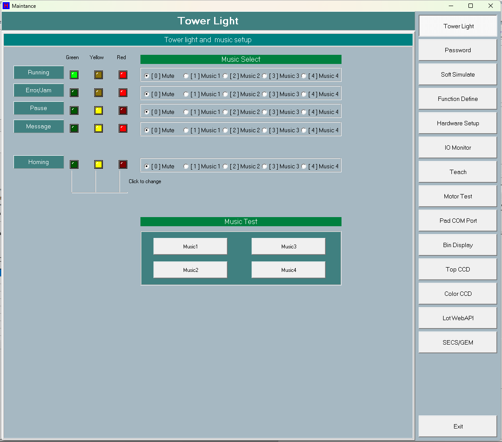

# 第 01 章　安全須知

本章說明操作 HT160S 自動分類機前必須了解的安全規則、機台警告標誌的意義，以及機台本身提供的安全防護功能（急停 EMG、安全門互鎖、三色塔燈與蜂鳴器、防碰撞互鎖等）。請所有操作員、維護人員在接觸機台前詳閱本章。

> ⚠️ 注意：本章前半段「一般安全規則」為操作機械設備的通用安全須知；後半段「HT160S 安全防護功能」則是本機台軟硬體實際提供的保護機制。兩者請分開理解，勿混為一談。

---

## 1.1 一般安全規則

以下為操作自動化設備的通用安全守則，適用於 HT160S：

1. 僅限受過訓練、了解本機台運作的人員操作。
2. 機台運轉中，請勿將手、工具或任何身體部位伸入機構動作範圍（吸嘴、SortArm、TrayArm、Loader 搬運軌道等）。
3. 進行教導（Teach）、馬達測試（Motor Test）、IO 監看（IO Monitor）等維護動作前，務必確認機台未在運轉狀態。
4. 排除卡料、清潔或更換零件前，請先停機，必要時切斷主電源（斷路器）。
5. 不可短接、拆除或繞過任何安全門感測器、急停按鈕或限位開關。
6. 發現異音、異常震動、警報或塔燈/蜂鳴器示警時，立即停機並通知維護人員。
7. 保持機台周邊整潔，搬運通道（含兩台 Loader 共軌區）淨空。

> ⚠️ 注意：HT160S 的防碰撞互鎖在實機（含 DUMMY 模式）一律生效，但任何軟體互鎖都不能取代人員的安全意識。請務必在停機且確認動力源已隔離後，才將身體伸入機構範圍。

---

## 1.2 警告標誌

> 【待補：機台外殼上各警告標籤（如高壓、夾傷、移動部位、雷射/CCD 等）的圖示、位置與文字內容。SPEC 來源未涵蓋實體標籤資訊，需現場拍照與量測補齊。】

---

## 1.3 三色塔燈與蜂鳴器

HT160S 以機台頂部的三色塔燈（綠 / 黃 / 紅）搭配蜂鳴器，向操作員顯示目前的運轉與故障狀態。塔燈與蜂鳴器的對應狀態由執行端 `DoSystemMessage` 即時驅動，燈色組合與音樂則於維護畫面的 Tower Light 分頁設定。

> 圖 1-1 三色塔燈與蜂鳴器狀態示意。（擷取方式：主畫面（fMain）運轉時觀察機台頂部塔燈；燈色/音樂組態於 Maintenance → Tower Light 分頁設定。）

### 1.3.1 主畫面狀態與燈號對應

主畫面狀態列由 `ProcessRunStatus` 設定，並對應紅 / 綠 / 黃燈。常見狀態如下：

| 狀態列顯示 | 意義 | 燈號傾向 |
| --- | --- | --- |
| INIT | 程式初始化中 | 待機 |
| HOMING | 回原點中 | 黃 |
| RUNNING | 生產運轉中 | 綠 |
| PAUSE | 暫停 | 黃 |
| Clean Out | 清機中 | — |
| One Cycle | 單循環 | — |
| Tray Feed | 送盤 | — |
| HALT | 停止 | — |
| LOCK | SafeLock 鎖定 | — |
| EMG | 急停被按下 | 紅 |
| MOTOR OFF | 馬達電源關閉 | 紅 |
| SAFE DOOR | 安全門開啟 | 紅 |
| AIR | 氣壓異常 | 紅 |

> 【待補：每一狀態對應的「確切」塔燈燈色組合（綠/黃/紅 ON/OFF）與蜂鳴器音樂編號。塔燈組態由維護畫面 Tower Light 的 6 列（Running / Error-Jam / Pause / Message / Homing，Reserved 列隱藏）× 3 色設定，預設值由程式給定但本 SPEC 未列出逐格預設燈色，需於實機 Maintenance → Tower Light 分頁確認。】

### 1.3.2 蜂鳴器音樂

塔燈各狀態列（Running / Error-Jam / Pause / Message / Homing）可各自選擇蜂鳴器音樂（`[0]Mute` / `[1]Music1` ～ `[4]Music4`），設定存於號誌燈 ini。實際發聲時機由執行端 `DoSystemMessage` 套用。設定與試聽方式詳見維護章節的 Tower Light 分頁。

> ⚠️ 注意：蜂鳴器響起代表機台正處於需要操作員注意的狀態（如錯誤/卡料、暫停、訊息）。聽到蜂鳴時請先確認主畫面狀態列與彈出的警示訊息，再進行處置。

---

## 1.4 HT160S 安全防護功能

HT160S 在運轉週期（背景執行緒 `TRunControl` 約每 1ms 呼叫一次 `MainProc`）中持續以 `ScanAllMotorStatus` 與 `ScanSystemSenser` 監控安全感測器與伺服狀態。一旦偵測到故障，會放下運轉旗標 `SystemStart`，並依「**絕不無聲停機**」鐵則彈出警示視窗，而非靜悄悄停下。

### 1.4.1 安全互鎖一覽

| 防護項目 | 觸發條件（訊號） | 動作 |
| --- | --- | --- |
| 安全門互鎖 | 安全門開啟 `IsSafeDoorOpen`（`SnSafeDoorFront/Right/Left/SlideRight/SlideLeft/Auto6` 任一 Off） | 運轉中 `StopAllMotor` + 彈 `Safety Door Open`（K_RETRY）+ `SystemStart=false` |
| 急停 EMG | 急停按下 `IsEMGPressed`（`SnEMG/_1.._4` 任一） | `StopAllMotor` + `AllBreakLock`；運轉中彈 `Emergency Stop` 後 `SystemStart=false`、`fAllMotorHome=false` |
| 馬達電源關閉 | `IsSystemPowerOff`（`SnMotorPower` Off 且非上電延遲中） | `StopAllMotor` + `AllBreakLock`；運轉中彈 `Motor Power Off` 後 `SystemStart=false`、`fAllMotorHome=false` |
| 離子風扇警報 | `IsIonFanAlarm`（**僅 REALLY 模式**，含時間去抖） | `DecStopAllMotor` + 彈 `Ion Fan Alarm` + `SystemStart=false` |
| 氣壓過低 | `IsAirCheck` | `DecStopAllMotor` + 彈 `Air Pressure Low` + `SystemStart=false` |
| 伺服軸警報 | `ScanAllMotorStatus`（軸 `ReadServoAlarmOn` 且 `Led[iAlarmLed]`，且非 CW/CCW 限位） | 運轉中彈 `ShowMotorError` + `SystemStart=false` |
| SafeLock | `IsSafeLock`（`SnSafeLock`） | 狀態列顯示 LOCK；SafeLock 時 `ScanPanelKeys` 不消費面板按鍵 |

> ⚠️ 注意：離子風扇警報具時間去抖（回原點中 20000ms、穩態 5000ms、電源 settle 期間略過），且**僅在 REALLY 模式**才生效；DUMMY / HAS_TRAY 模式不檢查離子風扇。

> ⚠️ 注意：伺服軸若停在 CW/CCW 限位上，系統視為回原點過程的正常狀態（不停機）；只有真正「離開限位」的伺服警報才會停機並彈窗。電源循環期間（`bHomePowerCycling`）亦略過此判斷。

### 1.4.2 急停（EMG）

按下急停後，機台立即 `StopAllMotor` 並鎖煞車（`AllBreakLock`）。若當下在運轉中，會彈出 `Emergency Stop`（K_RETRY）警示，並清除回原點完成旗標（`fAllMotorHome=false`）與重設馬達上電延遲。

復歸步驟：
1. 排除造成急停的原因。
2. 釋放（旋起）急停按鈕。
3. 因 `fAllMotorHome` 已清除，**必須重新回原點（HOME）成功**後機台才能再次運轉。

### 1.4.3 安全門互鎖

運轉中任一安全門開啟（`SnSafeDoorFront/Right/Left/SlideRight/SlideLeft/Auto6`），機台立即 `StopAllMotor`，彈出 `Safety Door Open`（K_RETRY），並放下 `SystemStart`。

復歸步驟：
1. 確認所有安全門均已關閉。
2. 於警示視窗選擇 Retry 重新啟動。

### 1.4.4 馬達電源與上電延遲

當馬達電源關閉（`SnMotorPower` Off 且不在上電延遲中），機台 `StopAllMotor` + `AllBreakLock`，運轉中彈 `Motor Power Off`。馬達繼電器 On 後會倒數 `MotorPowerOnDelay`（`SERVER_MOTOR_POWER_ON_DELAY`）；倒數期間 `SystemStart` 強制為 false，且 `IsSystemPowerOff` 與離子風扇檢查在延遲期間略過，避免上電瞬間誤報。

> ⚠️ 注意：馬達繼電器（`SwMotorRelay`）並不會切斷伺服驅動器的控制電源（A6 的 L1C/L2C）。因此若伺服鎖存警報無法以回原點時的電源循環清除，系統會提示「請循環 MAIN 電源（斷路器）或排除驅動器故障後重新 HOME」，並將 `SystemStart=false` 中止，避免無聲重試迴圈。

### 1.4.5 回原點（HOME）防碰撞

回原點過程內建多項防撞順序，避免機構互相碰撞或拖盤：

1. 批次回 XY 軸之前，先升起 TrayArm Z 上缸並確認到位，避免撞到下方盤子。
2. 若 TrayArm 持盤，回原點過程保持夾爪閉合，避免掉盤。
3. 兩台 Loader 共用同一軌道，回原點前先放後鉤、再放前擋，避免拖盤對撞。

> ⚠️ 注意：回原點完成（case200）時若 Loader 車仍持盤（夾爪已於回原點過程開啟、盤已鬆脫），系統會彈出 `ShowMyMessage` 要求**手動移除所有 Loader L/R 盤**，按 OK 後執行 `ClearTray` 清除盤身分與 map。請依提示先取出盤子再確認。

### 1.4.6 防碰撞互鎖恆常生效原則（重要安全原則）

HT160S 的所有防碰撞 / 安全感測互鎖遵循一條鐵則：

> ⚠️ 注意：**防碰撞與安全互鎖只在「編譯期」`SOFT_SIMULATE` 旁路，絕不在「執行期」DUMMY 模式旁路。** 因為在 DUMMY 模式下，馬達與氣缸仍會實際移動，互鎖若被關掉就會發生真實碰撞。換言之：實機（無論 Real / HasTray / Dummy）一律執行互鎖；只有開發者在筆電上以 `SOFT_SIMULATE` 建置驗證時，安全感測器才回傳安全值、操作員彈窗才被編譯排除（以免 `--selftest-home` 卡住）。現場機台上的安全防護**永遠是開啟的**。

---

## 1.5 停機與恢復（安全相關摘要）

下表彙整與安全相關的停機指令與其行為（完整運轉操作見「運轉操作」章節）：

| 指令 / 動作 | 行為 |
| --- | --- |
| Pause（按鈕或面板 Pause 鍵） | `SystemStart=false` + `SoftStop=true` → 下一週期減速停止（`DecStopAllMotor`）；**保留回原點狀態**，再按 Start 可續跑 |
| MachinePause(trig) | 優雅減速：記錄 `MACHINE PAUSE`、`SystemStart=false`、`DecStopAllMotor`、`SoftStop=true` |
| MachineStop(trig) | **硬停**（用於 EMG/故障）：`SystemStart=false`、`StopAllMotor`（不減速）、`SoftStop=true` |
| Abort Home（回原點中止） | `StopAllMotor`、`fAllMotorHome=false`、`SoftStop=true`、關閉視窗；**須重新回原點成功**才能運轉 |
| MachineHomeAbort(trig) | 記錄 `MACHINE HOME-ABORT`、`DecStopAllMotor`、`SystemStart=false`、`fAllMotorHome=false`、`SoftStop=true` |

> ⚠️ 注意：經由急停、安全門、馬達電源關閉或回原點中止導致停機後，`fAllMotorHome` 會被清除，機台必須重新回原點（HOME）成功才能再次啟動生產。

---

## 1.6 安全相關警報與復歸

| 警報訊息 | 意義 | 復歸方式 |
| --- | --- | --- |
| Safety Door Open | 安全門開啟 | 關閉所有安全門後於警示視窗 Retry |
| Emergency Stop | 急停被按下 | 釋放急停、需重新回原點（`fAllMotorHome` 已清除） |
| Motor Power Off | 馬達電源關閉（非上電延遲中） | 重新上電後回原點 |
| Ion Fan Alarm | 離子風扇異常（僅 REALLY 模式，含去抖） | 確認風扇運轉後 Retry |
| Air Pressure Low | 氣壓過低 | 恢復氣壓後 Retry |
| eMotorAlarm（ShowMotorError） | 伺服軸離限位警報 | 清除驅動器故障後重新回原點 |
| Servo alarm 無法以馬達電源循環清除 | 回原點電源循環後伺服仍鎖存 ALM（繼電器不切 A6 控制電源） | 循環 MAIN 電源（斷路器）或排除驅動器故障後重新 HOME |
| Loader still holds a tray | 回原點完成時 Loader 仍持盤 | 依提示手動移除所有 Loader L/R 盤，按 OK 後 ClearTray |

> ⚠️ 注意：所有上述警報均以系統警示視窗（`ShowSystemError` / `ShowMotorError`）方式呈現，而非無聲停機。看到警示時請先閱讀訊息內容，再依復歸方式處置。

---

## 1.7 待補事項

本章下列項目因 SPEC 來源未涵蓋實體 / 現場資訊，待補齊：

- 機台外殼各警告標籤（高壓、夾傷、移動部位、雷射/CCD 等）的圖示、位置與文字。
- 各運轉/故障狀態對應的「確切」三色塔燈燈色組合與蜂鳴器音樂預設值（需於 Maintenance → Tower Light 分頁與實機確認）。
- `screenshots/tower-light.png` 截圖檔尚未產生（目前為版位）。
