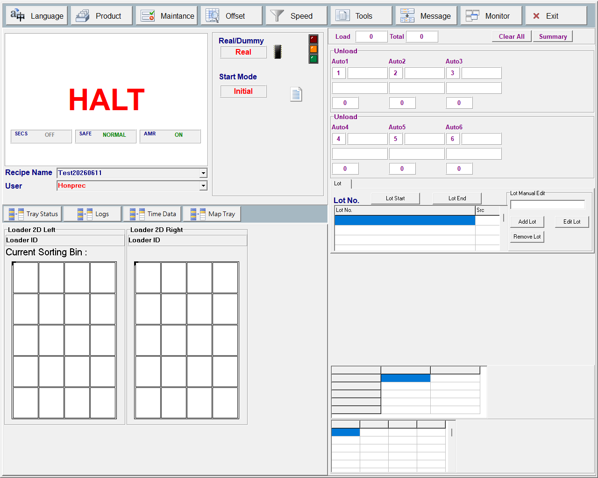

# 第 02 章　系統概觀與機構

本章為機台的整體導覽（orientation），說明 HT160S 是什麼、由哪些主要機構模組組成，以及料盤從進料到出料的整體物料流向。各模組的詳細操作、教導值與警報處理，請參閱第 14 章（各模組詳述）；本章僅做總覽，不深入單一模組。

## 2.1 HT160S 是什麼

HT160S 是一台 **料盤分類／搬運機（tray sorting / handling machine）**。它把來料盤上的每一顆 IC 透過頂部 CCD 逐格掃描（讀取每格的有無料、Bin 與 2D 條碼），依 Bin／Lot 路由規則，由分類臂（SortArm）的吸嘴逐顆吸取，放到對應的出料堆疊站（Auto1~6）；空盤則由盤臂（TrayArm）與空盤模組（Empty）負責供應與回收。整機由主畫面監看與操作，內建 SECS/GEM 與 AMR/AGV 補料／取車交握能力。


> 圖 2-1 HT160S 主畫面總覽，顯示頂部功能列、生產計數、Real/Dummy 與 Start Mode、SECS/SAFE/AMR 狀態徽章、三色塔燈與機台狀態文字。（擷取方式：開機後即進入此常駐全螢幕視窗 `fMain`；其分頁 `pgcMain` 預設停在 Main 主操作頁 `tsMain`。）

## 2.2 主要機構模組

HT160S 由以下機構模組構成。多數機構模組為「純邏輯／純控制模組」，無自身畫面，由主控迴圈逐拍驅動；其運轉狀態與計數投影到主畫面顯示。

| 模組 | 角色 |
| --- | --- |
| Loader 進料模組 | 雙側（Loader1 左／Loader2 右）來料盤的取放、頂部 CCD 掃描與索引、空盤後排排出 |
| Color 顏色模組 | 供應「身份盤（identity tray）」給後段 TrayArm（預設供盤模式），含 Color 2D CCD 讀碼 |
| Empty 空盤模組 | 從前段堆疊逐片取下空盤、搬移送入後段供 TrayArm 取走；批次結束或回收時反向上推 |
| SortArm 分類臂 + 吸嘴 | 以一排 4 個吸嘴從 Loader 來料盤逐顆吸取 IC，依 Bin/Lot 放到 Auto1~6 |
| TrayArm 盤臂 | 單軸搬運臂，從 Empty 空盤區／Loader 後方／Color 取空盤或身份盤，搬送並放到目標 Auto 後方或回收 |
| Auto1~6 出料堆疊 | 6 個出料堆疊站，把分料後滿料的盤子堆入堆疊車（output car），含 Clean Out 與 AMR 滿車交接 |
| Top CCD 頂部相機 | Loader 逐格讀 Bin/2D 條碼；Color 端讀身份盤 2D TrayID |

> ⚠️ 注意：Bin → Auto 的路由判定**不在** Auto 模組內，而是由 SortArm 依 Bin／Lot 綁定規則決定後，再把盤放入對應 Auto。

### 2.2.1 Loader 進料模組

雙側（Loader1 左 / Loader2 右）共用同一條 Loader-Y 物理導軌、共用前置疊盤機台與後排排出口。每側透過 Loader-Y 軸把盤子移到取盤位、用前置疊盤氣缸分出一盤、夾緊上料，再帶到 Top CCD 下方逐格掃描每顆 IC（讀 Bin 與 2D 條碼），把結果寫入該側盤面資料供 SortArm 取料分類。CCD 掃描完成的一側即標記為可供分類（供 SortArm 接管）；盤面全部排空後排到後方供 TrayArm 取走。

主畫面上的盤面區塊：

| 畫面項目 | 類型 | 功能 |
| --- | --- | --- |
| Loader 2D Left 盤面區 | 顯示 | 主畫面左側 Loader（Loader1）盤面區塊標題，含格點顯示與盤號/Bin 標籤 |
| Loader 2D Right 盤面區 | 顯示 | 主畫面右側 Loader（Loader2）盤面區塊標題，含格點顯示與盤號標籤 |
| 左側 Loader 盤面格點 | 表格 | 左側 Loader 盤面格點（4x5），顯示每格 IC 掃描/分類狀態（未檢查／空格／良品／錯誤碼） |
| 右側 Loader 盤面格點 | 表格 | 右側 Loader 盤面格點（4x5）狀態顯示 |

### 2.2.2 Color 顏色模組

負責供應身份盤給 TrayArm。預設為 TraySupply（供盤）模式：先在前方收/讀位置由破棧氣缸分離一片盤並夾住，透過 Color 2D CCD 讀取盤上的 2D TrayID，再用 ColorY 軸把載盤搬到後方取盤位置讓 TrayArm 夾取。實際供盤只在收到 AMR/TrayArm 真正需求時才推到輸出並讀碼，避免提前呈現身份盤。座標慣例：Y = 前/後、X = 左/右、Z = 上/下。

> ⚠️ 注意：Color 區受安裝設定控制——未在維護畫面硬體頁勾選「是否安裝 Color 輸出區」時，整個模組停用。

### 2.2.3 Empty 空盤模組

從前段堆疊以雙缸頂升/分張機構逐片取下空盤，再以斜靠 + 推送雙缸夾住料盤、搬移至放料位送入後段，供 TrayArm 取走。批次結束或需要回收時，可反向把後段料盤重新夾起、上推回前段堆疊。盤態以動作序列判定：盤子下來＝有盤，被夾走＝沒盤。

### 2.2.4 SortArm 分類臂與吸嘴

用一排 4 個吸嘴從 Loader 來料盤逐顆吸取 IC（單顆取放，每行程只取/放一顆），依路由 Bin 放到 Auto1~6（共 6 站）。橫移前先升到安全 Z 位置。

> ⚠️ 注意：分類臂 X 軸橫移前，任一啟用的吸嘴只要不在原點（Home）感應器即不准移動，避免吸嘴下伸時橫移撞料/撞框。此防撞互鎖僅模擬版略過，實機 Dummy/HasTray/Real 三種模式皆持續生效。

### 2.2.5 TrayArm 盤臂

單軸搬運臂，依派工優先序取盤搬運：1) Loader 後方滯留空盤回收；2) AMR 模式依 Auto 需求堆疊 identity/cover/normal 盤；3) Normal 模式從 Empty 空盤區 → Auto 補空盤。取盤來源依工作別不同：Loader 後方、Color（取 identity 盤）、或 Empty 空盤區後方。

> ⚠️ 注意：盤臂 X 軸橫移前，Z 升降氣缸須在上位才准橫移，避免頭/盤在低位時橫掃撞站。同樣僅模擬版略過，實機三模式皆生效。

### 2.2.6 Auto1~6 出料堆疊模組

管理 6 個出料堆疊站。每站把盤子在「後方接收位」、「作業位」與「堆疊車（output car）」之間搬移：TrayArm 把空盤（或 AMR 模式的 identity/cover/normal 盤）放到後方，以氣缸把盤夾入並帶到作業位供 SortArm 放 IC，盤子滿料後再以氣缸把盤堆入堆疊車。同時負責整機 Clean Out 清盤與 AMR/AGV 滿車交接握手，並輸出每站工作盤的 2D TrayID 與計數供主畫面 Unload 區顯示。

主畫面下料資訊面板：

| 畫面項目 | 類型 | 功能 |
| --- | --- | --- |
| 下料 Auto1~6 即時資訊面板 | 表格 | 下料 Auto1~6 即時資訊（Bin / Lot / ID / Cnt） |

## 2.3 整體物料流向

料盤的整體流程如下（以 ASCII 流向圖呈現）：

```
                      [ 來料堆疊 (input stack) ]
                                |
                                v
      +-----------------------------------------------+
      |  Loader (Loader1 左 / Loader2 右, 共用 Y 導軌)  |
      |   1. 前置疊盤分出一盤 -> 夾緊上料               |
      |   2. Top CCD 逐格掃描 (Bin + 2D 條碼)          |
      |   3. 2D 反查 Lot/Bin, 寫入盤面資料             |
      +-----------------------------------------------+
                                |  (掃描完成)
                                v
            +-----------------------------------+
            |  SortArm (4 吸嘴, 逐顆單取)         |
            |   依路由 Bin/Lot 對應 Auto          |
            +-----------------------------------+
                                |
                                v
       +--------------------------------------------------+
       |   Auto1   Auto2   Auto3   Auto4   Auto5   Auto6   |
       |   (依 Bin/Lot 分流, 作業位收 IC -> 滿盤堆入車)      |
       +--------------------------------------------------+
                                |  (滿料)
                                v
                    [ 堆疊車 output car -> 滿車交接 ]

   空盤供應路徑:
   [ Empty 空盤堆疊 ] --取盤/送料--> 後段 --> TrayArm --> Auto 後方接收位
   [ Color 身份盤 ]  --(AMR 需求)-->  讀 2D TrayID --> TrayArm --> Auto 後方
```

整體可分為三條主線：

1. **掃描線（讀料）**：來料盤進 Loader → 前置疊盤分一盤、夾緊上料 → Top CCD 逐格掃描讀 Bin 與 2D 條碼 → 2D 反查 Lot/Bin 寫入盤面 → 標記為可供分類。
2. **分類線（搬料）**：SortArm 向 Loader 取得 Y 軸獨佔權後逐顆吸取 IC → 依路由 Bin/Lot 對到 Auto → 放到該 Auto 作業盤 → 盤滿後 Auto 模組把盤堆入堆疊車。
3. **空盤線（供盤/回收）**：Empty 從堆疊取空盤送後段，或 Color 供身份盤；TrayArm 搬到目標 Auto 後方接收位；空盤/滿盤的後送與回收由 TrayArm 與各模組交握協同。

Loader 內部運作序列：待命 → 進料 → CCD 掃描 → 可供分類 →（SortArm 接管）分類中 → 送往後方 → 排出後回待命。

## 2.4 跨模組協同與安全原則

整機運轉建立在「需求驅動」與「防撞互鎖」兩大原則上：

1. **需求驅動（just-in-time）**：Color 供盤只在真正收到需求時才推到輸出讀碼；TrayArm 按 Auto 實際需求派工；Auto 各站回報目前想要的盤種。避免提前呈現/搬運盤子。
2. **共用機構互鎖**：Loader 雙側共用 Y 導軌、共用前置疊盤機台與後排出口，故有跨側安全距離互鎖（預設 100mm）、共用疊盤機互斥、以及 SortArm 對 Loader-Y 的軸獨佔握手。
3. **防撞硬安全法則**：SortArm 全吸嘴回原點互鎖、TrayArm Z 上位互鎖，皆僅模擬版略過；實機 Dummy/HasTray/Real 三模式一律生效（因 Dummy 下馬達與氣缸仍實際運動，僅略過正確性感應器確認）。
4. **AMR/AGV 交握**：Loader/Empty/Color 提供補料 Ready/Shortage/Finish 交握（交握期間凍結前段破棧/取盤）；Auto 提供滿車交接握手（由 SECS 協調），SECS 連線時把滿車交給 AGV，離線則維持人工換車。

> ⚠️ 注意：所有等待採非阻塞設計，機台控制路徑不使用強制延遲或畫面阻塞（警報彈窗除外）。

## 2.5 運轉模式與層級設定（總覽）

下列為與整機運轉相關的關鍵設定，操作細節見後續各章。

| 設定項目 | 範圍/預設 | 說明 |
| --- | --- | --- |
| 運轉模式（Real/Dummy） | Dummy / HasTray / Real | 運轉模式，影響感測器/CCD/拍照是否走實機路徑（三層 IO 檢查層級）；於主畫面 Real/Dummy 切換框切換，僅停機可改 |
| 起動模式（Start Mode） | Initial / Continue | 起動模式：初始起動或續做；於 Start Mode 切換框切換，僅停機可改 |
| AMR 模式 | 開 / 關 | AMR/AGV 堆疊模式總開關，決定堆疊順序 identity→cover→normal、滿車服務與 AGV 握手 |
| 分流模式（Sort Mode） | Normal / By Lot+Bin / By Lot+PassFail | 分流模式：Normal（靜態 Bin→Auto 表）、By Lot+Bin（動態綁定 (Lot,Bin)→Auto）、By Lot+PassFail（動態綁定 (Lot,PASS/FAIL)→Auto，PASS/FAIL 由 Bin==Pass Bin 導出、掃描時凍結）。詳見第 15 章 |
| 2D 條碼讀取 | 開 / 關 | 是否啟用 Top CCD 2D 條碼讀取與 Bin 反查（關閉則只讀有無料的 Bin） |
| Color CCD | 開 / 關 | 關閉時 Color 跳過相機、2D 碼留空，供盤照常進行 |
| SECS/GEM | 開 / 關 | SECS/GEM 功能旗標，決定 SECS 徽章是否顯示與可點擊 |
| Loader 跨側安全距離 | 預設 100mm；停用則不限 | 兩側 Loader-Y 車跨側最小安全間隔 |

> 註：位置/教導值單位為 1/100mm（100 units/mm）；mm 與設定值換算為 ×100 / ÷100。

## 2.6 補充定案（原待補項目）

- **盤面顯示對應**：生產中盤面＝Tray Status 分頁的「Loader 2D Left / Loader 2D Right」盤面（鏡射 Loader 車道內容盤）；移動盤面＝Motion View 的左/右 Loader 移動盤面（位置取實體馬達、內容取虛擬馬達）。
- **Loader 左右對應**：Loader1 → 畫面左側「Loader 2D Left」；Loader2 → 右側「Loader 2D Right」。
- **頂部功能列文字**：Language / Product / Maintance / Offset / Speed / Tools / Message / Monitor / Exit（螢幕實際拼字即「Maintance」）。
- **盤種與滿車上限**：盤種分 Normal（工作盤，載 IC）／Identity（帶 2D TrayID 身分盤，不載 IC）／Cover（頂蓋空盤，不得載 IC）；車內慣例第一片為 identity、第二片為 cover、其餘為 normal；每車最多 100 片盤。
- **IO 點位對照**：各模組氣缸/感測器位址見附錄 B。畫面顯示名稱由程式以「前綴＋Alias」慣例產生；最終位址以機台實際設定為準。
