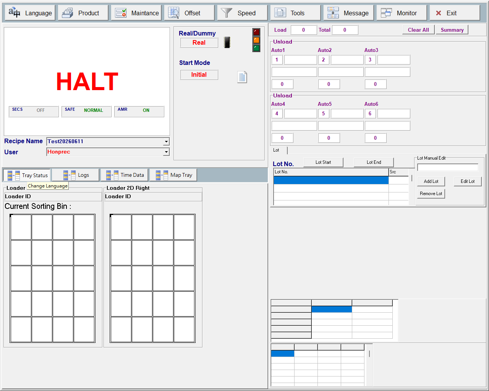
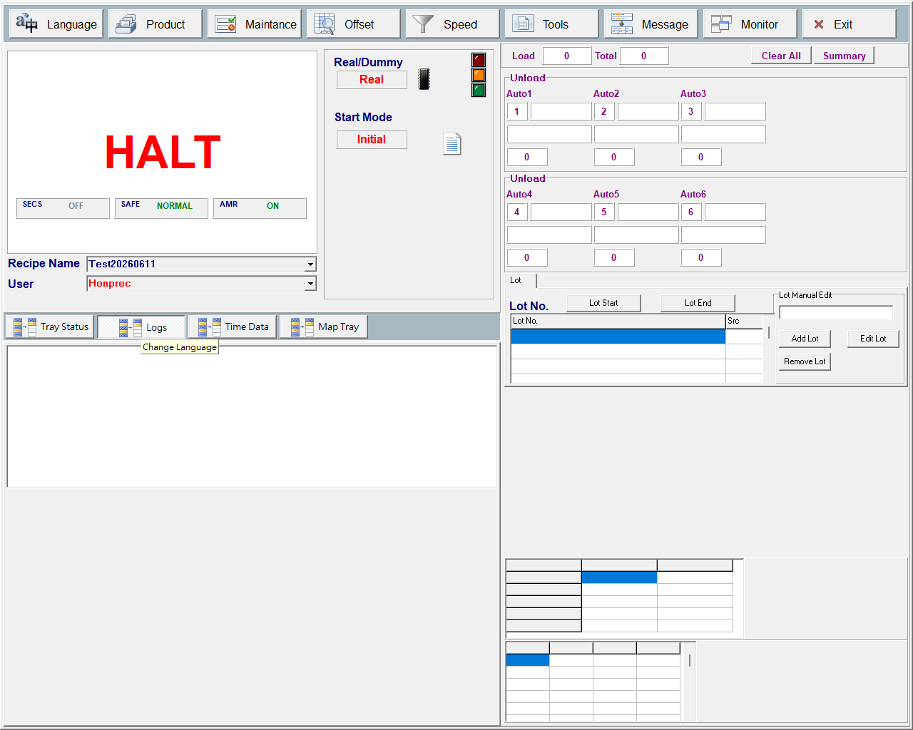
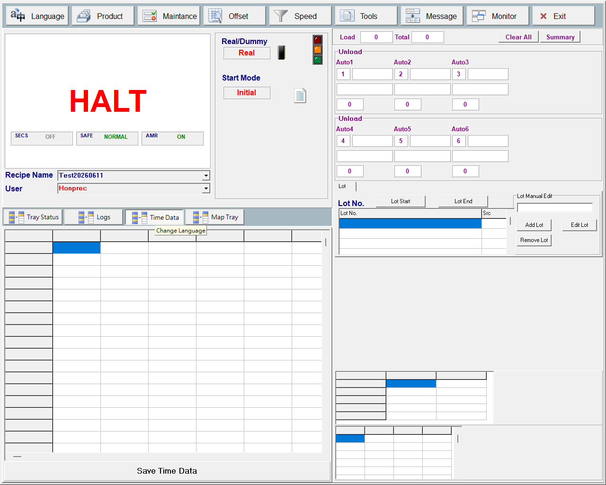
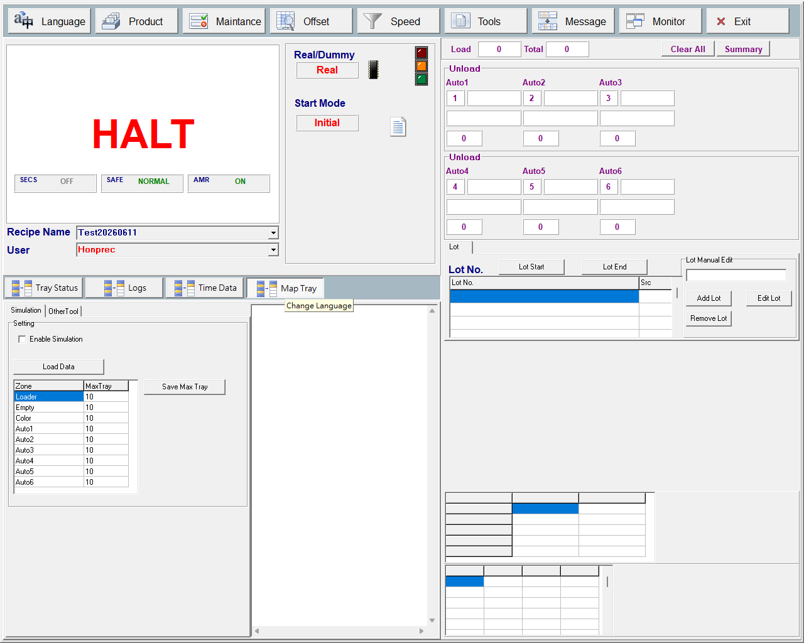

# 第 04 章　主畫面詳解

HT160S 開機後常駐於最上層的全螢幕視窗為主畫面（`TfMain` / `fMain`）。本章逐一說明主畫面下方分頁區（`pgcLog`）的六個操作分頁：Main、Lot、Tray Status、Logs、Time Data、Map Tray，並完整記錄生產計數區（Total / Fail / Summary 與 Unload Auto1~6）、Recipe Name 與 User 欄位的內容與操作方式。

> 說明：主畫面最外層另有一個 `pgcMain` 分頁，將整個畫面切分為「Main 主操作頁（`tsMain`）」與「MonitorView 監看頁（`tsMonitorView`）」。MonitorView 的運轉控制（Home / Start / Pause / One Cycle / Clean Out）與即時監看分頁（Motion / Motor / Record / Other）屬運轉操作範疇，本章僅在生產計數與按鈕關聯處提及，詳細操作另見運轉相關章節。本章聚焦於 `pgcLog` 下的六個資訊／設定分頁與計數欄位。

---

## 4.1 Main 分頁

Main 分頁是 HT160S 的主操作頁面，集中了頂部功能列、生產計數區、Recipe Name 與 User 選擇、Real/Dummy 與 Start Mode 切換、SECS/SAFE/AMR 狀態徽章，以及三色塔燈與機台狀態文字。

> 圖 4-1 Main 主操作分頁。（擷取方式：開機進入主畫面後，預設即停在此分頁。）

### 4.1.1 頂部功能列

頂部功能列為一排速度按鈕（speed-button），用於開啟各設定／工具子畫面或切換監看頁。

| 控制項 | 類型 | 功能 |
|---|---|---|
| `sbLaguage` | button | 開啟語言設定畫面 `fLan`（`ShowTopForm`）。提示文字為 Change Language。 |
| `sbProduct` | button | 開啟產品／配方設定畫面 `fSetup`（`ShowTopForm`）。 |
| `sbMaintance` | button | 開啟維護畫面 `fMaintenance`（`ShowTopForm`）。 |
| `sbOffset` | button | 開啟 Offset 偏移補正畫面 `fOffset`（`ShowTopForm`）。 |
| `sbSpeed` | button | 開啟速度設定畫面 `fSpeed`（`ShowTopForm`）。 |
| `sbTool` | button | 開啟系統工具畫面 `FormSysTools`（`ShowTopForm`）。 |
| `sbMessage` | button | 開啟訊息／警報視窗 `fNote`（`ShowTopForm`）。 |
| `sbMonitor` | button | 切換 `pgcMain` 至 MonitorView 監看分頁（`tsMonitorView`）。 |
| `sbExit` | button | 關閉主視窗（`Close()`）離開程式；`FormClose` 會先終止 `MyThread` 工作緒並釋放 Alarm 物件。 |

> 【待補：頂部功能列各速度按鈕（Language / Maintance / Offset / Speed / Tools / Message / Monitor / Exit）多採點陣圖示，且 DFM 內 Hint 統一為 Change Language，實際螢幕標籤以圖示呈現；標籤名稱依處理函式語意推得，確切圖示文字未在 DFM 文字屬性中，待現場截圖確認。】

### 4.1.2 Recipe Name 與 User 欄位

| 控制項 | 類型 | 功能 |
|---|---|---|
| `cb_WorkFile` | combobox | 選擇／顯示目前配方名稱（標籤 `lbl_WorkFile` = Recipe Name）。`OnChange`：空白、不存在或運轉中則還原並提示；有效則 `SetCurrentRecipeName`、存檔、重載 TrayForm 與各子畫面（Setup / Teach / Maintenance / Offset）的 WorkFile、刷新 Monitor 格線、`RecordProcess(Change Recipe...)`、`EventReport(RecipeChange)`。`OnDropDown` 會重整清單。 |
| `cbbUserSelect` | combobox | 切換操作者權限等級（`UserRoleManager`），標籤 `lblUserSelect` = User，選項 Operation / Supervisor / Engineer / Honprec。Operation 直接降權；其餘等級在 SOFT_SIMULATE 下強制切換，真機則提示尚未支援密碼登入並還原。變更成功 `RecordProcess(Change User...)`、`EventReport(ChangeUser)`。 |

> ⚠️ 注意：Recipe Name（`cb_WorkFile`）在運轉中不可變更（提示「Can not change recipe while machine is running.」）；請先停機再變更配方。

> ⚠️ 注意：真機（非 SOFT_SIMULATE）切換非 Operation 權限會被擋下（提示「User password login is not available yet.」）並還原為 Operation；此功能待後續實作。

### 4.1.3 生產計數區

生產計數區顯示上料、總下料與不良計數，並提供清除與彙總按鈕。

| 控制項 | 類型 | 功能 |
|---|---|---|
| `Label1` / `palloadingCount` | label | 上料計數標籤（Load）與數值面板，預設 0。 |
| `lblUnloadingCount` / `palUnloadingCount` | label | 總下料計數標籤（Total）與數值面板。 |
| `lblloseCnt` / `palloseCnt` | label | 不良／遺失計數標籤（Fail）；`lblloseCnt` 的 DFM `Visible=False`，目前隱藏。 |
| `btnClearCount` | button | 清除計數按鈕（Clear All）。 |
| `sbPaperSummary` | button | 產量彙總按鈕（Summary）。 |
| `UPH_StringGrid` | grid | 主畫面 UPH／產能統計表格（顯示用）。 |

> 【待補：`btnClearCount`（Clear All）與 `sbPaperSummary`（Summary）在 main.dfm 中未綁定 `OnClick`，main.h 亦無對應處理函式宣告，實際功能／是否啟用待現場確認（疑為待接線或保留按鈕）。】

> 【待補：Fail 計數標籤 `lblloseCnt` 的 DFM `Visible=False`，目前隱藏不顯示。】

#### Unload Auto1~6 下料即時資訊

主畫面以六組面板顯示下料 Auto1~Auto6 的即時資訊，由 `ShowUnloadAutoInfo` 每框更新。

| 控制項 | 類型 | 功能 |
|---|---|---|
| `palAuto01..06` Bin/ID/Cnt 與 `plLotNumberAuto1..6` | grid | Unload Auto1~Auto6 即時資訊（Bin / Lot / ID / Cnt）。Bin：LotBin 模式取 `LotBinBinding` 綁定，否則 `BinAreaMap.GetBinByArea`；Lot：Lot 號；ID：目前工作 Tray ID（`AutoModule->GetWorkingTrayID`）；Cnt：IC 計數（`tRunData.TrayICCnt`）。 |

### 4.1.4 Real/Dummy 與 Start Mode 切換

| 控制項 | 類型 | 功能 |
|---|---|---|
| `pnRealDummy` | button | 點擊循環切換 `iRealDummy`（DUMMY → HAS_TRAY → REALLY → 回 DUMMY）。更新圖示／文字（`LoadRunModePicture`）、寫入 ini、`RecordProcess`、`EventReport(RealDummy)`。Caption 對應 Dummy / HasTray / Real。 |
| `sbRealIcon` | button | 與 `pnRealDummy` 共用 `OnClick`（`pnRealDummyClick`）；依 `iRealDummy` 載入 `picture\status\real.bmp` 或 `dummy.bmp`。 |
| `lblRunMode` | label | `pnlSetting` 區塊標題標籤（Real/Dummy）。 |
| `pnStartMode` | button | 點擊切換 `iStartMode`（0=Initial 初始起動 ↔ 1=Continue 續做）。更新圖示／文字（`LoadStartModePicture`）、寫 ini、`RecordProcess(Change Initial/Continue Mode)`。 |
| `sbStartIcon` | button | 與 `pnStartMode` 共用 `OnClick`（`pnStartModeClick`）；依 `iStartMode` 載入 `initial.bmp` 或 `continue.bmp`。 |
| `lbStartMode` | label | Start Mode 區塊標題標籤。 |

> ⚠️ 注意：Real/Dummy（`pnRealDummy`）與 Start Mode（`pnStartMode`）僅在 `HSys.Sys.SystemStart==false`（停機）時可變更；運轉中點擊直接 return。

### 4.1.5 狀態徽章與三色塔燈

| 控制項 | 類型 | 功能 |
|---|---|---|
| `pnlFeatureBadge1`（`lblFeatureName1`/`lblFeatureValue1`） | led | SECS/GEM 連線狀態徽章。`UpdateSecsFeatureBadge` 依 HSMS 狀態設 OFF(灰) / CONNECT(橄欖) / ONLINE(綠)；僅在 `bUseSecsGem` 啟用時可見並可點擊開啟 SECS/GEM Log 視窗（`FeatureBadgeSecsClick`）。 |
| `pnlFeatureBadge2`（`lblFeatureName2`/`lblFeatureValue2`） | led | 安全門／安全狀態徽章，預設 NORMAL(綠)，名稱固定 SAFE。 |
| `pnlFeatureBadge3`（`lblFeatureName3`/`lblFeatureValue3`） | led | AMR/AGV 模式徽章。`UpdateAmrFeatureBadge` 依 `GeneralSetting.bUseAMR` 顯示 ON(綠) / OFF(灰)。 |
| `pnlLight`（`ledRed`/`ledYellow`/`ledGreen`） | led | 三色塔燈，鏡射實體塔燈；由 `DoSystemMessage` 依 `GetTowerLightRunState`/Config 設定 Value，同時驅動 `SwTowerRed`/`Yellow`/`Green` 與蜂鳴器。 |
| `palMainStatus` | label | 機台狀態文字與顏色，由 `SetMainStatus` 設定；狀態值見 `ProcessRunStatus`（HALT / INIT / HOMING / RUNNING / Clean Out / Tray Feed / One Cycle / LOCK / EMG / MOTOR OFF / SAFE DOOR / AIR / PAUSE）。 |

機台狀態文字（`palMainStatus`）為即時顯示，非彈窗，依下列邏輯設定：

- 程式未啟動 = INIT
- `SystemStart` 且未歸原 = HOMING（綠）
- `Run_CleanOut` = Clean Out（黃）；`Run_TrayFeed` = Tray Feed（黃）；`Run_OneCycle` = One Cycle（黃）；其餘運轉中 = RUNNING（綠）
- 停機時依序判定：`IsSafeLock`=LOCK、`IsEMGPressed`=EMG、`IsSystemPowerOff`=MOTOR OFF、`IsSafeDoorOpen`=SAFE DOOR、`IsAirCheck`=AIR、`HasICUnderMachine`=PAUSE，預設 HALT

> ⚠️ 注意：LOCK / EMG / MOTOR OFF / SAFE DOOR / AIR 等狀態為安全／電源／氣壓條件的顯示結果；排除對應條件後狀態會自行恢復。

> 【待補：`palMainStatus_En`（英文狀態面板）DFM `Visible=False`，目前隱藏不顯示。】

> 【待補：SECS 徽章狀態碼（0/1/2）對應的實際 HSMS 連線語意（OFF/CONNECT/ONLINE）來源在 SECS 引擎，本畫面僅做顯示對應。】

### 4.1.6 開始生產（Start）操作步驟

1. 於 Main 分頁確認 Real/Dummy 與 Start Mode（點 `pnRealDummy` / `pnStartMode` 切換，需停機狀態）。
2. 在 Recipe Name（`cb_WorkFile`）選好配方。
3. 於 Lot 分頁輸入 Lot No.（`edLotNo`）並用 Add Lot / Lot Start 建立 Lot 與載入 2D/Bin 資料（見 4.2 節）。
4. 切到 MonitorView 頁，按 Start（`sbStart1`）。
5. 系統檢查 LotID 與 Lot/2D 資料（`CheckLotDataReady`）；若未歸原會先進入 Home 並於完成後自動接續生產（`bHomeByStart=true`）。

> ⚠️ 注意：未輸入 Lot 或無 2D/Bin 資料會跳出提示並中止；運轉中無法更改 Recipe。Start 與 One Cycle 必須通過 `CheckLotDataReady`：LotID 不可空、`LotRegistry` 至少一筆 Lot 且至少一筆 2D/Bin 記錄。

---

## 4.2 Lot 分頁

Lot 分頁（`tsLotInfo`）用於管理生產批次（Lot），包含 Lot 編號輸入、Lot 清單、手動新增／編輯／移除，以及產品資訊表格。透過 Main 分頁的 log-menu 按鈕切換至此分頁。

> 圖 4-2 Lot 分頁。（擷取方式：於主畫面下方 log-menu 點選對應按鈕切換至 Lot 分頁。）

| 控制項 | 類型 | 功能 |
|---|---|---|
| `edLotNo` / `lblLotNo` | edit | Lot 編號輸入框（Lot No.）；為 Start / One Cycle 的必要條件（空白則 `CheckLotDataReady` 擋下並提示 Please Enter LotID）。 |
| `sgLotList` / `lblLotListHint` | grid | 手動 Lot 清單；雙擊列（`sgLotListDblClick`）顯示該 Lot 的 2D 明細（`ShowLotDetail`）。提示：Tip: double-click a lot row to view its 2D detail. |
| `btnAddLot` | button | 在 Lot Manual Edit 群組內新增 Lot 清單列（Add Lot）。 |
| `btnEditLot` | button | 編輯 Lot 清單列（Edit Lot）。 |
| `btnRemoveLot` | button | 移除 Lot 清單列（Remove Lot）。 |
| `btnLotStart` | button | 將清單 Lot 推入 `LotRegistry`（offline 來源），清除 `LotBinBinding` 動態綁定並存檔，設 `MachineRun.bRunning=true`、記錄作用中 Lot 數，啟動分類工單。 |
| `btnLotEnd` | button | 結束目前 Lot 工單（`btnLotEndClick`）。 |
| `sgProductInfo` | grid | 產品資訊表格（顯示用）。 |

### 4.2.1 建立 Lot 工單操作步驟

1. 於 `edLotNo` 輸入有效 Lot 編號。
2. 按 Add Lot（`btnAddLot`）將該 Lot 加入清單；必要時用 Edit Lot / Remove Lot 修改清單。
3. 按 Lot Start（`btnLotStart`）將清單 Lot 推入 `LotRegistry` 並啟動分類工單。
4. 如需查看某 Lot 的 2D 明細，雙擊清單列。
5. 工單結束時按 Lot End（`btnLotEnd`）。

> ⚠️ 注意：Lot Start 時清單為空會提示「Please add at least one Lot to the list !」；請先用 Add Lot 加入 Lot。

---

## 4.3 Tray Status 分頁

Tray Status 分頁（`tsTrayStatus`）以視覺化方式呈現各區盤位狀態，包含 Loader 左右側與分類／工作區的盤位排版。由 Main 分頁的 `spbTrayStatus` 速度按鈕切換（`pgcLog->ActivePage = tsTrayStatus`）。

> 圖 4-3 Tray Status 分頁。（擷取方式：於主畫面下方 log-menu 點選 `spbTrayStatus` 按鈕切換至此分頁。）

本分頁含 `grpLoaderR` / `grpLoaderL`（Loader 右／左側群組）與 `mtSortRecv` / `mtWorkArea`（分類接收／工作區）等盤位面板，屬視覺化盤位顯示。

> 【待補：Tray Status 分頁（`grpLoaderR`/`grpLoaderL`、`mtSortRecv`/`mtWorkArea`）大量 `TMyTray`/Panel 排版屬視覺化盤位呈現，其細部對應機構需另行對照 motion-view 文件。】

> 【待補：`spbTrayStatus` 按鈕在 DFM 內 Hint 為 Change Language，實際按鈕圖示／文字待現場螢幕截圖確認；其 `OnClick` 已確認切換至 `tsTrayStatus`。】

---

## 4.4 Logs 分頁

Logs 分頁（`tsLogs`）顯示系統日誌清單。由 Main 分頁的 `apbLogs` 速度按鈕切換（`pgcLog->ActivePage = tsLogs`）。

> 圖 4-4 Logs 分頁。（擷取方式：於主畫面下方 log-menu 點選 `apbLogs` 按鈕切換至此分頁。）

| 控制項 | 類型 | 功能 |
|---|---|---|
| `lstLog` | grid | 日誌列表（`TListBox`）。 |

> 【待補：`apbLogs` 按鈕在 DFM 內 Hint 為 Change Language，實際按鈕圖示／文字待現場螢幕截圖確認；其 `OnClick` 已確認切換至 `tsLogs`。】

---

## 4.5 Time Data 分頁

Time Data 分頁（`tsTimeData`）顯示時間統計表格並提供儲存。由 Main 分頁的 `sbTimeData` 速度按鈕切換（`pgcLog->ActivePage = tsTimeData`）。

> 圖 4-5 Time Data 分頁。（擷取方式：於主畫面下方 log-menu 點選 `sbTimeData` 按鈕切換至此分頁。）

| 控制項 | 類型 | 功能 |
|---|---|---|
| `sgTimeData` / `btSaveTimeData` | grid | 時間資料統計表格與存檔面板。 |

> 【待補：`sbTimeData` 按鈕在 DFM 內 Hint 為 Change Language，實際按鈕圖示／文字待現場螢幕截圖確認；其 `OnClick` 已確認切換至 `tsTimeData`。】

---

## 4.6 Map Tray 分頁

Map Tray 分頁（`tsMapTray`）以文字方式顯示盤位配置圖。由 Main 分頁的 `btnTrayMap` 速度按鈕切換（`pgcLog->ActivePage = tsMapTray`）。

> 圖 4-6 Map Tray 分頁。（擷取方式：於主畫面下方 log-menu 點選 `btnTrayMap` 按鈕切換至此分頁。）

| 控制項 | 類型 | 功能 |
|---|---|---|
| `Memo1` | edit | Tray 配置圖文字顯示。 |

> 【待補：`btnTrayMap` 按鈕在 DFM 內 Hint 為 Change Language，實際按鈕圖示／文字待現場螢幕截圖確認；其 `OnClick` 已確認切換至 `tsMapTray`。】

---

## 4.7 補充：相關設定參數

下表整理本章畫面所涉及的設定參數，供查閱。

| 參數 | 範圍/預設 | 說明 |
|---|---|---|
| `iRealDummy` | DUMMY / HAS_TRAY / REALLY | 運轉模式，影響三層 IO／感測檢查層級；由 `pnRealDummy` 循環切換並存 ini。 |
| `iStartMode` | 0=Initial / 1=Continue | 起動模式（初始起動 / 續做）；由 `pnStartMode` 切換並存 ini。 |
| Recipe Name（`RecipeManager` 目前配方） | 配方清單中存在的名稱 | 由 `cb_WorkFile` 選擇的作業配方名稱，變更後重載 Tray 幾何與各子畫面。 |
| User Role（`UserRoleManager`） | Operation / Supervisor / Engineer / Honprec | 操作者權限等級，由 `cbbUserSelect` 選擇。 |
| `GeneralSetting.bUseAMR` | true / false | AMR/AGV 模式啟用旗標，驅動 AMR 徽章 ON/OFF（此畫面唯讀顯示）。 |
| `CosFunction.bUseSecsGem` | true / false | SECS/GEM 付費功能旗標，決定 SECS 徽章是否顯示與可點擊（此畫面唯讀）。 |

> 說明：模擬相關參數（`tSimuData.bRunSimulation`、`GeneralSetting.iSimAmrMaxTray[9]`）及其控制項（`cbEnableSimulation`、`btnLoadSimuData`、`sgSimMaxTray`/`btnSaveSimMax`）位於 Simulation 分頁，屬模擬／測試用途，將於模擬相關章節說明。

---

## 4.8 主畫面常見提示訊息

| 訊息 | 含義 | 排除方式 |
|---|---|---|
| Please Enter LotID ! | 啟動前未輸入 Lot 編號 | 於 Lot No.（`edLotNo`）輸入有效 Lot 編號 |
| No Lot data : add at least one Lot before Start ! | `LotRegistry` 無任何 Lot | 先 Add Lot / Lot Start 建立 Lot |
| Recipe name cannot be empty. | Recipe Name 下拉留空 | 還原為目前配方；請選擇有效配方 |
| Can not change recipe while machine is running. | 運轉中嘗試變更配方 | 先停機再變更 |
| Recipe does not exist. | 輸入的配方名稱不存在 | 選擇清單中既有配方 |
| One Cycle is only allowed in Normal / Clean Out mode. | 非 Normal/Clean Out 模式下按 One Cycle | 切回 Normal/Clean Out 模式再執行 |
| State Record snapshot failed (check 7-Zip / disk). | 手動快照打包失敗 | 檢查 7-Zip 是否安裝、磁碟空間／路徑 `D:\HT160S_StateRecord\` |
| User password login is not available yet. | 真機切換非 Operation 權限尚未支援密碼登入 | 維持 Operation 等級（功能待實作） |
| Please add at least one Lot to the list ! | Lot Start 時清單為空 | 先用 Add Lot 加入 Lot |
