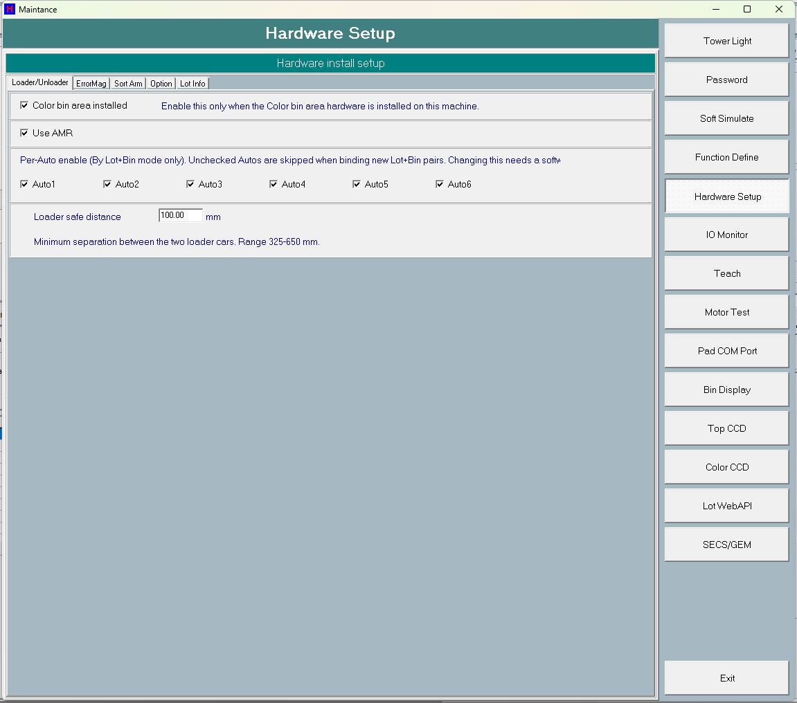
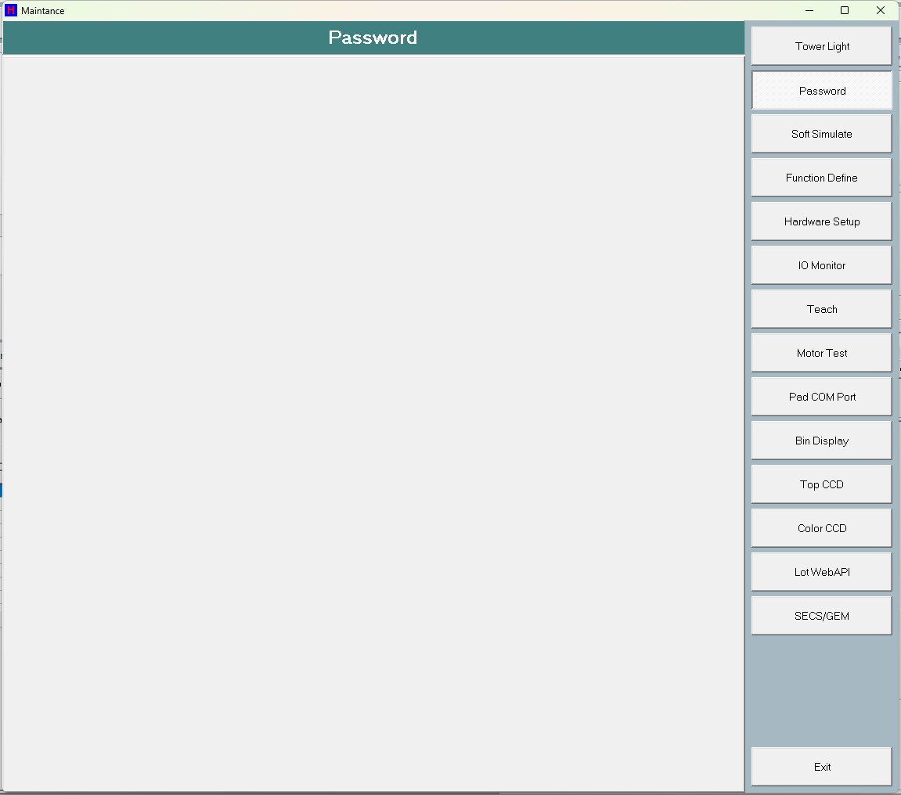
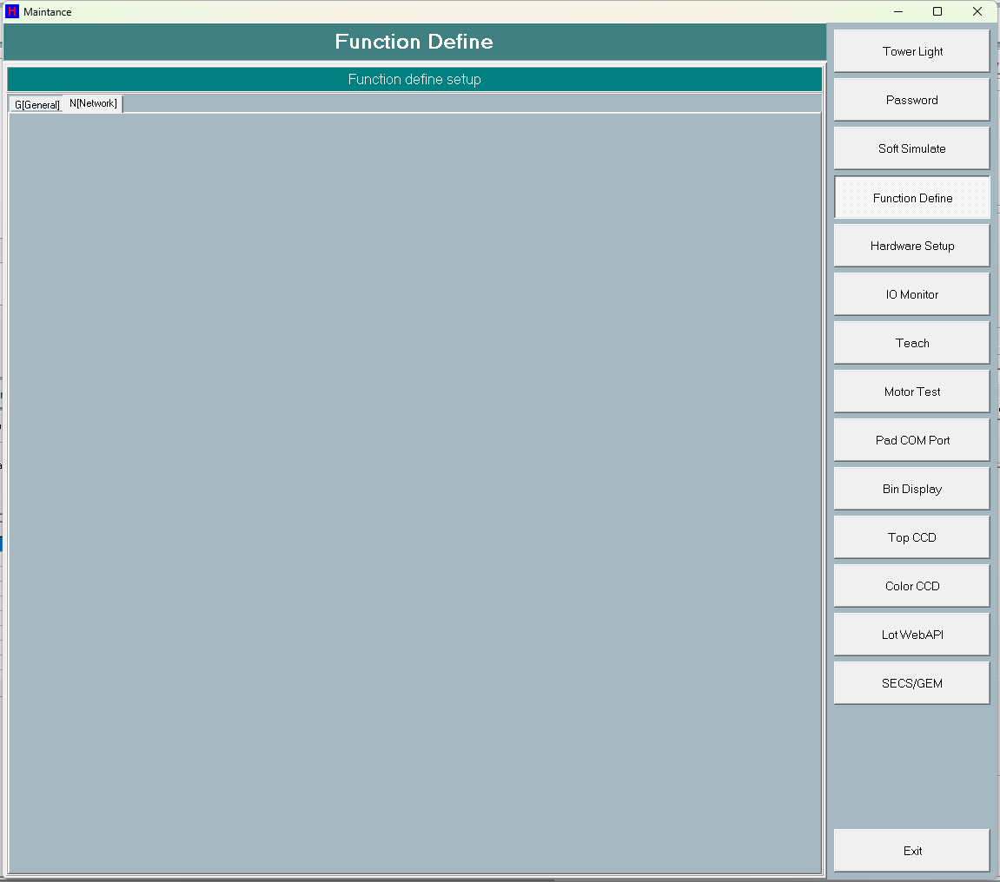
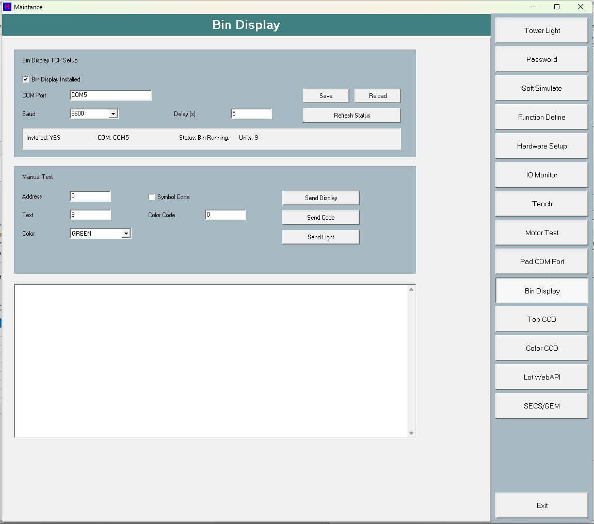
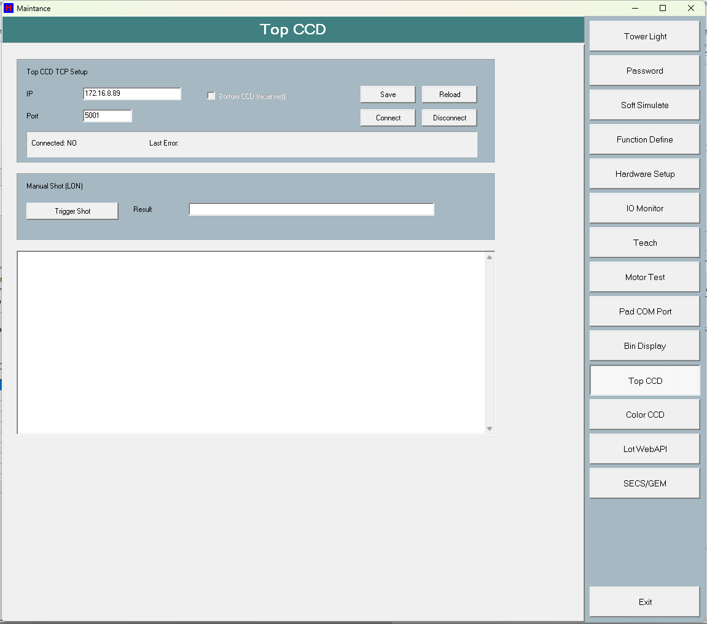
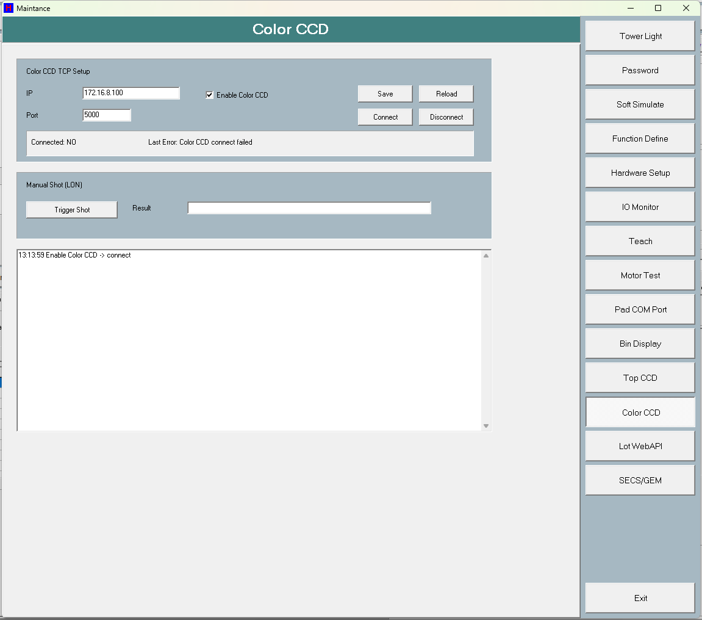
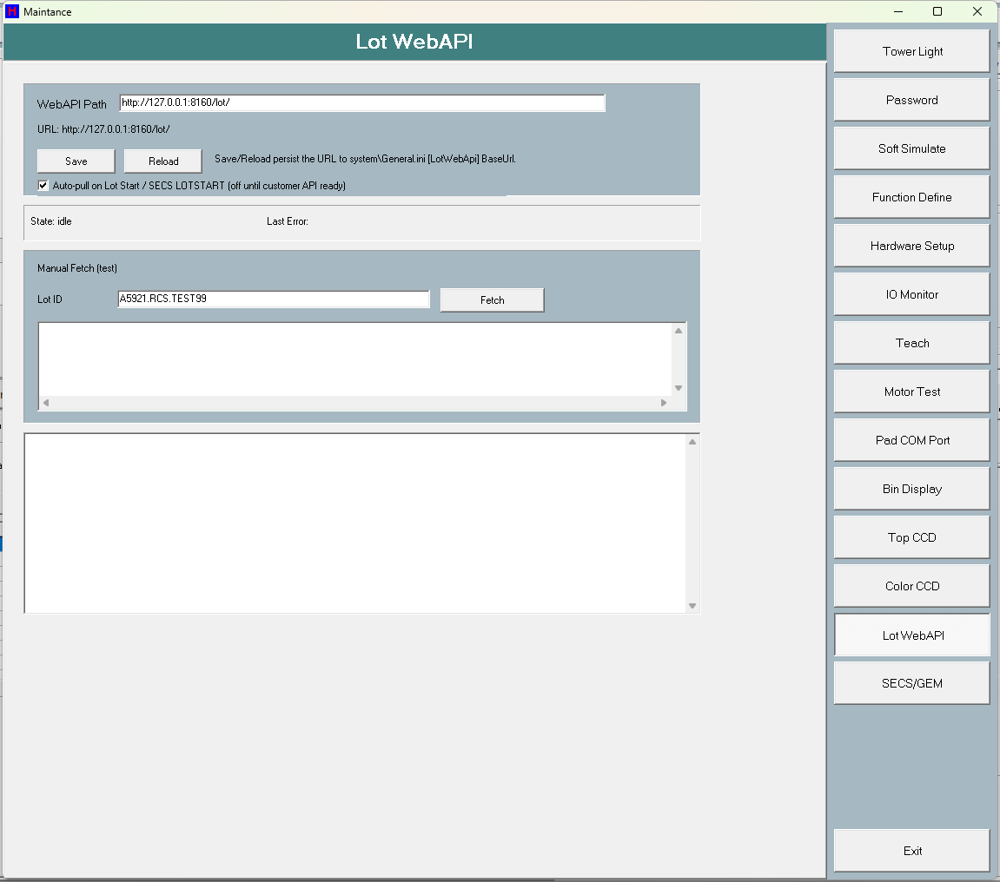
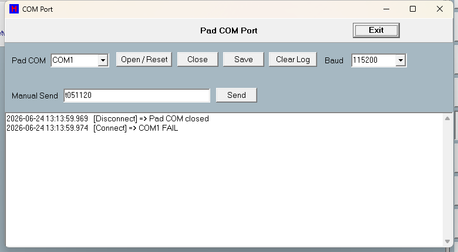

# 第 05 章　維護畫面 (Maintenance)

維護畫面 (TfMaintenance) 是 HT160S 工程與維護用的總畫面。版面分為兩區：右側為功能選單列（按鈕由上而下切換各功能），左側為對應的分頁內容區。本畫面集中提供：號誌燈 (Tower Light) 與蜂鳴器音樂設定、硬體安裝設定、Bin Display (COM) 設定與手動測試、Top CCD / Color CCD / Lot WebAPI 連線與測試，以及開啟 IO 監看、Teach、Motor Test、Pad COM Port、SECS/GEM 等子畫面。

存檔行為分為兩類，務必區分：

- **即時套用**：部分設定（吸嘴啟用、Color CCD Enable、Loader 安全距離、Color bin / AMR 勾選等）按下後立即寫入記憶體設定，部分並立即 `Save()`。
- **關閉時存檔**：多數號誌燈與硬體設定在按 **Exit** 關閉畫面時，由 `FormClose -> SaveWorkFile` 一併寫入號誌燈 ini 或 `system\General.ini`。
- **需重新啟動軟體**：分類模式 (Sort By Lot+Bin)、各 Auto 啟用變更後雖會即時寫入設定，但需重新啟動軟體才會乾淨生效（畫面會跳提示）。

> 圖 5-1 維護畫面 (Maintenance)。（擷取方式：於主畫面進入維護/工具入口開啟 TfMaintenance；預設顯示第 0 頁。）

---

## 5.1 功能選單列

右側選單列的按鈕，依其 Action 分為「切換分頁」與「開啟子畫面」兩種。子畫面類（IO / Teach / Motor Test / Pad COM）以 ShowModal 開啟，且機台運轉時被停用。

| 控制項 | 類型 | 功能 |
| --- | --- | --- |
| spbMaintTowerLight | button | 切換到號誌燈與音樂設定分頁 (tsMaintTowerLight) |
| spbMaintPassword | button | 切換到密碼分頁 (tsMaintPassword，目前為空白頁) |
| spbMaintSoftSimu | button | 切換到軟體模擬分頁 (tsMaintSoftSimu，目前為空白頁) |
| spbMaintFunctionDef | button | 切換到功能定義分頁（含 G[General]、N[Network] 子頁，Network 內容隱藏） |
| spbMaintHardware | button | 切換到硬體安裝設定分頁 (tsMaintHardware，內含 Loader/Unloader、ErrorMag、Sort Arm、Option、Lot Info 子頁) |
| spbMaintIO | button | 開啟 IO 監看畫面 (fiosetview，ShowModal)；機台運轉 (SystemStart) 時按鈕被停用且點擊無作用 |
| spbMaintTeach | button | 開啟 Teach 教導畫面 (fTeach，ShowModal)；運轉時停用 |
| spbMaintMotor | button | 開啟馬達測試畫面 (fMotorTest，ShowModal)；運轉時停用 |
| spbMaintCOM | button | 開啟 Pad/COM Port 畫面 (fComPort，ShowModal)；運轉時停用 |
| spbMaintMCUDisplay | button | 切換到 Bin Display (COM) 設定與手動測試分頁 (tsMaintMCUDisplay) |
| spbMaintTopCcd | button | 切換到 Top CCD 連線設定與測試分頁 (tsMaintTopCcd) |
| spbMaintColorCcd | button | 切換到 Color CCD 連線設定與測試分頁 (tsMaintColorCcd) |
| spbMaintLotApi | button | 切換到 Lot WebAPI 設定與手動 Fetch 測試分頁 (tsMaintLotApi) |
| spbMaintSECS | button | 開啟 SECS/GEM 監看視窗 (ShowSecsGemLog，非 modal)；運轉時仍可開啟 |
| spbMaintExit | button | 關閉維護畫面；關閉時自動存檔 (FormClose -> SaveWorkFile，寫號誌燈 ini 與各項硬體/裝置設定) |

> ⚠️ 注意：機台運轉中 (HSys.Sys.SystemStart) 時，IO Monitor / Teach / Motor Test / Pad COM Port 四個按鈕會被停用（純視覺互鎖）；即使被點到，各 Open* 函式內仍有 SystemStart 防呆直接 return，不會造成停機。**SECS/GEM 刻意不鎖**（其 EC 編輯內部已有 idle-guard），運轉中仍可檢視。

### 開啟子畫面操作

1. 按 **IO Monitor** / **Teach** / **Motor Test** / **Pad COM Port** 開啟對應子畫面（ShowModal，會獨佔輸入）。
2. 按 **SECS/GEM** 開啟 SECS 監看視窗（非 modal，可與主畫面並存）。

---

## 5.2 號誌燈與蜂鳴器音樂 (Tower Light)

按 **Tower Light** 進入號誌燈分頁。畫面為 6 個狀態列 × 3 個燈色的 LED 格陣列，每列右側對應一個蜂鳴器音樂選擇 (Music Select)，下方提供 Music 試聽鈕。

狀態列（由列標題 Panel13..Panel18 標示）：Running / Error-Jam / Pause / Message / Reserved（隱藏）/ Homing。燈色欄位（Label3/Label4/Label6）：Green / Yellow / Red。

### 控制項

| 控制項 | 類型 | 功能 |
| --- | --- | --- |
| RGB00..RGB52 | LED 格 | 6 列狀態 × 3 色的 TALed 格；點擊單格在 ON↔OFF 間切換（已移除 BLINK），即時更新顯示並由 SetTowerLightConfigState 寫入記憶體設定，畫面關閉時存入號誌燈 ini |
| Panel13..Panel18 | 列標題 | Running / Error-Jam / Pause / Message / Reserved / Homing（Panel17 Reserved 設 Visible=False 隱藏） |
| Label3 / Label4 / Label6 | 欄標題 | Green / Yellow / Red |
| RadioGroup2..RadioGroup7 | radio | 各狀態列 (Tag=1..6) 的蜂鳴器音樂選擇；存入號誌燈 ini（以 RadioGroup 名稱為 key）。RadioGroup6（Reserved/Heating 列）設 Visible=False 隱藏 |
| sbMusic1..sbMusic4 | button | Music Test 試聽鈕 (Tag=1..4)；按下立即觸發對應蜂鳴器開關，再按一次或切換其他鍵會 CloseBuzzerOff 關閉；即時動作、不存檔 |

### Music Select 選項

| 參數 | 範圍/預設 | 說明 |
| --- | --- | --- |
| RadioGroup2..7 (Music Select) | 0=Mute，1..4=Music1..Music4；預設 ItemIndex=0 | 各狀態列對應的蜂鳴器音樂索引，存於號誌燈 ini。**實際何時依此設定發聲，由執行端 DoSystemMessage 套用；本畫面只負責存值。** |
| TowerLightConfig[6][3] | 0=OFF / 1=ON / 2=BLINK（顯示為 ON）；預設由 LoadTowerLightDefaultConfig 給定 | 6 狀態列 × 3 色 ON/OFF 狀態，存於號誌燈 ini（每 LED 的 _Value/_Blink）。BLINK 已當成 ON 顯示。 |

### 操作步驟

1. 按右側 **Tower Light** 進入號誌燈分頁。
2. 在 6 列（Running / Error-Jam / Pause / Message / Homing；Reserved 列隱藏）× 3 色（Green / Yellow / Red）的格上點擊，切換該色 ON/OFF。
3. 在每列右側 **Music Select** 選擇該狀態要播放的音樂（[0]Mute ~ [4]Music4）。
4. （可選）按 **Music1~Music4** 試聽，再按一次或切換其他鍵停止。
5. 按 **Exit** 關閉畫面；關閉時自動將號誌燈狀態與音樂選擇存入號誌燈 ini。

> ⚠️ 注意：LED 格已取消 BLINK，僅在 ON/OFF 間切換。Music 試聽為即時動作，不寫入 ini。

> 【待補：RadioGroup6 對應狀態列在記憶體 enum 為 LED_Heating，DFM 列標題為 "Reserved" 且 Visible=False；Heating/Reserved 之實際語意需現場確認。】

---

## 5.3 隱藏的 Heating 列

號誌燈第 5 列（Panel17，列標題顯示為 **Reserved**）在 DFM 中設為 `Visible=False`，UI 上不顯示；其對應的 Music Select (RadioGroup6) 同樣設為 `Visible=False` 隱藏。此列在記憶體中對應的 enum 為 `LED_Heating`。

| 元件 | 狀態 | 說明 |
| --- | --- | --- |
| Panel17 (Reserved 列標題) | Visible=False | 第 5 狀態列標題，隱藏 |
| RadioGroup6 (該列 Music Select) | Visible=False | 該列蜂鳴器音樂選擇，隱藏 |

> 【待補：Heating（記憶體 LED_Heating）與畫面 "Reserved" 標籤之間的對應與實際語意，需現場確認。】

---

## 5.4 硬體安裝設定 (Hardware Setup)

按 **Hardware Setup** 進入硬體安裝分頁 (tsMaintHardware)，內含 Loader/Unloader、ErrorMag、Sort Arm、Option、Lot Info 等子頁。

> ⚠️ 注意：Lot 運轉中 (MachineRun.bRunning) 時，ApplyHardwareEditLock 會鎖定 Loader/Unloader 的 13 個硬體勾選框（Color bin / AMR / Lot+Bin / Auto1-6 / Nozzle1-4），須結束 Lot 才能編輯；標題會顯示 `(locked - lot running, end lot to edit)`。

### 5.4.1 Loader/Unloader 子頁

| 控制項 | 類型 | 功能 |
| --- | --- | --- |
| chkHardwareColorBinArea | checkbox | 是否安裝 Color bin 區硬體；OnClick 即時寫入 GeneralSetting.bColorBinAreaInstalled，存檔時寫入 General.ini |
| chkUseAMR | checkbox | 是否使用 AMR；OnClick 即時寫入 GeneralSetting.bUseAMR，存檔寫入 General.ini |
| chkAutoEnable1..chkAutoEnable6 | checkbox | 各 Auto 啟用（僅 By Lot+Bin 模式有效）；未勾選的 Auto 在綁定新 Lot+Bin 時被跳過。OnClick 即時寫入 GeneralSetting.bAutoEnabled[]，但會跳提示需重新啟動軟體才乾淨生效；運轉時被鎖定 |
| chkUseLotBinMode | checkbox | 切換分類模式：勾選=依 Lot+Bin 動態綁定 Auto，取消=Normal（靜態 Bin->Auto 表）。OnClick 即時寫入 GeneralSetting.bUseLotBinSortMode 並提示需重新啟動軟體；運轉時被鎖定 |
| edLoaderSafeDistance | edit | 兩台 Loader 車的最小間距（325~650 mm）；ReadOnly，點擊以螢幕鍵盤 (fQwertyKey) 輸入，OK 後 YES/NO 確認才存，即時寫入 GeneralSetting.iLoaderYSafeDistance（以 1/100mm 儲存、顯示為 mm）並 Save()；運轉時被鎖定；aLoader IsLoaderYMoveSafe 即時讀取 |

#### 相關參數

| 參數 | 範圍/預設 | 說明 |
| --- | --- | --- |
| GeneralSetting.bColorBinAreaInstalled | bool；由勾選決定 | 是否安裝 Color bin 區硬體 |
| GeneralSetting.bUseAMR | bool | 是否使用 AMR |
| GeneralSetting.bUseLotBinSortMode | bool；變更需重啟軟體 | 分類模式：true=By Lot+Bin 動態綁定，false=Normal 靜態 Bin->Auto |
| GeneralSetting.bAutoEnabled[6] | bool ×6；預設皆勾選；變更需重啟 | Auto1~Auto6 各別啟用（僅 Lot+Bin 模式有效） |
| GeneralSetting.iLoaderYSafeDistance | 325.00~650.00 mm（=32500~65000）；DFM 預設顯示 100.00 | 兩台 Loader 車最小間距，儲存單位 1/100mm，畫面以 mm 顯示/輸入 |

#### 操作步驟

1. 按 **Hardware Setup** 進入硬體分頁，選 **Loader/Unloader** 子頁。
2. 視機台安裝勾選 **Color bin area installed** / **Use AMR**（即時寫入記憶體設定）。
3. （By Lot+Bin 模式）勾/取消 **Auto1~Auto6**；會提示需重新啟動軟體。
4. 點 **Loader safe distance** 欄，以螢幕鍵盤輸入 325~650 mm，OK 後確認 **YES** 即時存檔。
5. 勾選/取消等變更於畫面關閉時一併寫入 General.ini。

> ⚠️ 注意：Loader 安全距離輸入經螢幕鍵盤限制在 325..650 mm，OK 後再以 YES/NO 確認才存；按 NO 則還原原值。

### 5.4.2 Sort Arm 子頁（吸嘴啟用）

| 控制項 | 類型 | 功能 |
| --- | --- | --- |
| chkSuckEnable1..chkSuckEnable4 | checkbox | 各 SortArm 吸嘴啟用（Nozzle1~Nozzle4）；未勾選者在取放 (FindPickCells) 時被跳過，可將壞吸嘴停用。OnClick 即時寫入並立即 GeneralSetting.Save()，每次取料循環即時讀取（免重啟）；至少需保留一個啟用，取消最後一個會自動勾回並提示；運轉時被鎖定 |

| 參數 | 範圍/預設 | 說明 |
| --- | --- | --- |
| GeneralSetting.bSuckerEnabled[4] | bool ×4；預設皆勾選；至少一個啟用；即時生效 | SortArm 吸嘴 Nozzle1~4 各別啟用 |

#### 操作步驟

1. 在 Hardware Setup 的 **Sort Arm** 子頁勾/取消 **Nozzle1~Nozzle4**。
2. 變更即時寫入並 `Save()`；取放循環即時讀取，免重啟。
3. 若取消最後一個啟用的吸嘴，會被自動勾回並提示至少保留一個。

> ⚠️ 注意：SortArm 吸嘴至少需保留一個啟用；取消最後一個會自動勾回並彈出提示（chkSuckEnableClick）。運轉時此區被鎖定。

### 5.4.3 Option 子頁

| 控制項 | 類型 | 功能 |
| --- | --- | --- |
| cbBinPanelType | combo | Bin 顯示面板型號選擇（LED (HT9046) / TFT (HT9011)）；存檔時寫入 GeneralSetting.iBinDispPanelType（無即時 OnClick） |
| cbCommType | checkbox | Option 分頁的 CommType 勾選框（DFM 有元件但載入/存檔程式未引用） |

| 參數 | 範圍/預設 | 說明 |
| --- | --- | --- |
| GeneralSetting.iBinDispPanelType | 0=LED(HT9046)，1=TFT(HT9011)；預設 0 | Bin 顯示面板型號 |

> 【待補：cbCommType（Option 分頁 "CommType" 勾選框）在 DFM 中存在，但 LoadHardwareSettings/SaveHardwareSettings 與其他 cpp 程式均未引用，實際作用無法從原始碼確認。】

### 5.4.4 ErrorMag 子頁（錯誤 Bin 對應顯示）

ErrorMag 子頁為唯讀資訊，顯示兩個特殊錯誤 Bin 目前對應的 BinArea 名稱。

| 控制項 | 類型 | 功能 |
| --- | --- | --- |
| lblHardwareErrorCode1000 | 顯示 | 1000 = 2D scan fail -> [區域]（2D 掃描失敗對應的 BinArea，唯讀） |
| lblHardwareErrorCode1001 | 顯示 | 1001 = no bin setting -> [區域]（無 Bin 設定對應的 BinArea，唯讀） |

> 【待補：Function Define 分頁的 G[General]/N[Network] 子頁內容為空（Panel4 設 Visible=False）；tsMaintPassword、tsMaintSoftSimu 分頁在 DFM 中為空白頁，實際內容/功能未在本檔出現。】

---

## 5.5 Bin Display (COM) 設定與手動測試

按 **Bin Display** 進入分頁 (tsMaintMCUDisplay)。上半為連線設定，下半為手動測試與操作記錄。

### 連線設定

| 控制項 | 類型 | 功能 |
| --- | --- | --- |
| chkMCUEnabled | checkbox | Bin Display 是否安裝；按 Save 時寫入 GeneralSetting.bBinDisplayInstalled 並重啟 COM |
| edMCUIP | edit | Bin Display COM 埠（預設 COM5）；Save 寫入 GeneralSetting.sBinDispComPort |
| edMCUPort | combo | Bin Display 鮑率（9600/19200/38400/57600/115200，原 TCP Port 欄重用）；Save 寫入 GeneralSetting.iBinDispBaud，非法值回退 9600 |
| edMCUReconnect | edit | Bin Display 重連/延遲秒數（預設 5）；Save 寫入 GeneralSetting.iBinDispDelaySec（最小 1） |
| btnMCUSave | button | 存 Bin Display 設定到 General.ini 並重啟 COM（RestartMCUDisplay 重設端點與標籤） |
| btnMCUReload | button | 重新自 General.ini 載入 Bin Display 設定 |
| btnMCURefresh | button | 刷新 Bin Display 狀態列（安裝/COM/狀態/單元數） |

### 手動測試

| 控制項 | 類型 | 功能 |
| --- | --- | --- |
| edMCUAddress | edit | 目標 Bin 顯示單元位址（預設 0） |
| edMCUText | edit | 要顯示的 Bin 文字/碼（預設 9，經 BinTextToDispValue 轉換） |
| cbbMCUColor | combo | 手動測試色彩下拉 (GREEN / RED)（DFM 有元件，但送出實際讀 edMCULightValue） |
| edMCULightValue | edit | 顏色代碼（Send Display / Send Light 實際使用，預設值 3） |
| chkMCUCodeSymbol | checkbox | Symbol Code 勾選框（DFM 有元件，但送出程式未引用） |
| btnMCUSendDisplay | button | 對 Address 設定 Bin 文字+顏色 (BinDisCtrl->SetUnitLabel)，即時動作 |
| btnMCUSendCode | button | 對 Address 只設定 Bin 碼 (SetUnitBin)，即時動作 |
| btnMCUSendLight | button | 對 Address 只設定顏色 (SetUnitColor)，即時動作 |
| memMCULog | grid | 唯讀操作記錄欄，保留最近 200 行 |

### 相關參數

| 參數 | 範圍/預設 | 說明 |
| --- | --- | --- |
| GeneralSetting.bBinDisplayInstalled | bool | 是否安裝 Bin Display |
| GeneralSetting.sBinDispComPort | 字串；DFM 預設 COM5 | Bin Display COM 埠 |
| GeneralSetting.iBinDispBaud | 9600/19200/38400/57600/115200；預設 9600，非法回退 9600 | Bin Display 鮑率 |
| GeneralSetting.iBinDispDelaySec | 最小 1；預設 5 | Bin Display 重連/延遲秒數 |

### 操作步驟

1. 按 **Bin Display** 進入分頁。
2. 設定 **Bin Display Installed**、**COM Port**、**Baud**、**Delay(s)**，按 **Save** 存檔並重啟 COM。
3. 在手動測試區輸入 **Address** / **Text** / **Color Code**，按 **Send Display** / **Send Code** / **Send Light** 即時對單元送出。
4. 按 **Refresh Status** 刷新狀態。

> 【待補：cbbMCUColor（Color 下拉 GREEN/RED）在送出按鈕程式中未被讀取（Send 動作改用 edMCULightValue 的 Color Code），此下拉是否仍生效需現場確認。】
> 【待補：chkMCUCodeSymbol（"Symbol Code"）勾選框 DFM 有定義，但 btnMCUSend* 程式未引用，作用需現場確認。】

---

## 5.6 Top CCD 設定與測試

按 **Top CCD** 進入分頁 (tsMaintTopCcd)。

| 控制項 | 類型 | 功能 |
| --- | --- | --- |
| edTopCcdIP | edit | Top CCD IP（預設 172.16.8.89）；Save 寫入 General.ini [TopCCD] Address |
| edTopCcdPort | edit | Top CCD Port（預設 5001）；Save 寫入 [TopCCD] Port |
| chkTopCcdBottomReserved | checkbox | Bottom CCD（保留項，Enabled=False 停用，僅佔位） |
| btnTopCcdSave | button | 存 Top CCD 端點到 General.ini 並套用到 socket（即時 SetEndpoint） |
| btnTopCcdReload | button | 重新載入 [TopCCD] 端點並重設 socket 設定 |
| btnTopCcdConnect | button | 先存端點再連線 Top CCD（即時） |
| btnTopCcdDisconnect | button | 中斷 Top CCD 連線（即時） |
| btnTopCcdShot | button | 手動觸發 Top CCD 拍照取 2D 結果（即時） |
| edTopCcdResult | edit | 顯示收到的 2D 碼（唯讀刷新） |
| memTopCcdLog | grid | 唯讀記錄欄，保留最近 200 行 |

| 參數 | 範圍/預設 | 說明 |
| --- | --- | --- |
| General.ini [TopCCD] Address/Port | 預設 172.16.8.89 : 5001；Port 1..65535，非法回退 5001 | Top CCD 連線端點 |

### 操作步驟

1. 按 **Top CCD** 進入分頁。
2. 輸入 **IP** / **Port**，按 **Save** 存端點。
3. 按 **Connect** / **Disconnect** 連線或中斷。
4. 按拍照鈕觸發一次取像，結果碼顯示於結果欄。

> 【待補：btnTopCcdShot 的 DFM Caption 螢幕文字未逐字讀取（由 .h/.cpp 確認為拍照觸發鈕），確切螢幕文字以現場為準。】

---

## 5.7 Color CCD 設定與測試

按 **Color CCD** 進入分頁 (tsMaintColorCcd)。本頁的 **Enable Color CCD** 為即時動作。

| 控制項 | 類型 | 功能 |
| --- | --- | --- |
| edColorCcdIP | edit | Color CCD IP（預設 172.16.8.100）；Save 寫入 General.ini [ColorCCD] Address |
| edColorCcdPort | edit | Color CCD Port（預設 5000）；Save 寫入 [ColorCCD] Port |
| chkColorCcdEnable | checkbox | 啟用 Color CCD；OnClick 即時存檔 ([ColorCCD] Enable) 並依勾選 connect/disconnect，同時設定 CosFunction.bUseColorCcd |
| btnColorCcdSave | button | 存 Color CCD 端點 + Enable 到 General.ini 並套用 socket |
| btnColorCcdReload | button | 重新載入 [ColorCCD] 設定並重設 socket |
| btnColorCcdConnect | button | 先存端點再連線 Color CCD（即時） |
| btnColorCcdDisconnect | button | 中斷 Color CCD 連線（即時） |
| btnColorCcdShot | button | 手動觸發 Color CCD 拍照（送 LON）；未連線時提示先 Connect |
| edColorCcdResult | edit | 顯示收到的 2D 碼（唯讀刷新） |
| memColorCcdLog | grid | 唯讀記錄欄，保留最近 200 行 |

| 參數 | 範圍/預設 | 說明 |
| --- | --- | --- |
| General.ini [ColorCCD] Address/Port/Enable | 預設 172.16.8.100 : 5000，Enable 預設 true；Enable 同步 CosFunction.bUseColorCcd | Color CCD 連線端點與啟用 |

### 操作步驟

1. 按 **Color CCD** 進入分頁。
2. 輸入 **IP** / **Port**，可勾 **Enable Color CCD**（即時存檔並連/斷線）。
3. 按 **Save** 存端點，按 **Connect** / **Disconnect** 連線或中斷。
4. 按拍照鈕觸發一次取像，結果碼顯示於結果欄（未連線時會提示先 Connect）。

> ⚠️ 注意：勾選 **Enable Color CCD** 為即時動作，會立即存檔並依勾選連線/斷線，同時同步設定 `CosFunction.bUseColorCcd`。

> 【待補：btnColorCcdShot 的 DFM Caption 螢幕文字未逐字讀取（由 .h/.cpp 確認為拍照觸發鈕），確切螢幕文字以現場為準。】

---

## 5.8 Lot WebAPI 設定與手動 Fetch 測試

按 **Lot WebAPI** 進入分頁 (tsMaintLotApi)。

| 控制項 | 類型 | 功能 |
| --- | --- | --- |
| edWebapiPath | edit | Lot WebAPI 基底 URL；Save/Reload 寫入/讀取 General.ini [LotWebApi] BaseUrl |
| chkLotApiUsePull | checkbox | 是否在 Lot Start / SECS LOTSTART 時自動抓取（customer API 就緒前預設關閉）；Save 時寫入 LotWebApiClient (SetUsePull) |
| btnLotApiSave | button | 存 Lot WebAPI URL + UsePull 到 General.ini |
| btnLotApiReload | button | 重新載入 [LotWebApi] 設定 |
| edLotApiTestLot | edit | 手動測試用 Lot 名稱（預設 A5921.RCS.TEST99） |
| btnLotApiFetch | button | 先存目前 URL，再對輸入 Lot 發起一次非同步 HTTP 抓取 (StartLotRequest)；空 Lot 或忙碌中會中止 |
| memLotApiResult | grid | 顯示 HTTP 狀態與回應 body |
| memLotApiLog | grid | 唯讀記錄欄，保留最近 200 行 |

| 參數 | 範圍/預設 | 說明 |
| --- | --- | --- |
| General.ini [LotWebApi] BaseUrl + UsePull | 空值回退 http://127.0.0.1:8160/lot/；UsePull 預設依設定 | Lot WebAPI 基底 URL 與是否自動抓取 |

### 操作步驟

1. 按 **Lot WebAPI** 進入分頁。
2. 輸入 **WebAPI Path**（基底 URL），（可選）勾 **Auto-pull**，按 **Save** 存檔。
3. 在手動測試區輸入 **Lot ID**，按 **Fetch** 發一次抓取。
4. 於 Result 欄查看 HTTP 狀態與回應 body。

> ⚠️ 注意：Fetch 為非同步動作；輸入 Lot 為空或目前正在抓取（忙碌中）時會中止。

---

## 5.9 互鎖與運轉鎖定總覽

本畫面為設定面，互鎖以「運轉 / Lot 編輯鎖」為主：

| 互鎖 | 觸發條件 | 行為 |
| --- | --- | --- |
| 子畫面按鈕鎖 (UpdateRunStateLock) | 機台運轉中 (HSys.Sys.SystemStart) | 停用 IO Monitor / Teach / Motor Test / Pad COM Port 按鈕；各 Open* 函式內另有 SystemStart 防呆直接 return（不停機） |
| SECS/GEM 不鎖 | — | 刻意不鎖（EC 編輯內部已 idle-guard），運轉中仍可檢視 |
| 硬體編輯鎖 (ApplyHardwareEditLock) | Lot 運轉中 (MachineRun.bRunning) | 鎖定 13 個硬體勾選框（Color bin / AMR / Lot+Bin / Auto1-6 / Nozzle1-4）；標題顯示 (locked - lot running, end lot to edit) |
| 吸嘴最少保留 (chkSuckEnableClick) | 取消最後一個啟用吸嘴 | 自動勾回並彈出提示，至少保留一個 |
| Loader 安全距離確認 | 輸入後 | 螢幕鍵盤限制 325..650 mm，OK 後再以 YES/NO 確認才存，否則還原原值 |

> ⚠️ 互鎖原則（專案規則）：防碰撞互鎖只在編譯期 SOFT_SIMULATE 旁路，絕不在執行期 DUMMY 旁路。本畫面主要為運轉/Lot 編輯鎖。

---

## 5.10 提示訊息一覽

| 訊息 | 意義 | 處置 |
| --- | --- | --- |
| Sort mode changed. Please restart the software so the new classification mode takes effect cleanly. | 切換 Sort By Lot+Bin 模式後的提示 (ShowMyMessage) | 重新啟動軟體使新分類模式乾淨生效 |
| Auto enable changed. Please restart the software so the new Lot+Bin routing takes effect cleanly. | 變更 Auto1~6 啟用後的提示 | 重新啟動軟體使新 Lot+Bin 路由生效 |
| At least one nozzle must stay enabled. | 嘗試取消最後一個 SortArm 吸嘴時的提示；系統會自動勾回 | 至少保留一個吸嘴啟用 |
| Save Loader safe distance? | Loader 安全距離輸入後的 YES/NO 確認 (ShowMyMessageBox_YES_NO) | YES=存檔套用；NO=還原原值 |
| 1000 = 2D scan fail -> [area] | ErrorMag 頁顯示錯誤 Bin 1000（2D 掃描失敗）對應的 BinArea（資訊，非警報） | 資訊顯示 |
| 1001 = no bin setting -> [area] | ErrorMag 頁顯示錯誤 Bin 1001（無 Bin 設定）對應的 BinArea（資訊） | 資訊顯示 |

---

## 5.x 維護樞紐子畫面總覽

維護畫面（Maintenance）右側選單為各工程子畫面的進入點。下列截圖為各子畫面實機畫面；其中 Hardware Setup 詳見第 6/15 章、Top/Color CCD 與料倉顯示見第 14 章、Lot WebAPI 見第 12 章。

> 圖 5-1 Hardware Setup 硬體安裝設定（Color bin / Use AMR / 各 Auto 啟用 / Loader 安全距離）。（擷取方式：Maintenance 右側選單點選對應項目。）

> 圖 5-2 Password 權限/密碼。（擷取方式：Maintenance 右側選單點選對應項目。）

> 圖 5-3 Function Define 功能定義。（擷取方式：Maintenance 右側選單點選對應項目。）

> 圖 5-4 Bin Display 料倉顯示面板設定。（擷取方式：Maintenance 右側選單點選對應項目。）

> 圖 5-5 Top CCD 頂部 CCD 設定/觸發。（擷取方式：Maintenance 右側選單點選對應項目。）

> 圖 5-6 Color CCD 顏色 CCD 設定/觸發。（擷取方式：Maintenance 右側選單點選對應項目。）

> 圖 5-7 Lot WebAPI Lot 2D/Bin 資料擷取。（擷取方式：Maintenance 右側選單點選對應項目。）

> 圖 5-8 Pad COM Port 操作面板通訊埠。（擷取方式：Maintenance 右側選單點選對應項目。）

