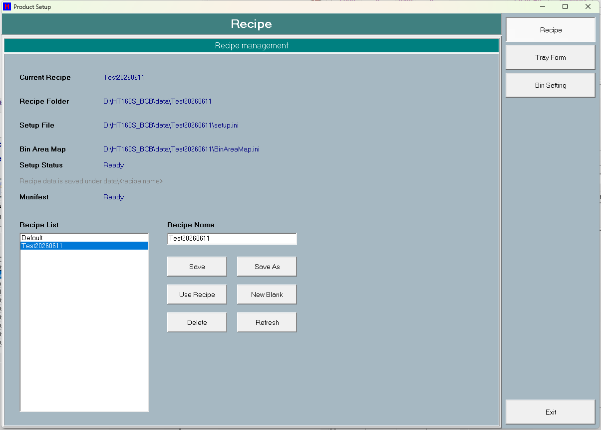

# 第 6 章　設定 (Config / Setup)

本章說明 HT160S 的「產品設定 (Product Setup)」畫面，以及與之相關的配方 (Recipe) 管理、料盤幾何 (Tray Form)、料區對 Bin 的對應 (Bin Area Map)，並涵蓋三種分流模式：靜態的 Normal 模式與動態的 By Lot+Bin、By Lot+PassFail 模式。設定畫面以「配方」為單位儲存，所有資料存於該配方的資料夾（`data\<配方名>`）之下。

設定畫面（畫面標題 **Product Setup**）由左側選單列切換三個分頁：

- **Recipe**：配方管理（新增、複製另存、套用、刪除）。
- **Tray Form**：料盤幾何（起點、間距、分割數）。
- **Bin Setting**：料區 (Area) → Bin 編號對應表與錯誤料 (NG) 收集區。

> 圖 6-1 Product Setup 設定畫面（左側選單列 Recipe / Tray Form / Bin Setting / Exit）。（擷取方式：由主畫面進入維護/設定入口開啟 Product Setup 畫面，預設顯示 Recipe 分頁。）

> ⚠️ 注意：設定畫面所有可見文字皆為英文。機台運轉中時，**Use Recipe** 與 **Delete** 按鈕會被自動禁用；切換或刪除配方須先停機。

---

## 6.1 設定畫面導覽

### 6.1.1 左側選單與標題列

| 畫面項目 | 類型 | 功能 |
| --- | --- | --- |
| Recipe | 選單按鈕 | 切換到 Recipe 配方管理分頁 |
| Tray Form | 選單按鈕 | 切換到 Tray Form 料盤幾何分頁 |
| Bin Setting | 選單按鈕 | 切換到 Bin Setting 料區對應分頁 |
| Exit | 選單按鈕 | 關閉設定畫面；關閉時會自動存檔目前配方 |
| 標題列 | 標籤 | 顯示目前作用分頁的名稱 |

操作步驟（切換分頁）：

1. 按左側選單 **Recipe** / **Tray Form** / **Bin Setting** 任一按鈕。
2. 畫面切換到對應分頁，標題列顯示該分頁名稱。
3. 按 **Exit** 關閉畫面（關閉時自動存檔）。

### 6.1.2 配方狀態欄

下列標籤位於畫面狀態區，僅供顯示目前配方與檔案狀態：

| 畫面項目 | 類型 | 功能 |
| --- | --- | --- |
| 目前配方名稱 | 顯示 | 顯示目前使用中的配方名稱 |
| 配方資料夾 | 顯示 | 顯示配方資料夾名稱/路徑 |
| 設定檔路徑 | 顯示 | 顯示配方設定檔路徑 |
| Bin 對應表檔路徑 | 顯示 | 顯示 Bin 對應表預設檔路徑 |
| 設定檔狀態 | 顯示 | 顯示配方設定檔狀態：Ready / Not Created |
| 配方摘要狀態 | 顯示 | 顯示配方摘要檔狀態：Ready / Not Created |
| 配方位置提示 | 顯示 | 提示文字：配方資料存於 `data\<配方名>` 之下 |

---

## 6.2 Recipe 配方管理

Recipe 分頁負責整套生產配方的新增、複製另存、套用與刪除。配方以資料夾為單位（`data\<配方名>`）；目前使用中的配方名由系統於開機時載入，預設為 `Default`。

### 6.2.1 控制項

| 畫面項目 | 類型 | 功能 |
| --- | --- | --- |
| Recipe List | 清單 | 列出所有配方供選取；點選會把名稱帶入 Recipe Name 欄 |
| Recipe Name | 輸入 | 輸入新配方名稱（供 Save As / New Blank 使用） |
| Save | 按鈕 | 存檔目前配方（配方設定 + Tray Form + Bin 對應表），並驗證 Bin 對應表 |
| Save As | 按鈕 | 以 Recipe Name 名稱另存為新配方（複製現配方）；名稱重複或為空會擋下 |
| Use Recipe | 按鈕 | 切換選取的配方為使用中配方並重新載入；運轉中被禁用/擋下 |
| New Blank | 按鈕 | 以 Recipe Name 建立空白新配方，寫入預設 Tray Form 與空白 Bin 對應表 |
| Delete | 按鈕 | 刪除選取配方（Yes/No 確認）；不可刪目前使用中配方；運轉中被禁用/擋下 |
| Refresh | 按鈕 | 重新掃描配方清單與狀態 |

> 配方名稱會自動整理：去除 `\ / : * ? " < > |` 等不合法字元並以底線取代；空白名稱退回 `Default`。

### 6.2.2 建立全新空白配方 (New Blank)

1. 切到 Recipe 分頁。
2. 在 **Recipe Name** 欄輸入新配方名稱（不可空白）。
3. 按 **New Blank**；若名稱重複或建立失敗會提示。
4. 系統建立資料夾並寫入配方設定、預設 Tray Form 與空白 Bin 對應表。
5. 清單刷新並選取新配方。

### 6.2.3 由現配方複製另存 (Save As)

1. 在 **Recipe Name** 欄輸入新名稱（不可空白、不可重複）。
2. 按 **Save As**。
3. 系統先存檔現配方，再複製為新配方，並記錄來源配方。
4. 清單刷新並選取新配方，提示已另存。

### 6.2.4 套用配方 (Use Recipe)

1. 在 **Recipe List** 選取一個配方。
2. 按 **Use Recipe**。
3. 若機台運轉中會被擋下並提示無法切換。
4. 存檔現配方後，將選取配方設為使用中並重新載入。

### 6.2.5 刪除配方 (Delete)

1. 在 **Recipe List** 選取要刪的配方（不可為目前使用中）。
2. 按 **Delete**。
3. 若運轉中或選到使用中配方會被擋下。
4. 出現 Yes/No 確認對話（`Delete recipe <name>?`），選 **Yes** 才刪除。
5. 清單與狀態刷新。

> ⚠️ 注意：不可刪除目前使用中的配方；切換或刪除配方均須先停機。

---

## 6.3 Tray Form 料盤幾何

Tray Form 分頁定義料盤的座標起點、格位間距與分割數。每次變更會即時重繪料盤格位預覽；存檔（Recipe 分頁 **Save** 或關閉畫面）時寫入配方設定，並即時更新記憶體幾何供 Loader / SortArm / Auto / Monitor 取用。

### 6.3.1 控制項

| 畫面項目 | 類型 | 功能 |
| --- | --- | --- |
| X-Start | 輸入 | 料盤 X 起點座標（浮點，預設 0.000） |
| X-Pitch | 輸入 | 料盤 X 方向間距（浮點，預設 1.000） |
| Y-Start | 輸入 | 料盤 Y 起點座標（浮點，預設 0.000） |
| Y-Pitch | 輸入 | 料盤 Y 方向間距（浮點，預設 1.000） |
| X-Division | 輸入 | 料盤 X 方向格數（整數，1~20） |
| Y-Division | 輸入 | 料盤 Y 方向格數（整數，1~50） |
| 料盤格位預覽區 | 顯示 | 依 X/Y Division 即時重繪料盤格位預覽，格內依序編號 |

### 6.3.2 參數

| 畫面項目 | 範圍/預設 | 說明 |
| --- | --- | --- |
| X-Start | 浮點，預設 0.0 | 料盤 X 起點 |
| X-Pitch | 浮點，預設 1.0 | 料盤 X 間距 |
| Y-Start | 浮點，預設 0.0 | 料盤 Y 起點 |
| Y-Pitch | 浮點，預設 1.0 | 料盤 Y 間距 |
| X-Division | 整數，1~20，預設 1 | 料盤 X 格數（上限 20） |
| Y-Division | 整數，1~50，預設 1 | 料盤 Y 格數（上限 50） |

> 註（定案）：`TrayForm.XStart/XPitch/YStart/YPitch` 的**設定值單位＝mm**；消費端（SortArm `aSortArm.cpp:457-473`、Loader `aLoader.cpp:196-212`）取值時一律 **×100 轉成 1/100mm** 教導座標（原始碼註解明寫 "tray pitch is mm (setup.ini) but teach coords are 1/100mm"）。`XDivision/YDivision` 為格數（消費端 Clamp X:1–50、Y:1–20）。

### 6.3.3 操作步驟

1. 切到 Tray Form 分頁。
2. 輸入 **X-Start** / **X-Pitch** / **Y-Start** / **Y-Pitch**（浮點）與 **X-Division** / **Y-Division**（整數）。
3. 每次變更會即時重繪料盤格位預覽。
4. 按 Recipe 分頁的 **Save**，或關閉畫面時，寫入配方設定。
5. 存檔後即時更新記憶體幾何。

> ⚠️ 注意：**X-Division** / **Y-Division** 超過機台上限（X=20 / Y=50）時，值會被夾限並提示 `Tray division exceeds machine limit (X max=.., Y max=..). Value clamped.`，修正後才存。

---

## 6.4 Bin Setting 料區對應表

Bin Setting 分頁設定「料區 (Area) → Bin 編號」的對應表，以及錯誤料 (NG) 的收集料區。每列對應一個料區：Auto1~Auto6，若安裝色彩 Bin 區則再加 Color。料區清單末端是否含 Color 區，由是否安裝 Color bin 區決定（此設定於維護畫面硬體安裝頁設定，本畫面僅唯讀顯示）。

### 6.4.1 控制項

| 畫面項目 | 類型 | 功能 |
| --- | --- | --- |
| 料區→Bin 對應表 | 表格 | 顯示各料區的 Bin 對應（Area / Bin / Status / Note）；每列一個料區，編輯 Bin 欄；驗證後顯示 OK/Empty/Duplicate/Invalid/Error 狀態與說明 |
| Error Bin 下拉 | 下拉 | 選擇錯誤料 (NG) 的收集料區；只列出已啟用的料區，預設為 Auto6 |
| Pass Bin 下拉 | 下拉 | 選擇視為 PASS 的 Bin：選項為 `0`（=關閉）+ 表格中各已設定的路由 Bin。存入配方設定，決定 Production_Log 的 PassFail 欄，且為 By Lot+PassFail 分流模式的分類依據（見第 15 章）。By Lot+PassFail 的 Lot 執行中變更會被拒絕 |
| Load Current | 按鈕 | 從預設對應表重新載入到表格 |
| Save Map | 按鈕 | 驗證並儲存 Bin 對應表（含 Error Bin 區），顯示結果 |
| Validate | 按鈕 | 驗證表格內容並顯示是否 OK（檢查範圍/重複/空白） |
| Clear All | 按鈕 | 將所有列 Bin 清為 0（未指派） |
| Default 1-N | 按鈕 | 依列序填入預設 Bin 值（1~N）；按鈕文字隨料區數動態變為 `Default 1-<數量>` |

Bin 分頁狀態欄：

| 畫面項目 | 類型 | 功能 |
| --- | --- | --- |
| 目前配方名稱 | 顯示 | 顯示目前配方名稱 |
| Bin 對應表檔路徑 | 顯示 | 顯示 Bin 對應表檔案路徑 |
| 已對應數 | 顯示 | 顯示已對應數 / 總料區數（Count / N） |
| 色彩 Bin 區安裝狀態 | 顯示 | 顯示色彩 Bin 區是否安裝：Installed / Not Installed |
| 對應表狀態 | 顯示 | 顯示對應表檔案狀態與已對應數：Ready / Not Created（Count / N） |
| Bin 提示 | 顯示 | 提示文字：Bin=0 代表該料區未指派 |

### 6.4.2 參數

| 畫面項目 | 範圍/預設 | 說明 |
| --- | --- | --- |
| 料區→Bin 對應 | 每區 Bin 0~999，0=未指派 | 各料區對應的 Bin 編號 |
| Error Bin 下拉 | 已啟用之料區，預設 Auto6 | 錯誤料 (NG) 收集料區 |
| Pass Bin 下拉 | 0（關閉）或某個已設定的 Bin | 視為 PASS 的 Bin。決定 Production_Log PassFail 欄；By Lot+PassFail 模式的分類/路由依據（該模式啟動前須 >0） |

> ⚠️ 注意：Bin 值範圍為 0~999（1000 起為錯誤碼）。非數字或越界視為 `Invalid`；同一 Bin 指派到不同料區視為 `Duplicate`；驗證未通過時 **Save** 會被擋下。

### 6.4.3 操作步驟

1. 切到 Bin Setting 分頁。
2. 在表格 Bin 欄為每個料區（Auto1~Auto6，及 Color 若已安裝）填入 Bin 編號（0~999，0=未指派）。
3. 在 **Error Bin** 下拉選擇錯誤料收集料區。
4. 按 **Validate** 檢查（範圍/重複/空白），狀態欄顯示 OK/Empty/Duplicate/Invalid/Error。
5. 按 **Save Map** 驗證並存檔。
6. 視需要可用 **Load Current** 重新載入、**Clear All** 全清為 0、**Default 1-N** 依序填入預設值。
7. 若使用 By Lot+PassFail 分流，另以 **Pass Bin** 下拉選擇視為 PASS 的 Bin（存入同一配方設定）。

> ⚠️ 注意：在動態分流模式（By Lot+Bin 或 By Lot+PassFail）下，整張表的 Bin 欄禁止手動編輯（Auto↔Bin 由執行時動態綁定），此時只能修改 **Error Bin**；**Pass Bin** 下拉為獨立控制項，仍可設定（惟 By Lot+PassFail 的 Lot 執行中會被鎖）。

---

## 6.5 配方存取流程

設定畫面的載入/儲存流程如下，供理解各檔案何時被讀寫：

- **開啟畫面時**：建立 Recipe / Tray Form / Bin Setting 三個分頁與選單按鈕，並預設顯示 Recipe 分頁。
- **顯示畫面時**：載入最後使用的配方（確保配方資料夾存在 → 載入 Tray Form → 載入 Bin 對應表到表格 → 刷新清單與狀態）。
- **存檔時**：確保配方資料夾存在 → 寫入配方設定 → 存 Tray Form（並即時刷新記憶體）→ 存 Bin 對應表（不跳訊息）→ 寫入配方摘要 → 記錄最後使用的配方名。
- **運轉狀態鎖（每週期檢查）**：依機台是否運轉，啟用/禁用 **Use Recipe** 與 **Delete** 按鈕，停機後自動恢復。
- **關閉畫面時**：自動存檔目前配方。

配方相關設定參數：

| 畫面項目 | 範圍/預設 | 說明 |
| --- | --- | --- |
| 配方名稱 | 由使用者輸入（自動整理後使用） | 配方名稱 |
| 配方資料夾 / Bin 對應表 | `data\<配方名>\...` | 配方資料夾與 Bin 對應表路徑 |
| 配方來源 / 最後更新時間 | Save As 時記錄來源；其餘空白 | 配方來源與最後更新時間 |
| Color bin area installed | 勾/不勾 | 是否安裝色彩 Bin 區，決定料區表是否含 Color 列（此畫面唯讀顯示，於維護畫面硬體安裝頁設定） |
| Sort Mode | Normal / By Lot+Bin / By Lot+PassFail | 分流模式（此畫面唯讀使用，於維護畫面硬體安裝頁設定） |

---

## 6.6 分流模式：Normal / By Lot+Bin / By Lot+PassFail

HT160S 把分類結果 (Bin) 導向輸出料倉（Auto1~Auto6 / Color / Error 區）有三種模式：

- **Normal 模式（預設）**：依靜態 Bin 對應表，每個 Bin 固定對到一個 Auto 區。
- **By Lot+Bin 模式**：在 CCD 掃描時依「先到先得 (first-come-first-served)」把每組 (LotID, Bin) 綁定到下一個尚未被佔用且已啟用的 Auto，之後僅讀取此綁定來放料。
- **By Lot+PassFail 模式**：掃描時以「Bin 是否等於 Pass Bin」把 IC 分為 PASS/FAIL，把每組 (LotID, PASS/FAIL) 先到先得綁定到 Auto；每 Lot 最多綁 2 個 Auto。分類在掃描當下凍結於料格，放料時只讀不重算。

模式切換與多數硬體/路由旗標的設定畫面位於維護畫面的硬體安裝頁；By Lot+PassFail 所需的 Pass Bin 於 Bin Setting 頁的 **Pass Bin** 下拉設定（見 6.4）。完整說明見第 15 章，本節一併概述。

> 圖 6-2 Product / 硬體安裝頁的分流與路由設定（模式切換、Auto/吸嘴啟用、安全距離等）。（擷取方式：進入 Maintenance → Hardware install setup 頁。）

### 6.6.1 硬體頁分流控制項

| 畫面項目 | 類型 | 功能 |
| --- | --- | --- |
| Sort Mode | 選項組（3 選項） | 切換分流模式 Normal / By Lot+Bin / By Lot+PassFail；變更後僅提醒重開軟體，不強制；lot 執行中被鎖定 |
| Auto1~Auto6 | 勾選 | 逐一啟用/停用 Auto1~Auto6 輸出站；停用者於綁定新分類鍵時被跳過；變更後提醒重開；lot 執行中鎖定 |
| Nozzle1~Nozzle4 | 勾選 | 逐一啟用/停用 SortArm 四個吸嘴；至少須保留一個啟用，取消最後一個時自動勾回並提示；即時生效；lot 執行中鎖定 |
| Color bin area installed | 勾選 | 宣告是否安裝 Color 輸出區；lot 執行中鎖定 |
| Use AMR | 勾選 | 啟用 AMR/AGV 模式；lot 執行中鎖定 |
| Bin 顯示面板型號下拉 | 下拉 | 選擇料倉顯示面板型號（LED (HT9046) / TFT (HT9011)） |
| Loader safe distance | 輸入 | 設定兩台 Loader-Y 車最小安全間距；以 mm 輸入，經螢幕鍵盤限制 325~650mm，YES/NO 確認後存入 |
| 硬體頁標題列 | 標籤 | 硬體頁標題列；lot 執行中顯示鎖定提示文字 |
| Lot No.（主畫面） | 輸入 | 主畫面輸入/顯示 Lot 編號；重新開始生產時被清空 |

### 6.6.2 設定參數

| 畫面項目 | 範圍/預設 | 說明 |
| --- | --- | --- |
| Sort Mode | 預設 Normal | 分流模式：Normal（靜態 Bin 對應表），By Lot+Bin（動態綁定 Bin），By Lot+PassFail（動態綁定 PASS/FAIL） |
| Pass Bin 下拉 | 預設 0（關閉） | 視為 PASS 的 Bin；By Lot+PassFail 模式的分類/路由依據（啟動前須 >0） |
| Auto1~Auto6 | 預設全部啟用 | Auto1~Auto6 是否參與分流（綁定時跳過停用者） |
| Nozzle1~Nozzle4 | 預設全部啟用，至少一個須啟用 | SortArm 四個吸嘴啟用（取料時跳過停用槽） |
| Color bin area installed | 預設不勾 | 是否安裝 Color 輸出區（影響 Bin 對應表 Color 區可用性） |
| Use AMR | 預設不勾 | 是否啟用 AMR/AGV 模式 |
| Loader safe distance | 預設 100.00 mm，輸入限 325~650mm | 兩 Loader-Y 車最小安全間距，畫面以 mm 顯示/輸入 |
| 目前配方名稱 | 預設 `Default` | 目前配方名稱（對應 `data\<配方名>` 資料夾） |
| 料區→Bin 對應 | 各輸出區的 Bin 值（>0 才設定） | Normal 模式各輸出區（Auto1~Auto6 / Color）對應的 Bin 號 |
| Error Bin 下拉 | 預設沿用通用錯誤區 | 未知/未設定 Bin 與錯誤 Bin（2D 掃描失敗 / 無 Bin 設定）的溢位目標區 |
| 動態綁定記錄 | 每產生新綁定即存檔 | 動態綁定的持久化記錄：記錄寫入時的分流模式，以及各組（Lot、Bin 或 PASS/FAIL）對應到哪個 Auto；載入時若模式與現行不符即整表捨棄 |

### 6.6.3 Normal 模式：設定 Bin 對 Auto 的靜態對應

1. 在 Bin 對應表中為每個輸出區（Auto1~Auto6，Color 若已安裝）各指定一個 Bin 號，存於配方設定。
2. 另設定 **Error Bin** 作為未知/未設定 Bin 的溢位目標；可分別為 2D 掃描失敗、無 Bin 設定兩種錯誤 Bin 指定收集區。
3. 執行時系統把每個 Bin 依對應表轉成對應的 Auto 輸出區；查不到對應者一律導向 Error Bin 區，絕不隨意放置（維持每盤由上到下、左到右填滿）。

### 6.6.4 啟用動態分流模式（By Lot+Bin / By Lot+PassFail）

1. （僅 By Lot+PassFail 需要）先於 Bin Setting 頁以 **Pass Bin** 下拉設定視為 PASS 的 Bin（存入配方設定）。
2. 於維護畫面硬體頁以 **Sort Mode** 選 By Lot+Bin 或 By Lot+PassFail，依提示重開軟體乾淨生效。
3. 以 **Auto1~Auto6** 設定哪些 Auto 可用於分流（停用者於綁定時被跳過）。By Lot+PassFail 每 Lot 用到 2 個 Auto，建議至少保留 2 個非 Error Auto。
4. 載入各 Lot 的 2D/Bin 資料（離線匯入或 WebAPI/SECS），使已載入的 IC 資料筆數 > 0。
5. 按 Start。全新工單以 0 綁定啟動是正常的——綁定只在掃描時產生。By Lot+PassFail 另檢查 Pass Bin 是否 >0，未設定會擋下並提示 `By Lot+PassFail mode is ON but no Pass Bin is set. Set the Pass Bin on the Bin Setting page before Start !`。

### 6.6.5 動態模式執行期綁定與放料

1. Loader CCD 掃描每顆 IC：以 2D 碼反查出所屬 Lot 與 Bin，寫入該料格；同時依「Bin 是否等於 Pass Bin」計算 PASS/FAIL 並凍結於料格。
2. 依模式綁定：By Lot+Bin 以 Bin 為鍵、By Lot+PassFail 以 PASS/FAIL 分類為鍵（分類為錯誤/關閉時不綁定）。先查既有綁定，無則以「先到先得」選最低編號、未被佔用且已啟用的非 Error Auto；全被佔用時溢位到 Error Auto。新綁定立即存檔。
3. SortArm 放料時只讀取既有綁定、不再重新配置；By Lot+Bin 用該格 Bin、By Lot+PassFail 用該格凍結的分類查表。無所屬 Lot、錯誤 Bin（2D 掃描失敗/無 Bin 設定）或分類為 0 者導向 Error Auto；動態模式不使用 Color 區做分流。
4. 綁定記錄會自動存檔並持久保留（記錄分流模式與各組對應到哪個 Auto）。

### 6.6.6 開機繼承上一筆工單 (inherit-record)

1. 開機若無工單資料，系統會還原上次的手動 Lot 清單與動態綁定。
2. 若有可還原內容（Lot 數或綁定數>0），會以 Yes/No 對話彈出 `Inherit last work order ? (N lots, M bindings) Yes = resume, No = start fresh`。
3. 選 **Yes**：保留 Lot 清單與 (Lot,Bin)→Auto 綁定（等同中途重啟續跑）。
4. 選 **No**：清空整筆工單（清 Lot 清單、綁定與 Lot 編號欄），等同 Lot End 語意；累計生產計數一律保留。

---

## 6.7 互鎖與防呆 (Interlock / Poka-yoke)

> ⚠️ 注意：以下互鎖在運轉或設定錯誤時會擋下操作，請逐項確認。

- **運轉中禁止切換/刪除配方**：機台運轉中禁止 **Use Recipe** / **Delete**；按鈕會被視覺禁用，即使點擊也會被擋下並提示。
- **不可刪除目前使用中配方**：按 **Delete** 時會比對名稱擋下。
- **配方名不可空白/重複**：Save As / New Blank 名稱不可空白；名稱重複擋下。
- **Tray Division 夾限**：X/Y Division 夾限於 1~20 / 1~50，超出提示並夾限後才存。
- **Bin 值範圍**：0~999（1000 起為錯誤碼）；非數字或越界視為 `Invalid`；同一 Bin 指派到不同料區視為 `Duplicate`；驗證未通過時 **Save** 被擋下。
- **By Lot+Bin 鎖編輯**：By Lot+Bin 模式時，Bin 對應表的 Bin 欄不可被選取/編輯（Auto↔Bin 由執行時動態綁定）。
- **硬體編輯鎖**：Lot 執行中鎖定 **Sort Mode** / **Auto1~Auto6** / **Nozzle1~Nozzle4** / **Color bin area installed** / **Use AMR**，避免中途改路由破壞進行中的分流；結束 Lot（未起 lot）即解鎖，標題加註 locked。（By Lot+PassFail 執行中另拒絕於 Bin Setting 頁變更 Pass Bin）
- **至少一個吸嘴啟用**：偵測到全部取消時自動勾回並提示 `At least one nozzle must stay enabled.`。
- **2D 碼全域唯一**：系統拒絕已被任一 Lot 擁有的重複 2D 碼，避免分流衝突。
- **Start 前置檢查（防呆）**：未載入任何 2D 資料時擋下 Start；By Lot+Bin 模式開啟但無任何綁定時擋下 Start。
- **路由確定性**：未知/未設定 Bin 一律導向 Error Bin 區，絕不隨意放置；綁定時跳過被停用的 Auto，但 Error Auto 即使自身停用仍保留為溢位目標。

---

## 6.8 訊息與提示對照

| 訊息 | 意義 | 處置 |
| --- | --- | --- |
| `Tray division exceeds machine limit (X max=.., Y max=..). Value clamped.` | Tray Form X/Y Division 超過機台上限（X=20 / Y=50），值已被夾限 | 改成不超過上限的格數後重新儲存 |
| `Bin map setting has invalid rows.` | Bin 對應表存在無效列（範圍錯/重複），存檔被拒 | 修正標示為 Invalid/Duplicate 的列再存 |
| `Bin must be 0-999. Error code starts from 1000.` | 格內 Bin 值超出 0-999 範圍（1000 起為錯誤碼） | 輸入 0~999 的有效 Bin 值 |
| `Bin map setting is OK. / Bin map saved.` | 驗證通過 / 對應表已儲存（資訊提示） | 無 |
| `Please input new recipe name.` | Save As / New Blank 未輸入配方名 | 在 Recipe Name 欄輸入名稱 |
| `Recipe already exists.` | Save As 目標配方名已存在 | 改用其他名稱 |
| `Save As recipe failed. / Create recipe failed or recipe already exists. / Delete recipe failed.` | 配方複製/建立/刪除作業失敗 | 檢查名稱與資料夾權限後重試 |
| `Can not change recipe while machine is running. / Can not delete recipe while machine is running.` | 機台運轉中不可切換或刪除配方 | 停機後再操作 |
| `Recipe does not exist.` | Use Recipe 選取的配方不存在 | 重新整理清單後選有效配方 |
| `Can not delete current recipe.` | 嘗試刪除目前使用中配方 | 先切換到其他配方再刪除 |
| `Delete recipe <name>?` | 刪除配方的 Yes/No 確認 | 選 Yes 確認，No 取消 |
| `Recipe saved as <name>.` | 另存配方成功提示 | 無 |
| `No 2D data : load lot 2D/Bin data before Start !` | Start 前未載入任何 IC 的 2D/Bin 資料 | 先以離線匯入 / WebAPI / SECS 載入再 Start |
| `By Lot+PassFail mode is ON but no Pass Bin is set. Set the Pass Bin on the Bin Setting page before Start !` | By Lot+PassFail 模式開啟但 Pass Bin=0 | 先於 Bin Setting 頁以 **Pass Bin** 下拉設定 Pass Bin 再 Start |
| `Pass Bin is locked while a By Lot+PassFail lot is running. Finish the lot (Lot End) before changing it.` | Lot 執行中嘗試更改 Pass Bin | 先結束目前 Lot 再變更 |
| `Sort mode changed. Please restart the software so the new classification mode takes effect cleanly.` | 切換分流模式後的提醒（非強制） | 重新啟動軟體讓新模式乾淨生效 |
| `Auto enable changed. Please restart the software so the new Lot+Bin routing takes effect cleanly.` | 變更 Auto 啟用後的提醒（非強制） | 重新啟動軟體讓新路由乾淨生效 |
| `At least one nozzle must stay enabled.` | 嘗試停用最後一個吸嘴 | 系統自動勾回；保留至少一個啟用的吸嘴 |
| `Inherit last work order ? (N lots, M bindings) Yes = resume, No = start fresh` | 開機詢問是否繼承上次工單 | Yes 續跑保留綁定；No 清空整筆工單重新開始 |

---

## 6.9 設定檔位置摘要

| 設定內容 | 位置 | 說明 |
| --- | --- | --- |
| 配方設定 | 配方資料夾 `data\<配方名>\` | 配方名/路徑、料盤幾何 (Tray Form) |
| Bin 對應表 | 配方資料夾 `data\<配方名>\` | 料區→Bin 對應、錯誤 Bin 溢位區 |
| 配方摘要 | 配方資料夾 `data\<配方名>\` | 來源配方、最後更新時間 |
| 機台設定 | 系統資料夾 `system\` | 分流模式、硬體安裝、安全距離等硬體/分流設定 |
| 最後使用配方 | 系統資料夾 `system\` | 目前使用中的配方名 |
| 動態綁定記錄 | 系統資料夾 `system\` | By Lot+Bin / By Lot+PassFail 動態綁定持久化 |
| 累計生產統計 | 系統資料夾 `system\` | 累計生產統計資料 |

> 註：GeneralSetting（色彩 Bin / Lot+Bin 模式等）對設定畫面而言為唯讀使用；其實際設定畫面在 GeneralSetting / maintenance 硬體頁，而非 Product Setup 畫面。

---

## 6.10 補充定案（原待補事項）

- **工程單位（定案）**：`TrayForm.XStart/XPitch/YStart/YPitch` 設定值單位＝mm，消費端 ×100 轉 1/100mm 教導座標（見 6.3.2 註）。
- **Area enum 編號 1/2（定案）**：`EHT160BinArea`＝NotUse=0、**Empty=1、Loader=2**（空盤站與進料站的區域代號，合法區域名但非分選目的地）、Auto1..6=3..8、Color=9。Bin 設定格與所有分選走訪一律從 `eHT160BinAreaAuto1`(=3) 起，1/2 純屬站別保留代號。
- **畫面標籤（定案）**：byte-safe DFM 讀取確認全為英文——`rgSortMode`＝"Sort Mode"（選項 Normal / By Lot+Bin / By Lot+PassFail / By WhiteList）、`chkAutoEnable1~6`＝"Auto1"~"Auto6"、`chkSuckEnable1~4`＝"Nozzle1"~"Nozzle4"、`chkHardwareColorBinArea`＝"Color bin area installed"、`chkUseAMR`＝"Use AMR"、`cbBinPanelType`＝"LED (HT9046)" / "TFT (HT9011)"。（註：這些控制項實際位於 maintenance.dfm 硬體頁；`edLotNo` 位於 main.dfm 的 Lot 分頁 "Lot Manual Edit" 群組。）
- **`SYSTEM_BIN_SELECT BinSelect[2]`（定性）**：cprod 內僅宣告、全程式未見讀寫——舊機型遺留宣告，不影響行為。
- **Error 區設為 Color 的 fallback（定案）**：`GetErrorAutoIndex` 回傳最後一個 Auto（Auto6）；滿載溢流同。詳見第 15 章 15.12。
- **手動綁定 UI（定案）**：不提供；綁定僅由 Loader CCD 掃碼路徑自動產生（最低 index 先到先得），UI 僅顯示。
- **配方選單畫面（定案）**：不存在獨立 form；新增/複製/刪除/切換全在 Product Setup（`lstRecipe`＋`edRecipeName`），主畫面 `cb_WorkFile` 亦可切換。
