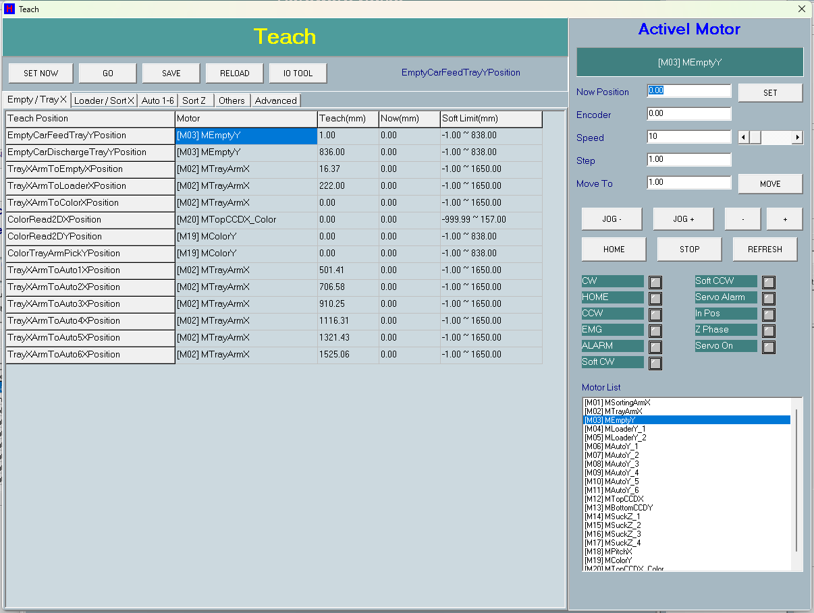

# 第 07 章　教導 (Teach)

教導畫面 (`TfTeach`) 供工程師對機台各軸馬達進行手動定位與校點。透過此畫面可選擇作用中馬達、以 Jog 或定步方式趨近目標物理位置、把目前位置存入教導點位、移動到既有教導點，以及把所有點位存回教導檔。Advanced 分頁另提供 SortArm 單吸嘴與各升降柱的點位測試功能。

> ⚠️ 注意：所有教導動作只能在機台**未執行生產**（`HSys.Sys.SystemStart` 為假）且**未按下 EMG** 的狀態下進行。畫面上的移動連鎖會在不符合條件時彈窗中止；計時器 (`tmrUpdate`) 也會在移動/Jog/Home/測試進行中持續偵測 EMG，按下即時停止。

> 圖 7-1 教導畫面。（擷取方式：於主畫面進入維護/工程模式後開啟 Teach 教導畫面）

---

## 7.1 畫面配置

教導畫面分為左右兩區：

- **左側教導點位區**：依分頁分類的教導點位表，分頁包含 `Empty/Tray X`、`Loader/Sort X`、`Auto 1-6`、`Sort Z`、`Others`、`Advanced`（含子分頁 Sort Arm / Channel）。
- **右側馬達控制區**：選軸、Jog、Step、Move、Home、Stop、速度設定、即時位置/Encoder 顯示、狀態 LED 與馬達清單 (`Motor List`)。

### 位置單位（重要）

> ⚠️ 注意：所有教導座標於內部一律以 **1/100mm** 儲存，即 **100 單位 = 1mm**。畫面以 mm、小數 2 位顯示與輸入；輸入時 `ParsePositionText` 會把 mm 文字乘以 100 取整存入內部欄位，顯示時 `FormatPositionText` 把內部值除以 100 以 `%.2f` 呈現。例如畫面輸入 `100.00`（mm）即內部值 `10000`。

---

## 7.2 馬達控制區控制項

| 控制項 | 類型 | 功能 |
| --- | --- | --- |
| palMotorName | led | 顯示作用中馬達 `NumberAlias`（別名） |
| edNowPos | edit（唯讀） | 作用中馬達目前位置 `ReadPos`，mm 2 位小數 |
| edEncoder | edit（唯讀） | 作用中馬達 Encoder 位置 `ReadEncoderPos`，mm |
| edSpeed | edit | Jog/Move 速度；輸入即套用 (`SetSpeed`)，夾在馬達 `JogLow`~`JogHigh`，與速度捲軸同步 |
| scbTeachSpeed | scroll | 速度捲軸；Min/Max 取自馬達 `JogLowSpeed`/`JogHighSpeed`，即時 `SetSpeed` |
| edStep | edit | Step `+`/`-` 的步距 (mm)；預設 `1.00`，輸入 0 時內部以 100（=1mm）代入 |
| edTarget | edit | `MOVE` 目標位置 (mm)；選點/Step/編輯時會自動填入 |
| btnMotorSet | button（SET） | 把目前位置存入選定教導點位（與左側 `SET NOW` 同一處理函式） |
| btnMove | button（MOVE） | 移動作用中馬達到 `Move To` 值 (`MoveActiveMotorToTarget`；需 Home、檢查軟限與連鎖) |
| btnJogP | button（JOG +） | 按下開始正向 Jog (`Motor->JogP`，CW 方向)，放開停止；Jog 不需先 Home，可用於趨近 home 感測 |
| btnJogN | button（JOG -） | 按下開始負向 Jog (`Motor->JogN`，CCW 方向)，放開停止 |
| btnStepP | button（+） | 以 `edStep` 步距正向定步移動（Now+Step 後 Move） |
| btnStepN | button（-） | 以 `edStep` 步距負向定步移動（Now-Step 後 Move） |
| btnHome | button（HOME） | 對作用中單軸啟動回 Home (`InitHomeTask_forSingleAxis`)，由 `tmrUpdate` 推進 |
| btnStop | button（STOP） | 停止作用中馬達並中止 SortArm/Car 測試 |
| btnRefresh | button（REFRESH） | 重建馬達清單、刷新表格與監看顯示 |
| lstMotors | grid（Motor List） | 列出全部馬達 `NumberAlias`；單擊設為作用中馬達 (`SetActiveMotor`) |

### 狀態 LED（ledStatus0..10）

依序對應：`CW`、`HOME`、`CCW`、`EMG`、`ALARM`、`Soft CW`、`Soft CCW`、`Servo Alarm`、`In Pos`、`Z Phase`、`Servo On`。內容取自 `Motor->Led[]`。

LED 顏色慣例：

- **綠色**：使用中且該訊號觸發。
- **灰色**：使用中且閒置。
- **紅色**：未使用（馬達 disable）。

其中 EMG 燈另疊加系統 `IsEMGPressed` 狀態。

> 註（定案）：LED 索引常數定義於 `MotorAndIO/HTMotor.h`（非 database.h）：`iCwLed=0`、`iHomeLed=1`、`iCcwLed=2`、`iEmgLed=3`、`iAlarmLed=4`、`iSoftcwLed=5`、`iSoftccwLed=6`、`iServoalarmLed=7`、`iInposLed=8`、`iZPhaseLed=9`、`iServoOn=10`（共 11 顆）。實值由各驅動層 `ScanMotorStatus` 填入（MC88X1 全填；MN200/SMC 僅 Inpos）。

---

## 7.3 教導點位區控制項

| 控制項 | 類型 | 功能 |
| --- | --- | --- |
| palTitle | panel | 畫面標題列「Teach」 |
| btnSetTeach | button（SET NOW） | 把作用中馬達目前位置 (`ReadPos`) 寫入目前選定的教導點位 (`SetSelectedTeachFromNow`)；與右側 `SET` 同一處理函式 |
| btnGoTeach | button（GO） | 把選定教導點位的值載入 `Move To` 後實際移動作用中馬達到該點 (`MoveSelectedTeach`，經 `CheckCanTeachMove` 連鎖) |
| btnSave | button（SAVE） | 先彈出 Yes/No 確認，確認後把所有教導點位以 mm 文字寫入 `system\tech.ini`，並重新折算 `Teach = TeachBase + Offset` (`UpdateAllParameter`) |
| btnReload | button（RELOAD） | 從教導檔重新載入所有點位 (`OpenWorkFile`) 並重折 Offset |
| btnIOForm | button（IO TOOL） | 開啟 IO 監看/設定畫面 (`fiosetview`)，並設 `bFromTeach=true` 以抑制其關閉時的還原提示 |
| lblMessage | label | 狀態/提示訊息列；顯示載入路徑、Move/Jog/Home 狀態、Home 完成行程、各種中止原因 |
| PageTeach | tab | 教導點位分頁（`Empty/Tray X`、`Loader/Sort X`、`Auto 1-6`、`Sort Z`、`Others`、`Advanced`） |

### 點位分頁與表格

| 分頁/表格 | 內容 |
| --- | --- |
| grdEmptyTray（Empty / Tray X） | Empty 車與 TrayArmX（含 Color 2D / 取放 Y、各 Auto X）點位 |
| grdLoaderSort（Loader / Sort X） | Loader1/2 車 Y、Top CCD X、SortArm X 各目的地點位 |
| grdAuto（Auto 1-6） | Auto1~6 車 Feed/Discharge/FirstSort Y 點位 |
| grdSortZ（Sort Z） | SortArm 各吸嘴 Z (`SuckZ_1`~`SuckZ_4`) 對 Loader/Auto 的 Z1~Z4 點位 |
| grdOthers（Others） | PitchArm X 最小/最大、BottomCCD Y 取像點位 |

每個點位表格欄位如下：

| 欄位 | 說明 |
| --- | --- |
| Teach Position | 點位名稱 |
| Motor | 對應馬達別名 |
| Teach(mm) | 已教導值（mm） |
| Now(mm) | 馬達目前位置（mm） |
| Soft Limit(mm) | 軟體上下限範圍（mm） |

> 單擊表格列：選定該列並切到對應分頁、設為作用中馬達。
> 雙擊表格列：開啟數字鍵盤直接編輯該值（**僅編輯數值，不會移動馬達**）。

---

## 7.4 如何教導一個位置

> ⚠️ 注意：執行 `MOVE` / Step / `GO` 前該軸必須已回 Home（`bHomeFlag==true`），否則彈窗「Motor is not home」。`JOG` 與 `HOME` 本身不要求先 Home。若作用軸為 `SortingArmX`，移動前所有吸嘴 Z 必須全部回 Home，否則彈窗「Sort arm Z must be home before X move.」以防撞。

以 `SET NOW` 方式教導單一點位的標準流程：

1. 在 `Motor List` 選擇要操作的馬達，或在左側點位表中**單擊**要教導的列（會自動切到對應分頁並設為作用中馬達）。
2. 視需要先按 `HOME` 讓該軸回原點（`MOVE`/Step 需先 Home；純 Jog 趨近可略過）。
3. 用 `JOG +` / `JOG -`、`+` / `-` Step，或在 `Move To` 輸入值後按 `MOVE`，把該軸移到目標物理位置。
4. 確認 `Now Position` 為所要位置後，按 `SET NOW`（或右側 `SET`）；目前位置 (`ReadPos`) 寫入該點位（以 1/100mm 儲存）。
5. 確認表格 `Teach(mm)` 欄已更新為新值。
6. 所有點位調整完成後按 `SAVE`，於 Yes/No 確認窗按 Yes，寫入 `system\tech.ini`。

> `SET NOW` 取的是 `Motor->ReadPos()` 的即時值，不需先 Home；但 `MOVE`/Step 移動需該軸已 Home。

### 以數字鍵盤直接編輯點位值

1. 在點位表中**雙擊**要編輯的列。
2. 於彈出的 `fQwertyKey` 數字鍵盤輸入 mm 值（小數 2 位）。
3. 按 OK；輸入文字解析回 1/100mm 存入該點位並刷新該列（**此操作不會移動馬達**）。
4. 按 `SAVE` 寫回檔案。

> 雙擊只編輯數值，不會跑點；實際移動仍須用 `GO` 或 `MOVE` 按鈕。

### 移到既有教導點（GO）

1. 選定目標點位列。
2. 按 `GO`；把該點位值載入 `Move To` 後執行 `MoveActiveMotorToTarget`。
3. 若連鎖未過（系統執行中 / EMG / 馬達 disable / 警報 / 未 Home / SortArm-Z 未 Home / 超軟限）會彈窗並中止。

---

## 7.5 Jog 與限位方向

`JOG +` 呼叫 `Motor->JogP`（CW 方向），`JOG -` 呼叫 `Motor->JogN`（CCW 方向）。限位採**空間慣例、與 Direction 無關**：

- `Jog +` 端 = CW 限位（`iCwLed`）。
- `Jog -` 端 = CCW 限位（`iCcwLed`）。

> ⚠️ 注意：CW（+）限位亮起時 `Jog +` 被擋，只能用 `Jog -` 退離；CCW（-）限位亮起時 `Jog -` 被擋，只能用 `Jog +` 退離。

> 【待補：`JOG +`=CW、`JOG -`=CCW 對應的實際物理方向（右/左、前/後、上/下）依各軸機構與驅動 Direction 設定而定。教導採「+/right、-/left」語意，但實際對應因軸而異，需現場確認。】

---

## 7.6 單軸回 Home 與 HOME 步進顯示

1. 選定作用中馬達。
2. 按 `HOME`；通過連鎖後 `InitHomeTask_forSingleAxis` 啟動，`tmrUpdate` 逐次推進 `Home()`。
3. 按下時訊息列顯示 `Home start`。
4. 完成時訊息列顯示 `Home finish, <行程mm>`；行程取 `GetLastHomePos`（card 實際位置，1/100mm 經 `FormatPositionText` 顯示）。
5. 失敗時訊息列顯示錯誤字串 (`Err`)。

> HOME 步進狀態僅以訊息列 (`lblMessage`) 呈現，無獨立步序欄位。
>
> ⚠️ 注意：HOME 允許在「限位-only 警報」下執行（作為脫離限位的復歸路徑）；過程中按 EMG 或 `STOP` 會中止。

---

## 7.7 移動連鎖與防撞（CheckCanTeachMove）

`MOVE` / Step / `GO` 三種移動皆通過 `CheckCanTeachMove` 連鎖：

| 連鎖條件 | 說明 |
| --- | --- |
| 馬達非 NULL | 作用中馬達必須存在 |
| 非機台執行中 | `HSys.Sys.SystemStart` 為真時彈窗中止 |
| 無 EMG | `IsEMGPressed>0` 中止 |
| 馬達已 enable | `GetEnable==false` 中止（其狀態 LED 顯示紅色） |
| 無馬達警報 | 伺服警報 (`iServoalarmLed`) 或 EMG 燈 (`iEmgLed`) 一律擋；一般 `ALARM` 燈中止，**除非**屬限位-only 警報（ALARM + CW 或 CCW 燈、且無伺服警報/無 EMG）且呼叫端允許 (`bAllowLimitAlarm`)——此放行僅用於 Jog 與 HOME 的退離/復歸 |
| 需 Home | `MOVE`/Step/`GO` 要求作用軸 `bHomeFlag==true`；Jog 與 Home 本身不要求 |
| SortArm-Z 防撞 | 作用馬達為 `SortingArmX` 時，須 `CheckSortArmZHome()`（委派 `SortArmModule->AreAllSuckersHome()`，用即時 Home 感測）為真，否則中止 |
| 軟體上下限 | `bUseTarget` 時 `Motor->CheckSoftLimit(Target)` 須通過，否則「Target over soft limit.」中止 |

> ⚠️ 注意：SortArm-Z 防撞連鎖在 Teach、Motor Test、生產三處共用同一來源 (`AreAllSuckersHome()`)，使用即時 Home 感測判斷，避免 SortArm X 移動時撞到未抬升的吸嘴。

### EMG 動態處理（tmrUpdate，每 200ms）

- `IsEMGPressed>0` 時 latch `bEmgActive`、`StopActiveMotor` 並停 SortArm/Car 測試、顯示中止訊息。
- 放開（`bEmgActive` 由真轉假）時，對作用且 enable 的軸呼叫 `ServoOnResetPos()`，把 `NowPos` 對齊 encoder，避免伺服放鬆期間手動移動造成 `SET` 取到舊值。

---

## 7.8 Advanced：SortArm 單吸嘴點位測試

| 控制項 | 類型 | 功能 |
| --- | --- | --- |
| cbSuckUse | combo | 選擇要測試的吸嘴（slot 0~3，Suck1..Suck4） |
| cbToArea | combo | 吸嘴目的地（Loader1/Loader2/Auto1..Auto6）；轉成 Target 代碼（1,2,11..16） |
| edSaCol | edit | 目的盤目標欄（1-based，內部轉 0-based） |
| edSaRow | edit | 目的盤目標列（1-based，內部轉 0-based） |
| chkSaZDown | checkbox | XY 到位後是否下降 Z 到教導 Z（預設勾選） |
| btnSaGo | button | GO (Move Suck To Cell)：啟動 SortArm 單吸嘴移到指定 cell 測試 |

操作步驟：

1. 選 `Suck Use`（吸嘴）、`To Area`（目的地）、輸入 `Column`/`Row`（1-based），視需要勾選 `Z Down`。
2. 按 `GO (Move Suck To Cell)`；先 `CheckSortArmTestReady` 再 `CanMoveSuckerToCell`。
3. 由 `tmrUpdate` 推進 `MoveSuckerToCell`，完成顯示 finish。

> ⚠️ 注意：前置條件（`CheckSortArmTestReady`）：非 SystemStart、無 EMG；X / 目標 Y / SuckZ 三軸皆 enable；三軸皆無 ALARM/伺服警報；X 與目標 Y 皆 `bHomeFlag==true`；所有 Suck Z 皆 Home (`CheckSortArmZHome`)。再經模組 `CanMoveSuckerToCell` 才啟動。

---

## 7.9 Advanced：升降柱測試（Channel）

| 控制項 | 類型 | 功能 |
| --- | --- | --- |
| cbCarArea | combo | 選雙缸升降柱區域（Empty/Loader/Color） |
| chkCarLoop | checkbox | 是否循環執行升降 N 回合 |
| edLoopTimes | edit | 循環回合數（預設 1，<1 視為 1） |
| btnCarGo | button | GO (GoUp -> GoDown)：啟動 Empty/Loader/Color 升降柱一回合；可循環 |
| cbAutoArea | combo | 選 Auto 區（Auto1..Auto6） |
| btnAutoGoUp | button | GO (GoUp Once)：Auto1~6 單缸上升一次測試 (`TestGoUpOnce`) |

操作步驟：

1. **雙缸柱**：選 `Car Area`（Empty/Loader/Color），視需要勾 `Loop` 並設 `Loop Times`，按 `GO (GoUp -> GoDown)`。
2. **單缸 Auto**：選 `Auto Area`（Auto1~6），按 `GO (GoUp Once)`。
3. 測試由 `tmrUpdate` 逐回合推進，完成顯示 finish。

> ⚠️ 注意：前置條件（`CheckCarTestReady`）：非 SystemStart 且無 EMG。

---

## 7.10 設定參數

| 參數 | 範圍/預設 | 說明 |
| --- | --- | --- |
| edSpeed / scbTeachSpeed | 預設文字 `10`；範圍 = 各馬達 `GetJogLowSpeed()`~`GetJogHighSpeed()` | Jog/Move 速度，夾在作用馬達 `JogLowSpeed`~`JogHighSpeed` |
| edStep | 預設 `1.00`；輸入 0 時內部以 100（=1mm）代入 | Step `+`/`-` 步距（mm） |
| edTarget | 預設 `0.00`；須在軟限內 | `MOVE` 目標位置（mm） |
| 教導點位（TEACH/TeachBase 結構） | 由 `system\tech.ini` 載入/存檔；有效值 = TeachBase + Offset；`MAX_TEACH_ITEM=96` | 各軸教導座標（Empty/Tray X、Loader/Sort X、Auto、Sort Z、Others 共多筆，以 1/100mm 儲存） |
| chkSaZDown | 預設勾選 (true) | SortArm 測試 XY 到位後是否下降 Z 到教導 Z |
| edSaCol / edSaRow | 預設 `1` | SortArm 測試目的盤欄/列（1-based，內部轉 0-based） |
| chkCarLoop / edLoopTimes | Loop 預設未勾；Loop Times 預設 `1`，<1 視為 1 | 升降柱測試是否循環與回合數 |

---

## 7.11 教導值結構與檔案

- **教導值結構**：每筆 `TECH_PARA` 綁定 {對應馬達 Tag、指向 `TeachBase` 欄位的 `int*` `iPara`、`GroupName`、`Caption`、Grid、Row}。`SET NOW` 寫入的是 `TeachBase` 欄位；載入/存檔對應 `OpenWorkFile`/`SaveWorkFile` 與 `tech.ini`。
- **Offset 折算**：有效 `Teach = TeachBase + Offset`。載入與存檔後呼叫 `UpdateAllParameter()` 重折（`Teach` 結構供生產運動使用，`TeachBase` 為 Offset 基準）。
- **教導檔尋找順序**（`FindTeachFileName`）：`system\tech.ini` → `lastset.ini` 指定的 `data\<WorkFile>.tech` → `data\Ztex_001`/`Ztex`/`EAGLEP2RIGHT.tech` → 舊機對應檔 → 退回 `tech.ini`。`SAVE` 一律寫 `system\tech.ini`。
- **tech.ini 鍵名**：多數點位鍵 = `ed_` + Caption；`BottomCCDYCapturePosition` 例外用 `edt_` + Caption。讀取時先試 `ed_`/`edt_` 鍵，空白則回退用純 Caption 鍵（相容舊檔）。
- **畫面生命週期**：開啟 (`FormShow`) 啟用 `tmrUpdate`、開啟 `MotorTaskLog` 一次性 home/limit 擷取；關閉 (`FormClose`) 停計時器、停軸與測試並關閉 `MotorTaskLog`。

> 註（定案）：tech 檔節段名（`GroupName`）實際只有 **3 個**：`TeachEmptyAndTrayX`（Empty/TrayX 格線與 Others 一筆）、`TeachLoader`（Loader/Sort 格線＋SortZ 格線）、`TeachAuto`（Auto 格線）。鍵名一律 `ed_`＋Caption，唯一例外 `BottomCCDYCapturePosition` 用 `edt_` 前綴；讀檔先試前綴鍵、空白再回退裸 Caption（相容舊檔），存檔只寫前綴鍵。（`uteach.cpp` `AddTeachItem`/`GetTeachKey`）

---

## 7.12 訊息與警報

| 訊息/警報 | 意義 | 復歸方式 |
| --- | --- | --- |
| Machine is running. | 機台執行中 (`HSys.Sys.SystemStart`) 無法進行教導移動 | 停止生產/離開執行狀態後再操作 |
| EMG is pressed. | 緊急停止被按下 | 釋放 EMG；`tmrUpdate` 會在放開後對作用軸 `ServoOnResetPos` 校位 |
| Motor is disabled. | 作用中馬達未啟用 (`GetEnable==false`)；狀態 LED 顯示紅色 | 啟用該馬達後再操作 |
| Motor alarm is active. | 伺服警報或一般 ALARM 燈亮（非限位-only） | 排除警報；限位-only 可用 HOME 或反向 Jog 退離後復歸 |
| Motor is not home. | `MOVE`/Step/`GO` 前作用軸尚未回 Home (`bHomeFlag==false`) | 先按 `HOME` 完成回原點 |
| Sort arm Z must be home before X move. | 作用軸為 SortArm X 但吸嘴 Z 未全部回 Home，擋住 X 移動防撞 | 先讓所有 Suck Z 回 Home |
| Target over soft limit. | `MOVE` 目標超出軟體上下限 | 修改 `Move To` 至軟限範圍內 |
| CW (+) limit is triggered. Jog + is blocked; use Jog - to move away. | CW（+）端限位觸發，`Jog +` 被擋 | 用 `Jog -` 退離限位 |
| CCW (-) limit is triggered. Jog - is blocked; use Jog + to move away. | CCW（-）端限位觸發，`Jog -` 被擋 | 用 `Jog +` 退離限位 |
| SortArm X / target Y / Suck Z must be enabled. | SortArm 測試所需三軸有未啟用者 | 啟用 X/目標 Y/SuckZ 後再試 |
| SortArm X and target Y must be home. | SortArm 測試前 X 或目標 Y 未回 Home | 先讓 X 與目標 Y 回 Home |
| All Suck Z must be home before X move. | SortArm 測試前吸嘴 Z 未全 Home | 先讓全部 Suck Z 回 Home |
| Home finish, <travel> | 回 Home 完成，顯示回 Home 行程（mm） | 資訊性訊息，無需復歸 |

---

## 7.13 補充定案與現場確認事項

已定案（原待補）：
- 狀態 LED 索引常數＝`HTMotor.h` 的 11 顆 LED enum（見 7.2 註）。
- tech 檔節段名＝3 個 GroupName、鍵名 `ed_`/`edt_` 前綴規則（見 7.11 註）。
- DFM 標籤：byte-safe 稽核確認全機 UI 為英文，無另外中文化字串。

仍需現場確認：
- `JOG +`=CW / `JOG -`=CCW 對應的實際物理方向（右/左、前/後、上/下）因軸機構與 Direction 設定而異——現場逐軸低速確認一次並記入附錄 A。
- Advanced 分頁 SortArm cell 幾何（Column/Row → 實際盤格座標）與升降柱測試內部缸序/感測，屬各模組實作，未於本畫面展開（見第 14 章）。
