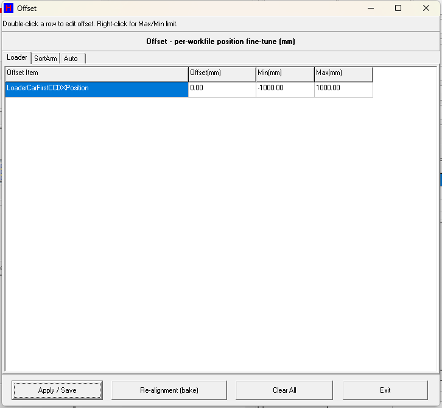

# 第 08 章　偏移 (Offset)

本章說明「偏移 (Offset)」畫面的用途與操作。Offset 提供「每料號 / 每工作檔 (workfile / recipe)」的位置微調功能，讓操作者在 **不更動 Teach 教導基準值** 的前提下，對特定軸位置加上一個微小偏移量。其運作邏輯為「套用時折疊 (apply-time fold)」：

> **有效位置 Teach = 教導基準 TeachBase (.tech / tech.ini) + 偏移 Offset (.ofs)**

馬達運動實際讀取的是折疊後的有效 Teach；基準值由 Teach 畫面 (第 07 章) 維護，偏移值則依工作檔分別儲存。

> 圖 8-1 偏移 (Offset) 畫面。（擷取方式：於主畫面或維護 / 工程選單按下 Offset 對應按鈕進入；上層由 `main.cpp` 以 `ShowTopForm(fOffset, sbOffset)` 開啟。）

---

## 8.1 畫面概觀

Offset 畫面以三個分頁 (PageOffset) 將共 **56 個** 可微調欄位分組顯示，每一欄都對應一個現有的 Teach 基準位置欄位：

| 分頁 | 表格 | 欄位數 | 內容 |
| --- | --- | --- | --- |
| Loader | grdLoader | 9 | Loader1/2 載台 Y 各 4 項 (FeedTray / DischargeTray / FirstCCD / FirstSort) + Loader 頂部 CCD X (LoaderCarFirstCCDXPosition) |
| SortArm | grdSortArm | 41 | SortArm X 停止點 9 項 + SortArm 吸嘴 Z 高度 32 項 |
| Auto | grdAuto | 6 | Auto1..6 各 CarFirstSortYPosition 載台首次分類 Y |

每個表格的欄位為：**Offset Item / Offset(mm) / Min(mm) / Max(mm)**。畫面數值單位為 **mm，解析度 0.01mm**（內部以 1/100mm 整數儲存）。

> ⚠️ 注意：畫面上方說明列 (palExplain / lblExplain) 預設顯示操作提示 `Double-click a row to edit offset. Right-click for Max/Min limit.`；當選取某一列時，會改為顯示該欄位的名稱與用途說明 (GetOffsetExplain)。請務必確認選取的欄位即為欲調整的目標位置後再編輯。

### 控制項清單

| 控制項 | 類型 | 功能 |
| --- | --- | --- |
| palTitle | panel | 標題列，顯示畫面名稱與單位提示 (mm) |
| palExplain / lblExplain | label | 說明列；預設顯示操作方式，選取列時顯示該欄位用途 (GetOffsetExplain) |
| PageOffset | tab | 分頁控制，將 56 個欄位分為 Loader / SortArm / Auto 三組 |
| grdLoader | grid | Loader 群組偏移表格 (9 列) |
| grdSortArm | grid | SortArm 群組偏移表格 (41 列) |
| grdAuto | grid | Auto 群組偏移表格 (6 列) |
| btnApply | button | Apply / Save：確認後將所有偏移存入 .ofs，呼叫 UpdateAllParameter() 重新折疊立即生效 |
| btnReAlign | button | Re-alignment (bake)：將偏移永久折入 Teach 基準，Offset 歸零並存回 tech.ini |
| btnClear | button | Clear All：將記憶體中所有 Offset 歸零並更新表格（尚未存檔） |
| btnExit | button | Exit：關閉畫面 (Close) |
| popLimit / miSetMax / miSetMin | popupmenu | 表格列右鍵叫出，設定該欄位偏移上 / 下限，存入 OffsetLimit.ini |
| edScratch | edit | 隱藏暫存輸入框，供 QwertyKey 軟鍵盤輸入數值用（不可見） |

> 【待補：畫面標籤與按鈕文字在原始碼中皆為英文 ASCII (Offset / Apply / Save / Re-alignment / Exit / Clear All 等)，機台實機上是否另有中文化字串無法由原始碼判定。】

---

## 8.2 偏移欄位 (參數)

| 參數 | 範圍 / 預設 | 說明 |
| --- | --- | --- |
| Offset (共 56 項) | 預設 0；範圍由 OffsetLimit.ini 決定 | 每工作檔位置偏移量，內部單位 1/100mm；分 Loader(9) / SortArm(41) / Auto(6) 三群，每項對應一個 Teach 基準欄位 |
| Loader 群組 (9) | 各 ±1000.00mm (預設) | Loader1/2 各 FeedTray / DischargeTray / FirstCCD / FirstSort 載台 Y (8) + LoaderCarFirstCCDX 頂部 CCD X (1) |
| SortArm 群組 (41) | 各 ±1000.00mm (預設) | SortArm X 停止點 9 (ToLoader1/2、ToAuto1..6、ToBottomCCDFirstX) + 吸嘴 Z 高度 32 (Loader1/2 各 Z1..4 = 8、Auto1..6 各 Z1..4 = 24) |
| Auto 群組 (6) | 各 ±1000.00mm (預設) | Auto1..6 各 CarFirstSortYPosition 載台首次分類 Y |
| OffsetLimit.ini (Max / Min per item) | system\\OffsetLimit.ini；缺檔時以內建 ±100000 自動種出 | 每欄位偏移輸入上 / 下限，section=Offset，key=`<Caption>_Max` / `<Caption>_Min` |
| data\\<workfile>.ofs | 工作檔名由 RecipeManager.GetCurrentRecipeName() 取得；無工作檔名時退回 system\\offset.ini | 目前工作檔的偏移值檔 (INI)，section=GroupName (OffsetLoader / OffsetSortArm / OffsetAuto)，key=`ed_<Caption>` |
| system\\tech.ini (TeachBase) | 由 Teach 畫面維護，本畫面僅 Re-alignment 會改寫 | Teach 教導基準位置；Re-alignment 烘焙時由 fTeach->SaveWorkFile() 寫回 |

> ⚠️ 注意：下列位置因 **無對應的現有 Teach 基準欄位** 而排除於偏移之外（原始碼註解標明）：`LoaderCarLastCCDX`、`SortArmToBottomCCD` 的 Z1–Z4。

> 【待補：56 個欄位的精確物理意義（各站點 Z1..Z4 對應的吸嘴 / 疊高層級等）僅能由命名與 GetOffsetExplain 概略說明推斷，精確機構對應需現場確認。】

---

## 8.3 操作步驟

### 8.3.1 輸入單一欄位的偏移值

1. 切換到對應分頁 (Loader / SortArm / Auto)。
2. 在表格選取要微調的欄位列；說明列會顯示該欄位用途。
3. 在該列上點兩下 (double-click) 叫出 QwertyKey 軟鍵盤（N_DOUBLE，2 位小數，受該列 Min / Max 限制）。
4. 輸入偏移量 (mm，可為負；正值往一方向、負值往反方向)，確認。
5. 表格 Offset(mm) 欄更新；此時僅在記憶體，尚未存檔生效。
6. 按 **Apply / Save** 並於確認對話框選 YES，才會寫入 .ofs 並重新折疊生效。

> ⚠️ 注意：此步驟僅改有效位置 Teach，不改 TeachBase 基準。每個欄位輸入受該列 Min / Max 限值約束（限值來自 system\\OffsetLimit.ini）。

### 8.3.2 設定欄位偏移上下限

1. 在目標列上按滑鼠右鍵，叫出 popLimit 選單。
2. 選 **Set Max Limit ...** 或 **Set Min Limit ...**。
3. 以軟鍵盤輸入限值並確認。
4. 限值立即寫入 system\\OffsetLimit.ini 並更新該列 Min / Max 顯示，之後編輯偏移時即受此範圍限制。

> ⚠️ 注意：首次無 OffsetLimit.ini 時，程式會以內建預設 (±1000.00mm，即 ±100000 內部單位) 自動種出檔案。

### 8.3.3 套用並儲存偏移 (Apply)

1. 按 **Apply / Save**。
2. 於 YES / NO 對話框選 **YES**。
3. SaveWorkFile() 將所有偏移寫入 data\\<workfile>.ofs。
4. UpdateAllParameter() 以「Teach = TeachBase + Offset」重新折疊，運動立即採用新有效位置。
5. 顯示成功訊息 `Offset saved and applied.`。

> ⚠️ 注意：無工作檔名時改存於 system\\offset.ini。折疊採賦值式（非累加），重複 Apply 不會疊加放大，具冪等性。

### 8.3.4 重新對位 / 烘焙基準 (Re-alignment)

1. 按 **Re-alignment (bake)**。
2. 於 YES / NO 對話框選 **YES**。
3. TeachBase 各欄 += 對應 Offset（共 56 項），Offset 全部歸零 (memset)。
4. 若 fTeach 存在，呼叫 fTeach->SaveWorkFile() 將新基準存回 system\\tech.ini。
5. SaveWorkFile() 存回歸零後的 .ofs，UpdateAllParameter() 重新折疊並刷新表格。
6. 顯示訊息 `Re-alignment done: offset folded into base teach.`。

> ⚠️ 注意：此動作會 **永久改變 Teach 基準值**，等於把累積微調烘焙成新的教導基準。折疊後 Offset 歸零、有效位置不變。執行前請確認目前偏移量已驗證無誤。

### 8.3.5 清除所有偏移 (Clear All)

1. 按 **Clear All**。
2. 於 YES / NO 對話框選 **YES**。
3. 記憶體 Offset 全部歸零並刷新表格（尚未存檔）。
4. 若要生效需再按 **Apply / Save**；若要放棄改回原值可直接按 **Exit**。

> ⚠️ 注意：Clear 本身不寫檔，Exit 不存檔即放棄變更。

---

## 8.4 何時用 Offset、何時重新 Teach

| 情境 | 建議動作 |
| --- | --- |
| 同一料號 / 工作檔下，某軸位置出現微小偏差，需快速微調且不影響其他工作檔 | 使用 **Offset**（每工作檔獨立，data\\<workfile>.ofs） |
| 微調已驗證穩定，欲將其變成所有後續引用的新教導基準 | 使用 **Re-alignment (bake)** 將偏移折入 TeachBase |
| 機構更換、重新組裝或基準大幅跑掉，原 Teach 值已不可信 | 回到 Teach 畫面 (第 07 章) **重新教導**，而非以 Offset 堆疊大量補償 |
| 欄位無對應 Teach 基準（如 LoaderCarLastCCDX、SortArmToBottomCCD Z1–4） | 無法用 Offset，需於 Teach 畫面處理 |

換料號連動：`main.cpp` 載入新 recipe 時會呼叫 `fOffset->OpenWorkFile()`，重新讀該工作檔偏移並重新折疊；畫面顯示 (OnShow) 時亦會再次 OpenWorkFile() 以反映最新工作檔。

---

## 8.5 互鎖與安全規則

- 所有破壞性 / 生效動作 (**Apply、Re-alignment、Clear All**) 皆需先通過 YES / NO 確認對話框 (ShowMyMessageBox_YES_NO) 才執行。
- 每個偏移欄位輸入受 Min / Max 限值約束；限值來自 system\\OffsetLimit.ini，缺檔時預設 ±100000 內部單位 (±1000.00mm)。
- Clear All 與記憶體中的編輯不會自動寫檔；未按 Apply 前不生效，Exit 即放棄，避免誤動作直接影響機台。
- 折疊採賦值式 (Teach = TeachBase + Offset) 而非累加，重複 Apply / OpenWorkFile 不會疊加放大，具冪等性。

> ⚠️ 注意：偏移值會直接改變馬達運動的實際停止位置。請於空機或安全狀態下調整並小幅驗證，避免一次輸入過大偏移造成機構碰撞。

---

## 8.6 內部單位換算說明

- 畫面顯示為 mm：`FormatOffsetText = 內部值 / 100`，固定 2 位小數。
- 輸入 mm 經 `ParseOffsetText = mm × 100 ± 0.5` 四捨五入轉為內部整數 (1/100mm) 寫回對應欄位。
- 偏移檔 .ofs / OffsetLimit.ini 內存放的均為內部單位 (1/100mm)。

> 【待補：QwertyKey 軟鍵盤 (`fQwertyKey->ShowQwertyKey`) 各參數語意 (N_DOUBLE、小數位 2、range 啟用旗標) 定義於 uQwertyKey，未在本畫面原始檔內，僅依呼叫推斷。】
>
> 【待補：原始 DFM (ClientWidth=640 / Height=480) 與 BuildUI() 程式設定 (720×640) 不一致；實際顯示尺寸以執行時 BuildUI 為準，此差異是否刻意需確認。】
>
> 【待補：畫面是否有權限 / 模式（例如維修模式）限制存取，需由開啟它的 `main.cpp` 上層 (ShowTopForm(fOffset, sbOffset)) 確認。】
