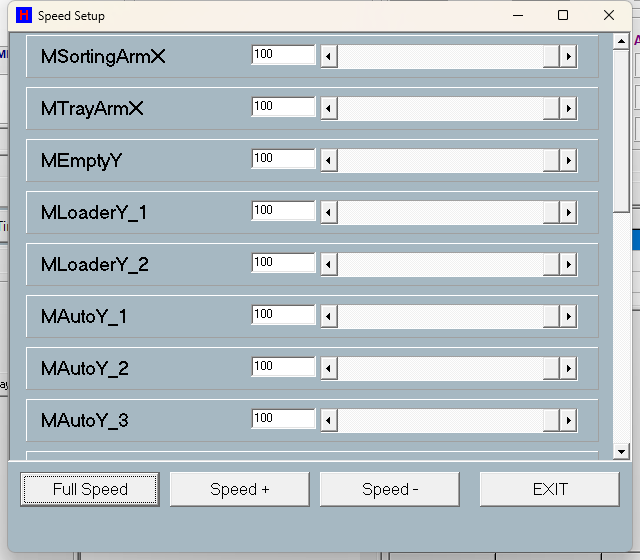

# 第 09 章　速度 (Speed)

本章說明「Speed Setup」速度設定畫面的用途、操作方式與儲存機制。本畫面以「百分比」方式調整每一顆馬達的運轉速度倍率，並提供群組按鈕一次調整所有馬達。

> ⚠️ 注意：本畫面所設定的是「速度百分比」(1~100%)，並非實際速度數值，也**不提供加速度 (accel) / 減速度 (decel) 的編輯欄位**。在本程式中 acc/dec 為馬達唯讀參數，不在此畫面設定。詳見本章 9.6「關於加速度／減速度」。

---

## 9.1 畫面概觀

畫面標題 (DFM Caption) 為 **Speed Setup**。開啟畫面時，程式依目前機台的馬達總數 (`HSys.iTotalMotor`) 動態為每一顆「已建立 (非 NULL)」的馬達產生一列調整介面，每列包含：

- 馬達別名標籤 (`labMotorSpeed`，取自 `Motor->Alias`)
- 數值輸入框 (`edtMotorSpeed`，可輸入 1~100)
- 水平捲軸 (`scbMotorSpeed`，Min=1、Max=100)

各列由程式於 `FormCreate` 時動態建立並放入捲動區 (`ScrollBox1`)，列數依機台馬達數量而定，超出時可捲動。畫面下方提供 **Full Speed / Speed + / Speed -** 三顆群組按鈕與 **EXIT** 按鈕。

百分比會乘上各馬達的 `JogHighSpeed` 換算成實際速度寫入驅動器；關閉畫面時自動存回 `system\machine_speed.ini`。

> 圖 9-1 Speed Setup 速度設定畫面。（擷取方式：自主畫面進入速度設定畫面後擷取整個 Speed Setup 視窗）

> 註（定案）：本畫面由主畫面頂部功能列 **Speed** 按鈕開啟（`sbSpeedClick` → `ShowTopForm(fSpeed, sbSpeed)`，main.cpp:640-643）；無權限等級、無運轉中鎖定（運轉中僅實際套用被擋，見 9.7）。

---

## 9.2 控制項說明

| 控制項 | 類型 | 功能 |
| --- | --- | --- |
| `ScrollBox1` | scrollbox | 承載動態建立的每一顆馬達速度調整列；列數依機台馬達數量而定，超出可捲動。 |
| `palMotorSpeed` (每軸一列) | panel | 單一馬達的一列容器（程式動態建立），內含該軸的名稱標籤、數值框與捲軸。 |
| `labMotorSpeed` (每軸一列) | label | 顯示該列對應馬達的別名 (`Motor->Alias`)；由馬達設定帶入，非固定字串。 |
| `edtMotorSpeed` (每軸一列) | edit | 直接輸入該馬達的速度百分比 (1~100)。離開欄位 (OnExit) 時將輸入值夾在 1~100、寫入 `iPersentSpeed`、同步捲軸並立即套用速度 (SetMotorSpeed)。 |
| `scbMotorSpeed` (每軸一列) | scrollbar | 拖動調整該馬達速度百分比 (Min=1, Max=100)。變動 (OnChange) 時更新數值框、寫入 `iPersentSpeed` 並立即套用 (SetMotorSpeed)。 |
| `spbFullSpeed` | button | 標籤 **Full Speed**：將所有馬達速度一次設為 100%（`GroupSpeedAddSub(2)`）後套用。 |
| `spbAddSpeed` | button | 標籤 **Speed +**：將所有馬達速度各 +10%（`GroupSpeedAddSub(1)`），上限由套用程序夾在 100%。 |
| `spbSubSpeed` | button | 標籤 **Speed -**：將所有馬達速度依分段方式遞減（>20% 減 10、>10% 減 5、>1% 減 1）後套用，下限 1%（`GroupSpeedAddSub(0)`）。 |
| `spbExit` | button | 標籤 **EXIT**：關閉畫面 (Close)；關閉時觸發 FormClose 自動存檔。 |

---

## 9.3 速度設定一覽

本畫面為「逐軸一列」的形式，每一列對應一顆馬達。下表以「軸/條件 | 速度 | 加速 | 減速 | 說明」呈現本畫面的可調項目。

| 軸/條件 | 速度 | 加速 | 減速 | 說明 |
| --- | --- | --- | --- | --- |
| 各馬達（每軸一列，軸名取自 `Motor->Alias`） | 可調，百分比 1~100% | 本畫面不提供 | 本畫面不提供 | 百分比乘上該軸 `JogHighSpeed` 換算成實際速度寫入驅動器；INI 不存在時預設 100。 |
| 全部馬達（群組）— Full Speed | 全部設為 100% | — | — | 群組全速，一次套用所有列。 |
| 全部馬達（群組）— Speed + | 每按一次 +10%（上限 100%） | — | — | 群組加速步進。 |
| 全部馬達（群組）— Speed - | 分段遞減：>20% 減 10、>10% 減 5、>1% 減 1（下限 1%） | — | — | 群組減速步進，依目前值分段。 |

依現行 `system/Mot_Table.csv`，啟用（Enable=1）的 18 軸如下（M13 MBottomCCDY、M18 MPitchX 停用不建列）：

| 軸 | Alias | 軸 | Alias |
| --- | --- | --- | --- |
| M01 | MSortingArmX（分類臂 X） | M10 | MAutoY_5 |
| M02 | MTrayArmX（盤臂 X） | M11 | MAutoY_6 |
| M03 | MEmptyY（空盤 Y） | M12 | MTopCCDX（頂部 CCD X） |
| M04 | MLoaderY_1（Loader1 Y） | M14 | MSuckZ_1（吸嘴 1 Z） |
| M05 | MLoaderY_2（Loader2 Y） | M15 | MSuckZ_2（吸嘴 2 Z） |
| M06 | MAutoY_1 | M16 | MSuckZ_3（吸嘴 3 Z） |
| M07 | MAutoY_2 | M17 | MSuckZ_4（吸嘴 4 Z） |
| M08 | MAutoY_3 | M19 | MColorY（Color Y） |
| M09 | MAutoY_4 | M20 | MTopCCDX_Color（Color CCD X） |

> 註：畫面對所有 `MotPtr` 非 NULL 的馬達一律建列；最終清單依該機 `Mot_Table.csv` 為準（以機台 State Record 副本核對）。

加速/減速兩欄在本畫面皆標示為「不提供」，係依 SPEC 屬實呈現，並非省略；說明見 9.6。

---

## 9.4 操作步驟

### 9.4.1 調整單一馬達速度

1. 在對應馬達該列，拖動水平捲軸，或直接於數值框輸入 1~100 的百分比。
2. 拖動捲軸時即時套用；於數值框輸入後，按離開該欄位 (OnExit) 即套用。
3. 系統將百分比乘上該軸 `JogHighSpeed` 換算成實際速度，於閒置時立即生效；HOME 中或機台運轉中 (`SystemStart`) 則延後套用。

> 輸入值會自動夾在 1~100；輸入非數字時會回復為馬達目前值（`StrToIntDef` 預設）。

### 9.4.2 群組一次調整所有馬達

1. 按 **Full Speed** 將全部馬達設為 100%。
2. 或按 **Speed +** 將全部馬達各加 10%（上限 100%）。
3. 或按 **Speed -** 將全部馬達遞減（>20%: −10 / >10%: −5 / >1%: −1，下限 1%）。

> 三顆按鈕皆套用到 `ScrollBox1` 內所有列，並呼叫 `SetMotorSpeed` 立即生效。

### 9.4.3 儲存設定

1. 按 **EXIT** 或直接關閉畫面。
2. `FormClose` 自動呼叫 `SaveMotorSpeedToIni`，將各馬達目前百分比寫入 `system\machine_speed.ini`。

> 本畫面無獨立的「儲存」按鈕；存檔是在關閉畫面時自動發生。

---

## 9.5 參數說明

| 參數 | 範圍/預設 | 說明 |
| --- | --- | --- |
| `iPersentSpeed` (每顆馬達) | 1~100；INI 不存在時預設 100 | 每顆馬達的工作速度百分比；實際速度 = `JogHighSpeed × iPersentSpeed / 100`（已 Enable 馬達）。本畫面唯一可編輯的設定。 |
| `machine_speed.ini` | 由 `SaveMotorSpeedToIni` 寫入；首次不存在時以全部 100% 建立基準 | 持久化檔，路徑 `<HSys.CurrentDir>\system\machine_speed.ini`（`CurrentDir` 為空時退回 `..\system`）；`[Speed]` 區段，key 為馬達 `Alias`（Alias 空則 `Mot<i>`），value 為百分比。 |
| `Speed +` | 每按一次 +10%（上限 100） | 群組加速步進。 |
| `Speed -` | >20% 減 10、>10% 減 5、>1% 減 1（下限 1） | 群組減速步進，依目前值分段。 |
| `Full Speed` | 全部設為 100% | 群組全速。 |

---

## 9.6 關於加速度／減速度

本畫面**不提供**加速度 (accel)／減速度 (decel) 的編輯欄位。在本程式中 acc/dec 為馬達唯讀參數，不在 Speed Setup 畫面設定。

> 註（定案）：accel/decel 定義於 `system/Mot_Table.csv` 的 **Acc / Dec 欄位**（機台設定檔，逐軸），程式啟動時載入——**無任何 UI 畫面可調**，需改值時直接編輯 CSV 後重啟軟體（工程師作業）。

> 操作員在本畫面看到的僅是 1~100 的百分比，並無實際速度單位顯示；百分比的「實際速度基準」是各馬達的 `JogHighSpeed`（見 `MyMotor.cpp` `SetPersentSpeed`），非畫面內顯示值。

---

## 9.7 安全與互鎖

> ⚠️ 注意：運轉中保護。當 `RunMode == Run_Home` 或 `SystemStart == true`（HOME 中或機台運轉中）時，`SetMotorSpeed(bSet=false)` 直接 return，**不會**於 HOME 或機台運轉中變更實際速度（避免動作中改速）。此期間使用者的調整僅存入 `iPersentSpeed`，待閒置或下次 START／HOME 後才套用。

> ⚠️ 注意：數值範圍夾制。所有輸入／捲軸／群組運算結果一律夾在 1~100%（低於 1 取 1，高於 100 取 100）；`SetPersentSpeed` 內部再次夾 1~100，換算後實際速度最低為 1。

> ⚠️ 注意：僅在 `Motor->Enable` 為真時，才把換算速度寫入硬體驅動器；未啟用 (`Enable=false`) 時改寫的是模擬速度 (`SimulateSpeed × persent / 100`)。

> ⚠️ 注意：設定過高的速度可能造成機構碰撞、定位過衝或產品損傷。請在確認機構行程與安全的前提下逐步調整，勿一次將不熟悉的軸拉至高百分比；如非必要，調速後務必以低速試運轉確認動作正常後再恢復生產速度。

---

## 9.8 處理流程（參考）

下列為本畫面內部流程，供維護與除錯參考：

1. `FormCreate -> BuildPanels()`：若 `HSys.MotPtr` 非空，逐一掃描 `i = 0..iTotalMotor-1`，為每顆非 NULL 馬達建立一個 `TMySpeedPanel` 並加入 `ScrollBox1`，依 pitch=52 由上而下排列。
2. `TMySpeedPanel` 建立時 `SyncFromMotor()`：讀 `Motor->GetPersentSpeed()`，夾 1~100，設定捲軸 Position 與數值框文字。
3. `FormShow -> RefreshAll()`：所有列再次 `SyncFromMotor()`，使畫面反映目前各馬達百分比。
4. 使用者操作捲軸／數值框／群組按鈕 → 寫入 `Motor->iPersentSpeed`（只儲存）→ 呼叫 `SetMotorSpeed()`。
5. `SetMotorSpeed(bSet=false)`：若 `RunMode == Run_Home` 或 `SystemStart == true` 則直接 return；否則對每顆馬達呼叫 `SetPersentSpeed(GetPersentSpeed())` 將百分比 × `JogHighSpeed / 100` 換算後寫入驅動器。
6. `FormClose -> SaveMotorSpeedToIni()`：把各馬達百分比以 `key = Alias`（或 `Mot<i>`）寫入 `[Speed]` 區段於 `system\machine_speed.ini`。
7. `FormDestroy`：釋放所有 `TMySpeedPanel` 包裝物件（VCL 子控制項由 host 自動釋放）。
8. 程式啟動端 (`csystem.cpp`) 另呼叫 `LoadMotorSpeedFromIni()` 載入基準百分比；每次 START 前呼叫 `SetMotorSpeed()`；HOME 完成後呼叫 `SetMotorSpeed(true)` 強制重套。

---

## 9.9 本章補充定案

- 進入路徑（定案）：主畫面頂部功能列 **Speed** 按鈕（見 9.1 註）。
- 軸名清單（定案）：現行 `Mot_Table.csv` 啟用 18 軸（見 9.3 表）；最終以機台設定檔為準。
- accel/decel（定案）：位於 `Mot_Table.csv` Acc/Dec 欄，無 UI 可調（見 9.6 註）。
