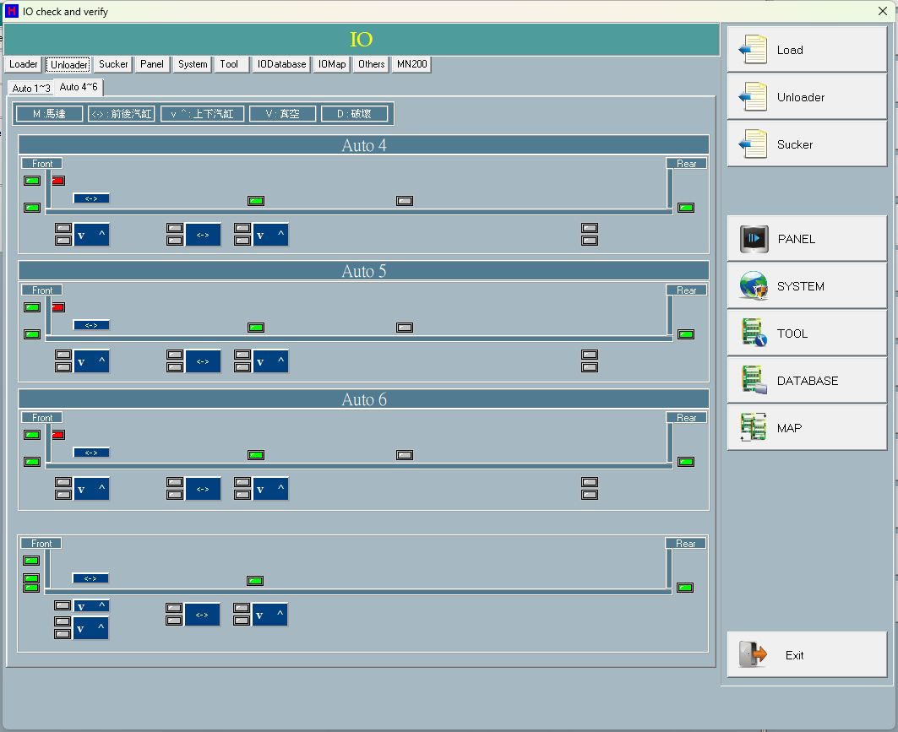

# 第 10 章　輸出入監看 (I/O)

輸出入監看畫面（標題列 "IO check and verify"）讓維修人員即時觀察機台上所有輸入（感測器、汽缸到位、真空到位）與輸出（電磁閥 Switch、汽缸、吸嘴真空 V／破真空 D）的現況，並以 LED 與按鈕面板的顏色表示 ON／OFF。除監看外，本畫面亦可：

- 手動強制切換單一輸出；
- 對整組吸嘴執行 Suck（全部吸）／Destroy（全部破）／All Off（全關）；
- 線上編修 `IO_Table.csv`（Add／Delete／Modify／Save）；
- 匯出輸入／輸出位址對照表（IOMap）；
- 查看 MN200 MotionNet 介面卡的連線狀態。

離開畫面時，系統會依現場是否有料件，決定是否還原被動過的輸出，避免維修後在機台上留下危險的輸出狀態。

> 圖 10-1 輸出入監看畫面（IOsetview）。（擷取方式：由 Maintenance 或 Teach 畫面進入「輸出入監看 / IO check and verify」）

---

## 10.1 安全須知

> ⚠️ 注意：本畫面可在運轉外手動激磁輸出（電磁閥、汽缸、吸嘴真空）。在機台上料件仍在機內時強制輸出，可能造成機構碰撞、料件損壞或人員夾傷。手動操作前務必確認動作路徑淨空。

> ⚠️ 注意：機台運轉中時，畫面會自動隱藏所有分頁標籤，避免運轉期間誤切到各 IO 頁觸動輸出。請勿在運轉中試圖手動切換輸出。

> ⚠️ 注意：離開畫面時若期間動過任何輸出：機台內有料件時 → 系統強制還原輸出，無選擇餘地；機台空 → 詢問操作員是否還原。原則：有料件在機內，絕不留下被動過的輸出狀態。

---

## 10.2 LED 與按鈕的顏色約定

顏色是判讀本畫面的核心，為硬性約定：

| 畫面項目 | 顏色 | 意義 |
| --- | --- | --- |
| 輸入 LED | 綠 | 該輸入 ON |
| 輸入 LED | 灰 | 該輸入 OFF |
| 輸入 LED | 紅 | 該點未綁定，或 Enable=0（停用） |
| 輸出按鈕 | 亮橘 | 該輸出 ON |
| 輸出按鈕 | 深藍灰 | 該輸出 OFF |
| 輸出按鈕 | 紅 | 該點未綁定，或 Enable=0（停用） |

> ⚠️ 注意：紅色一律代表「該 IO 點不可用」——可能是 IO 對照表沒有對應的 Alias、位址綁定失敗，或該點 Enable=0。紅色點無法手動切換。發現應作用的點顯示紅色時，請檢查 IO 對照表設定。

LED／按鈕的狀態依各元件的 Alias 自動解析：可解析時依目前狀態上綠／灰（輸入）或亮橘／深藍灰（輸出）；無法綁定或停用時整顆顯示紅色。畫面進入後會週期自動重新整理。

---

## 10.3 畫面分頁與控制項

主分頁每個分頁對應一個模組或功能區。預設啟動頁為 Unloader。

| 畫面項目 | 類型 | 功能 |
| --- | --- | --- |
| 主分頁列 | 分頁 | 主分頁：Loader（裝載／料車 1-2／TrayArm）、Unloader（Auto1~3 與 Auto4~6 子頁）、Sucker（吸嘴，含整組吸／破／全關按鈕）、Panel（操作面板 IO）、System（全機安全與系統訊號）、Tool、IODatabase（IO 對照表編修）、IOMap、Others、MN200（介面卡連線狀態）。運轉中所有分頁標籤被隱藏。 |
| Exit | 按鈕 | 關閉本畫面，離開時會執行輸出還原判斷流程。 |
| 輸入狀態指示燈 | 圖示 | 依 Alias 綁定感測器／汽缸到位／真空到位。綠＝ON、灰＝OFF、紅＝未綁定／停用。旁有文字標示（如 Front／Rear／v ^／<->）。 |
| 輸出控制按鈕 | 按鈕 | 輸出控制按鈕兼狀態顯示。點擊直接切換對應的電磁閥／汽缸／吸嘴輸出；按鈕壓下狀態反映目前輸出。 |
| Suck | 按鈕 | Sucker 分頁：全部真空 ON＋破真空 OFF（僅作用於已啟用的吸嘴）。 |
| Destroy | 按鈕 | Sucker 分頁：全部破真空 ON＋真空 OFF（僅作用於已啟用的吸嘴）。 |
| All Off | 按鈕 | Sucker 分頁：強制每顆吸嘴全關（不檢查是否啟用）。 |
| MN200 連線狀態表 | 表格 | 每列一個 ring，顯示 Started／Devices／ErrorCode。 |
| MN200 開卡狀態列 | 顯示 | 顯示 MN200 開卡狀態、ring 數、IO 對照表中啟用的 MotionNet 點數，或開卡失敗的錯誤訊息。 |
| Type 篩選下拉 | 下拉 | IODatabase 型別篩選：All／Sensor／Sucker／Switch／Cylinder。 |
| Lane 篩選下拉 | 下拉 | IODatabase 的 Lane（環／卡）篩選：All／0..9。 |
| Alias 搜尋框 | 輸入 | 以 Alias 子字串（大寫比對）過濾 IO 對照表；輸入長度 ≥2 或清空時觸發重載。 |
| IO 對照表編修表格 | 表格 | IO_Table 編修主表格（16 欄）：No／Type／Alias／Lane／ModuleType／IP／Port／Bit／InType／ISA Base／Enable／OnAlarmTime／OffAlarmTime／OnDelayTime／OffDelayTime／Note。 |
| Add／Delete／Modify | 按鈕 | Add 新增空白列；Delete 移除選定列；Modify 以輸入框編輯選定格。 |
| Save | 按鈕 | 驗證後備份原檔再寫回 IO 對照表，並即時重新繫結感測器／汽缸／電磁閥／吸嘴。 |
| Refresh | 按鈕 | 重新載入 IO 資料並重載表格。 |
| IOMap 位址對照表／診斷訊息框 | 表格 | IOMap 分頁：列出每點位址對照（Lane／IP／Port／Bit／Type／Alias）；另一欄顯示未綁定診斷訊息（Unbound input／output）。 |

### 右側選單列（定案：保留鈕，換頁請點分頁標籤）

畫面右側有一排單選式按鈕：Load／TOOL／DATABASE／MAP／Sucker／Unloader／SYSTEM／PANEL／Terminal Program。

> 註（定案）：這排選單鈕（除 Exit 外）目前**按了沒有作用（保留鈕）**；換頁一律直接點各分頁標籤。Terminal Program 鈕另隱藏＋空實作＝Terminal 功能未啟用。Pad 鈕未接動作＝不會觸發；Pad 通訊功能入口在 **Maintenance → Pad COM Port** 分頁。「Enable IO Change」與「Loop Output Interval」相關控制為空實作＝保留功能，勾選/輸入無效果。

---

## 10.4 操作程序

### 10.4.1 監看輸入／輸出狀態

1. 由 Maintenance 或 Teach 進入輸出入監看畫面。
2. 點選要觀察的模組分頁（Loader／Unloader／Sucker／Panel／System…）。
3. 判讀：綠燈＝該輸入 ON、灰燈＝OFF、紅燈＝該點未綁定或被停用（Enable=0）。
4. 畫面會每隔一段週期自動重新整理。

> ⚠️ 注意：機台運轉中分頁標籤會被隱藏，避免運轉時切頁誤操作。

### 10.4.2 手動強制切換單一輸出

1. 切到對應模組分頁。
2. 點該輸出按鈕，切換 ON／OFF。
3. 電磁閥／汽缸為單純反相切換；吸嘴 V（真空）與 D（破真空）互鎖——開其一會自動關另一（On＝破真空關＋真空開、Off＝真空關＋破真空開）。
4. 若按鈕未綁定或該輸出停用，會彈出 "Output is not bound or disabled." 提示。
5. 任一次成功切換後，離開時系統會據以判斷是否還原輸出。

> ⚠️ 注意：本畫面已移除舊的手動輸出總開關，點按鈕即直接切換；未綁定／停用的點會被拒絕。每次動作都會記錄。

### 10.4.3 整組吸嘴 吸／破／全關

1. 切到 Sucker 分頁。
2. 選擇動作：
   - Suck＝全部真空（僅啟用之吸嘴）；
   - Destroy＝全部破真空（僅啟用）；
   - All Off＝強制全部關（不分啟用與否）。
3. 動作後系統會記錄該組吸嘴動作，並在離開時據以判斷是否還原。

### 10.4.4 離開畫面與輸出還原

1. 點 Exit 或關閉視窗。
2. 若期間動過輸出且非由 Teach 進入：
   - 機台內有料件 → 強制還原（提示後自動還原）；
   - 機台空 → 詢問操作員是否還原（Yes／No）。
3. 由 Teach 進入時不提示、不還原（維持 Teach 自由探測行為）。

> ⚠️ 注意：進入畫面時系統已先備份所有電磁閥／汽缸／吸嘴輸出，作為離開時還原的依據。安全原則：有料件在機內絕不留下被動過的輸出。

### 10.4.5 線上編修 IO_Table

1. 切到 IODatabase 分頁（或用 Tool 的 Input／Output／Vacuum／Cylinder 快速篩選）。
2. 以 Type／Lane 篩選下拉與 Alias 搜尋框縮小範圍。
3. 編輯：Add 新增列、選格後 Modify（或雙擊）以輸入框修改、Delete 刪列。
4. 點 Save：先驗證 → 備份原檔 → 寫回 IO 對照表 → 重新繫結感測器／汽缸／電磁閥／吸嘴 → 重載與重繪。
5. 存檔成功會顯示備份路徑；失敗顯示錯誤。

> ⚠️ 注意：存檔前必先驗證且備份原檔（備份失敗即中止存檔）。系統會控管備份保留上限。儲存後免重啟即生效（會自動重新繫結 IP／Port／Bit）。

### 10.4.6 查看 MN200 介面卡狀態

1. 切到 MN200 分頁。
2. MN200 開卡狀態列顯示開卡狀態／ring 數／MotionNet 點數，或錯誤訊息。
3. MN200 連線狀態表每列顯示各 ring 的 Started／Devices／ErrorCode。

> 模擬版（軟體模擬模式）不開卡，改顯示模擬模式提示。

---

## 10.5 MN200／IO 位址模型

本機 IO 點以 IO 對照表（IO_Table.csv）定義，每筆組合出實際位址。對 MN200 MotionNet 介面卡而言，Lane 即環（ring）編號：

- 卡號 = Lane × 100 + IP；
- 位址要素：Lane（ring）、IP、Port、Bit、ISA Base；
- 感測器顯示值依 InType 欄做極性換算：InType=1 直接採用原始輸入位元，其他值則反相；
- MN200 最多 8 個 ring；MN200 頁僅統計 ISA Base 為 MotionNet 且已啟用（Enable≠0）的點數。

### IO_Table.csv 欄位

每筆 IO 點定義一個感測器或輸出。表頭：IOType,Alias,Lane,ModuleType,IP,Port,Bit,InType,ISABase,Enable,OnAlarmTime,OffAlarmTime,OnDelayTime,OffDelayTime,Note，存於 IO 對照表檔（IO_Table.csv）。

| 參數 | 範圍／預設 | 說明 |
| --- | --- | --- |
| Type | SENSOR／SUCKER／SWITCH／CYLINDER／CYLINDER_ON／_OFF／SUCKER_ON／_OFF | IO 點型別 |
| Alias | 字串 | 點名稱，畫面 LED／按鈕依此綁定 |
| Lane | 環／卡編號（ring） | MN200 即 ring 編號 |
| ModuleType | — | 模組別 |
| IP | — | 位址 IP 要素 |
| Port | — | 位址 Port 要素 |
| Bit | — | 位址 Bit 要素 |
| InType | 通常 0／1 | 感測器極性；1＝直接採用原始輸入位元，其他值＝反相 |
| ISA Base | 0..4 | 介面類別（見下表） |
| Enable | 0／1 | 0＝停用 → LED／按鈕顯示紅色且不可手動切換 |
| OnAlarmTime／OffAlarmTime | — | 到位／離位逾時告警時間 |
| OnDelayTime／OffDelayTime | — | 到位／離位延遲時間 |
| Note | 字串 | 備註；填 COMM_PAD 代表 Pad 通訊點 |

### ISA Base（介面類別）

| 值 | 說明 |
| --- | --- |
| 0 | MN200 MotionNet |
| 1 | ISA 介面 |
| 2 | PCI-1735U |
| 3 | PCI-1203 |
| 4 | PLC |

### 顏色／篩選常數

| 項目 | 值 | 說明 |
| --- | --- | --- |
| 輸出按鈕 ON 色 | 亮橘（16744448） | 輸出 ON 時的按鈕顏色 |
| 輸出按鈕 OFF 色 | 深藍灰（8404992） | 輸出 OFF 時的按鈕顏色 |
| IO 表固定列底色 | 9534289 | IO 對照表固定表頭列底色 |
| LED 顏色 | 綠／灰／紅 | 綠＝ON、灰＝OFF、紅＝未綁定／停用 |
| Type 篩選索引 | 0=All,1=Sensor,2=Sucker,3=Switch,4=Cylinder | 以 Type 子字串比對；Tool 的 Input=1／Vacuum=2／Output=3／Cylinder=4 快速設定 |

---

## 10.6 互鎖與保護機制

> ⚠️ 注意：以下為本畫面的硬性互鎖，維修時不可繞過。

1. **顏色硬性約定**：綠＝輸入 ON、灰＝輸入 OFF、紅＝該點未綁定或 Enable=0；輸出按鈕亮橘＝ON、深藍灰＝OFF、紅＝未綁定／停用。紅色即代表 IO 點不可用或設定缺失。
2. **運轉中保護**：機台運轉中會隱藏所有分頁標籤，避免運轉中切到各 IO 頁誤觸輸出。
3. **吸嘴真空／破真空互鎖**（每個吸嘴）：開真空＝破真空關＋真空開、關真空＝真空關＋破真空開，兩者不可能同時被激磁。
4. **離開還原安全鏈**：動過輸出且機內有料件 → 強制還原備份輸出（無選擇）；機內空 → 詢問；由 Teach 進入 → 完全不還原。
5. **手動切換僅作用於已啟用的點**：切換前會檢查電磁閥／汽缸／吸嘴對應的 Enable，停用點拒絕切換並提示 "Output is not bound or disabled."。
6. **IO 對照表存檔保護**：存檔前先驗證且備份原檔，備份失敗則中止存檔。

---

## 10.7 訊息與告警

| 訊息 | 意義 | 處理 |
| --- | --- | --- |
| Output is not bound or disabled. | 手動點輸出按鈕但該 Alias 找不到對應電磁閥／汽缸／吸嘴，或對應點 Enable=0（停用） | 檢查 IO 對照表中該點 Alias／Enable／位址設定 |
| IO table data invalid: | Save 時驗證未過（格式／重複 Alias／數值錯誤等），逐列列出錯誤（最多 20 列） | 修正表格內容後重新 Save；此訊息不中止機台 |
| IO_Table.csv backup failed. Save aborted. | 存檔前備份原始 IO 對照表失敗，為安全起見中止存檔 | 檢查備份目錄權限／磁碟空間後重試 |
| IO_Table.csv save failed. | 寫回 IO 對照表過程發生例外 | 檢查檔案是否被佔用／路徑後重試 |
| IO_Table.csv saved. (Backup: ...) | 存檔成功提示（含備份路徑） | 資訊性提示，無需處理 |
| IO already change, will restore IO!! | 離開時偵測到動過輸出，且機內有料件 → 強制還原 | 系統自動還原 |
| IO already change, want to restore? | 離開時偵測到動過輸出，機內空 → 詢問是否還原（Yes／No） | 選 Yes 還原、No 保留現狀 |

---

## 10.8 補充定案（原待補項目）

- **右側選單鈕／Pad／Terminal／Enable IO Change（定案）**：皆為保留/未啟用的按鈕，詳見 10.2「右側選單列」註。
- **圖例文字（定案）**：畫面圖例為——M :馬達、<-> : 前後汽缸、v ^ : 上下汽缸、V : 真空、D : 破壞（破真空/blow-off），四組分佈於不同分頁、文字相同。另各汽缸按鈕的中文提示全檔僅一種值「分離汽缸」（19 顆氣缸鈕共用，屬複製遺留）；輸入指示燈的提示文字由程式在執行時設定。
- **逐點 Alias 對照（定案）**：顯示名稱採「前綴＋Alias」慣例組出；完整位址對照見**附錄 B**（自 system/IO_Table.csv 產生，含 IOType/Lane/IP/Port/Bit）。IO_Table.csv 本身無中文欄。
- **IOMap 匯出（定案）**：輸入／輸出位址對照表會輸出至 <程式目錄>\io_map\InputMap.csv／OutputMap.csv（目錄不存在會自動建立；格式為逐列 CSV）。
