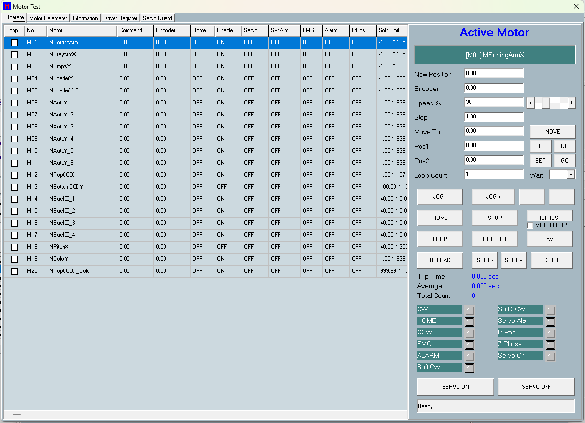

# 第 11 章　馬達測試 (Motor Test)

馬達測試 (Motor Test) 畫面提供工程與維修人員逐軸操作、診斷單一馬達的工具。可選定任一軸後進行點動 (JOG +/-)、步進 (Step +/-)、移動到指定位置 (MOVE / Pos1 / Pos2 / SOFT +/-)、單軸回原點 (HOME)，以及來回往復測試 (LOOP / MULTI LOOP)，並即時顯示命令位置 (Command)、編碼器位置 (Encoder) 與每軸狀態 LED。另含分頁可檢視/編輯馬達參數、檢視硬體資訊、讀取驅動器暫存器，以及帶安全連鎖的伺服上/下電 (Servo Guard) 作業。

所有移動皆受 EMG（急停）、伺服警報、機台運轉中、SortArm Z 回原點、軟體極限等連鎖把關。

> ⚠️ 注意：本畫面下達的命令會讓馬達**實際運轉**。即使機台處於 DUMMY（模擬料盤）模式，馬達與氣缸仍會物理移動（防撞連鎖僅在軟體模擬版編譯下才停用，執行期 DUMMY 不會停用）。操作前務必確認機構行程內無人員、工具或料件，並備妥急停 (EMG)。

> 圖 11-1 馬達測試畫面。（擷取方式：於主畫面進入維護/工程功能後開啟 Motor Test 畫面，預設停在 Operate 分頁）

## 11.1 畫面架構

馬達測試畫面分為五個分頁：

| 畫面項目 | 類型 | 功能 |
| --- | --- | --- |
| 分頁列 | 分頁容器 | 五個分頁：Operate / Motor Parameter / Information / Driver Register / Servo Guard |
| Operate | 分頁 | 主要操作分頁：左側為馬達清單+狀態，右側為操作面板 |
| Motor Parameter | 分頁 | 顯示/編輯每軸 Mot_Table.csv 參數列 |
| Information | 分頁 | 唯讀顯示每軸硬體資訊（卡別/板/埠/位址/伺服設定/馬達繼電/上電狀態等） |
| Driver Register | 分頁 | 讀取 MC88X1 驅動器暫存器（依 offset 或預設清單，唯讀） |
| Servo Guard | 分頁 | 伺服上/下電前的安全條件檢查（Guard 乾跑 / Apply 實際動作） |

## 11.2 Operate 分頁（操作）

### 11.2.1 馬達清單與狀態顯示

左側的馬達清單兼選擇器，點任一列即選為作用軸（該列以藍色高亮）。

| 畫面項目 | 類型 | 功能 |
| --- | --- | --- |
| 馬達清單表 | 表格 | 馬達清單兼選擇器，欄位：Loop / No / Motor / Command / Encoder / Home / Enable / Servo / Svr Alm / EMG / Alarm / InPos / Soft Limit；點任一列選為作用軸；第一欄 Loop 為核取方塊，標記 MULTI LOOP 成員 |
| 作用軸名稱顯示燈 | 顯示燈 | 顯示目前作用軸的編號+別名 |
| 命令位置顯示欄 | 顯示欄 | 作用軸命令位置（唯讀，單位 mm，2 位小數） |
| 編碼器位置顯示欄 | 顯示欄 | 作用軸編碼器位置（唯讀） |
| 訊息列 | 顯示燈 | 顯示操作結果/中止原因 |

### 11.2.2 速度、步距與目標設定

| 畫面項目 | 類型 | 功能 |
| --- | --- | --- |
| Speed % 輸入欄 | 輸入欄 | 速度百分比 (1~100)；點擊跳出鍵盤輸入；每次選軸自動重設為安全 30% |
| Speed % 捲軸 | 捲軸 | 以捲軸調整速度百分比，同步 Speed % 輸入欄（HOME 進行中不套用） |
| Step 步距輸入欄 | 輸入欄 | 步進距離 (mm, 2 位小數)；Step +/- 以目前位置±步距為目標；為 0 時預設 100 (=1mm) |
| Move To 目標位置輸入欄 | 輸入欄 | MOVE 目標位置輸入 (mm) |
| Pos1 教導位置輸入欄 | 輸入欄 | 教導位置 1 (mm)；SET 由現位記錄，GO 移動到此，亦為 Loop 端點之一 |
| Pos2 教導位置輸入欄 | 輸入欄 | 教導位置 2 (mm)；SET/GO 同上，Loop 另一端點 |
| Loop Count 輸入欄 | 輸入欄 | 往復測試次數 (1~99999) |
| Wait 下拉 | 下拉/輸入 | 每段往復之間的等待時間下拉選擇 (ms) |
| MULTI LOOP 勾選 | 核取方塊 | 勾選後 LOOP 改為多軸同時往復（成員由馬達清單表 Loop 欄核取方塊決定，至少 2 軸） |

### 11.2.3 操作按鈕

| 畫面項目 | 類型 | 功能 |
| --- | --- | --- |
| JOG + | 按鈕 | 按住點動正向 (CW)，放開停止 |
| JOG - | 按鈕 | 按住點動負向 (CCW)，放開停止 |
| + | 按鈕 | 正向步進一個 Step 距離 |
| - | 按鈕 | 負向步進一個 Step 距離 |
| MOVE | 按鈕 | 移動作用軸到 Move To 目標位置 |
| HOME | 按鈕 | 單軸回原點；進行中顯示 HOMING.. 紅字，完成後顯示回原行程 |
| STOP | 按鈕 | 停止作用軸；若 HOME 進行中，會重新初始化單軸回原點程序以免之後 JOG/MOVE 無效 |
| REFRESH | 按鈕 | 重新載入馬達清單與所有表格 |
| SET | 按鈕 | 以現位記錄到 Pos1 / Pos2 |
| GO | 按鈕 | 移動到 Pos1 / Pos2 |
| SOFT - / SOFT + | 按鈕 | 移動到負向/正向軟體極限 (SoftLimitN / SoftLimitP) |
| LOOP | 按鈕 | 開始往復測試（單軸或多軸，視 MULTI LOOP 勾選） |
| LOOP STOP | 按鈕 | 停止往復測試並停止馬達 |
| SAVE / RELOAD | 按鈕 | 儲存/重新載入 Pos1/Pos2 等設定（存於 motor_test.ini） |
| SERVO ON / OFF | 按鈕 | 伺服上/下電（直接走伺服上下電安全連鎖路徑） |
| CLOSE | 按鈕 | 關閉畫面（有未存參數會先提示） |

### 11.2.4 狀態 LED

作用軸右側有 11 顆狀態燈，依馬達狀態點亮：

| 序號 | 標籤 | 說明 |
| --- | --- | --- |
| 0 | CW | 正向（CW）硬極限 |
| 1 | HOME | 原點感測 |
| 2 | CCW | 負向（CCW）硬極限 |
| 3 | EMG | 急停 |
| 4 | ALARM | 馬達警報 |
| 5 | Soft CW | 正向軟體極限 |
| 6 | Soft CCW | 負向軟體極限 |
| 7 | Servo Alarm | 伺服警報 |
| 8 | In Pos | 到位 |
| 9 | Z Phase | Z 相 |
| 10 | Servo On | 伺服上電 |

**LED 顏色慣例**：其中 EMG / ALARM / Servo Alarm 三顆觸發時亮紅，其餘為預設色（一般為綠）。

> ⚠️ 注意：本畫面（Motor Test）**未套用**其他畫面（如 Teach）的「綠=使用中且觸發 / 灰=使用中閒置 / 紅=未使用」三色慣例。各 LED 確切顏色語意請以實機現場確認。

> 註（定案）：Soft CW／CCW 兩顆狀態燈**僅 MC88X1 驅動的軸會點亮**；MN200 與 SMC 驅動的軸只更新 Inpos、其餘狀態燈恆為熄——**MN200/SMC 軸這兩顆燈永遠不亮屬預期行為，非故障**。

## 11.3 操作流程

### 11.3.1 選擇作用軸並 JOG / Step 微動

1. 於 Operate 分頁的馬達清單表點選目標馬達列（該列變藍色高亮）。
2. 確認右側的作用軸名稱顯示燈顯示正確的編號+別名。
3. 視需要調整 Speed %（預設每次選軸重設為 30%）。
4. 按住 JOG +（CW）或 JOG -（CCW）點動，放開即停；或於 Step 設步距後按 + / - 步進。

> ⚠️ 注意：JOG 受下列連鎖把關 — EMG、HOME 或 LOOP 進行中、SortArm X 需 Z 全吸嘴回原點、以及方向性極限（CW 燈擋 JOG+，CCW 燈擋 JOG-，此為空間慣例，與 Direction 設定無關）。極限造成的 ALARM 燈**不擋** JOG，可往反方向 JOG 脫離極限。

### 11.3.2 移動到指定位置

1. 選定作用軸。
2. 於 Move To 輸入目標（或按 SET 記錄 Pos1/Pos2）。
3. 按 MOVE / GO(Pos1) / GO(Pos2) / SOFT + / SOFT -。
4. 觀察命令位置 / Encoder 與 In Pos 燈。

> ⚠️ 注意：移動前系統會把關：參數需已存、機台非運轉中、無 HOME/LOOP 進行中、無 EMG、馬達需 Enable、無伺服/EMG/非極限 ALARM、需已回原點、SortArm X 移動需 Z 回原點、目標需在軟體極限內。任一不符即中止並於訊息列顯示原因。

### 11.3.3 單軸回原點 (HOME)

1. 選定作用軸。
2. 按 HOME。
3. 按鈕顯示 HOMING.. 紅字，等待完成。
4. 完成後訊息列顯示 Home finish 與回原行程 (mm)。

> ⚠️ 注意：HOME 為脫離 CW/CCW 極限的復歸路徑，故僅限**極限造成**的 ALARM 不擋 HOME；真正的伺服警報或 EMG 仍會擋。過程中按 STOP 會重新初始化單軸回原點程序。

### 11.3.4 往復 Loop 測試

1. 選軸並設定 Pos1 / Pos2 與 Loop Count，可設 Wait。
2. （可選）勾選 MULTI LOOP 並在馬達清單表 Loop 欄核取至少 2 軸。
3. 按 LOOP 開始，Trip / Average / Total 統計即時更新。
4. 按 LOOP STOP 結束。

> ⚠️ 注意：啟動前會對 Pos1 與 Pos2 各做一次移動條件檢查；多軸模式成員為馬達清單表 Loop 欄核取方塊勾選的軸。

## 11.4 Motor Parameter 分頁（馬達參數）

顯示/編輯每軸 Mot_Table.csv 參數列，表頭文字即 CSV 欄名（含舊拼字 HomeDirectior），首欄 Motorname 凍結唯讀。

| 畫面項目 | 類型 | 功能 |
| --- | --- | --- |
| 馬達參數表 | 表格 | 逐軸 Mot_Table 參數表；雙擊可編輯允許欄位；欄位：Motorname / Alias / Direction / GearRatio / HomeDirectior / HomeHighSpeed / HomeLowSpeed / InitSpeed / JogHighSpeed / JogLowSpeed / Rate / SoftLimitN / SoftLimitP / Enable / ServoAlarmOn / Range / 1P2P / SensorType / SimulateSpeed / CardModel / BoardID / Port / Acc / Dec / MotorKind / FlushPanel / HomeOrder / LimitLogic / In1Logic |
| SAVE PARAM | 按鈕 | 驗證後將參數寫回 Mot_Table.csv（先備份並寫 log） |
| RELOAD PARAM | 按鈕 | 放棄編輯，重新載入作用軸參數 |
| VALIDATE ALL | 按鈕 | 驗證整份 Mot_Table.csv 並顯示摘要/錯誤 |

**編輯參數步驟**：

1. 切換到 Motor Parameter 分頁。
2. 雙擊可編輯欄位修改值。
3. 按 VALIDATE ALL 驗證整檔。
4. 按 SAVE PARAM 寫回（先備份+log）；或 RELOAD PARAM 放棄。

> ⚠️ 注意：有未存編輯時，Move / Servo 等動作會被擋下，關閉畫面也會先提示。

> 註：回原相關可設定欄為 `Mot_Table.csv` 的 `HomeDirectior`（舊拼字）/`HomeHighSpeed`/`HomeLowSpeed`/`HomeOrder`。現行機台設定：**全部啟用軸 HomeDirectior=1（僅 M20 MTopCCDX_Color=0）**；HomeHighSpeed/LowSpeed 多數軸 100/10（M12/M20 CCD 軸 200/20、M14~M17 吸嘴 Z 軸 100/50）；**HomeOrder 欄全部空白**（回原順序由程式內建順序決定，非 CSV 控制）。實際回原方式（如 type-7）定義於馬達驅動層。

## 11.5 Information 分頁（硬體資訊）

唯讀顯示每軸硬體與電源資訊。

| 畫面項目 | 類型 | 功能 |
| --- | --- | --- |
| 硬體資訊表 | 表格 | 唯讀硬體與電源資訊表；欄位：No / Alias / Card / Board / Port / Address / Kind / Flush Panel / ServoCfg / IsServo / MotorRelay / ServerON / SnMotorPower / PowerState / Delay |

## 11.6 Driver Register 分頁（驅動器暫存器）

讀取 MC88X1 驅動器暫存器（依 offset 或預設清單，唯讀）。

| 畫面項目 | 類型 | 功能 |
| --- | --- | --- |
| 暫存器結果表 | 表格 | 顯示暫存器讀取結果，欄位：Register / Value / Result |
| Offset 輸入欄 | 輸入欄 | 暫存器 offset 輸入（支援 0x 十六進位） |
| READ OFFSET | 按鈕 | 依 Offset 讀取暫存器 |
| READ DEFAULTS | 按鈕 | 讀取預設暫存器清單 (0x00 / 0x02 / 0x04 / 0x08) |

## 11.7 Servo Guard 分頁（伺服上/下電安全檢查）

提供伺服上/下電前的安全條件逐項檢查。Guard 為乾跑（不實際動作），Apply 為條件通過後實際動作。

| 畫面項目 | 類型 | 功能 |
| --- | --- | --- |
| 安全條件檢查表 | 表格 | 伺服上/下電安全條件逐項檢查結果，欄位：Item / Value / Note（含 SystemStart / EMG / SafeDoor / MotorRelay / ServerON / PowerState / PowerDelay / 伺服數 / 警報數 / Actuation 等） |
| SERVO ON GUARD | 按鈕 | 伺服上電條件乾跑檢查（不動作，寫 log） |
| SERVO OFF GUARD | 按鈕 | 伺服下電條件乾跑檢查 |
| SERVO ON APPLY | 按鈕 | 條件通過後實際伺服上電 |
| SERVO OFF APPLY | 按鈕 | 條件通過後實際伺服下電 |

**伺服上/下電步驟**：

1. 切換到 Servo Guard 分頁。
2. 先按 SERVO ON/OFF GUARD 乾跑檢查條件，看 Result = PASS / BLOCKED 與各 Item。
3. 條件通過後按 SERVO ON/OFF APPLY 實際動作（操作面板的 SERVO ON / OFF 直接走 Apply 路徑）。

> ⚠️ 注意：伺服上電 (APPLY ON) 需全數通過 — 無未存參數、機台非運轉中、無 HOME/LOOP 進行中、EMG=0、SafeDoor=0、至少一顆 Enable 的伺服、MotorRelay ON、馬達電源狀態 ON、上電延遲=0、無伺服警報（非極限的 ALARM 或伺服警報燈或 EMG 燈）。下電 (APPLY OFF) 會先停止作用軸、解除所有鎖並關閉伺服電源，再逐軸下電。每次操作都會寫 Servo Guard log。

### 伺服警報的清除

伺服警報屬「鎖存 (latched)」狀態。MC88X1 的伺服上電指令對清除鎖存警報無效，鎖存的伺服警報需經 **馬達繼電 (Motor Relay) Off→On 的電源重置 (power-cycle)** 才能清除。

> ⚠️ 注意：本畫面的 SERVO ON / OFF 走伺服電源 (Servo ON) 路徑。伺服電源 Off→On 是否等同馬達繼電的 power-cycle、是否足以清除所有鎖存伺服警報，需實機確認。若 SERVO OFF→ON 無法解除警報，請改以馬達繼電電源重置。

> 註（既定結論）：MC88X1 的鎖存伺服警報 `SetServoOn` 清不掉（no-op），**必須 `SwMotorRelay` Off→On 電源重置**。本畫面 SERVO ON/OFF 走 `SwServerON`，與 `SwMotorRelay` 為不同輸出點，**不等同 power-cycle**——SERVO OFF→ON 無法解除鎖存警報時，請以馬達繼電（`SwMotorRelay`）電源重置處理。
>
> 【待補（現場）：實機驗證一次「SERVO OFF→ON 不能清除、SwMotorRelay 重置可清除」的完整操作動線，補上操作員步驟。】

## 11.8 參數範圍

| 參數 | 範圍/預設 | 說明 |
| --- | --- | --- |
| Speed % | 1~100；每次選軸重設為 30 | JOG/移動速度百分比（套用於 JogHighSpeed 的百分比，下限 JogLowSpeed） |
| Step | 0.01~999999；0 時用 100 (=1mm) | 步進距離 (mm) |
| Move To / Pos1 / Pos2 | 無上下限檢查，受軟體極限把關 | 目標/教導位置 (mm，內部 1/100mm) |
| Loop Count | 1~99999 | 往復測試次數 |
| Wait | 下拉選擇 | 每段往復間等待時間 (ms) |
| motor_test.ini | — | Pos1/Pos2/Multi-loop 等暫存設定檔（SAVE/RELOAD） |
| Mot_Table.csv 欄位 | 存檔前驗證 | Motor Parameter 分頁可編輯的每軸參數；表頭=CSV 欄名（含舊拼字 HomeDirectior） |
| Driver Register Offset | 支援 0x 十六進位；預設清單 0x00/0x02/0x04/0x08 | MC88X1 暫存器讀取 offset（唯讀） |
| 最大馬達數 | 64（實際軸數取總馬達數與 64 的較小值） | Motor Test 支援的最大馬達數上限 |

> 註（定案）：Wait 下拉選項為 **0 / 0.05 / 0.1 / 0.2 / 0.5 / 1.0 / 2.0 / 5.0 / 10.0（秒）**，預設 0；換算為 0/50/100/200/500/1000/2000/5000/10000 ms，可手動輸入任意值，上限 100 秒。

## 11.9 安全連鎖總覽

| 連鎖 | 觸發時機 | 說明 |
| --- | --- | --- |
| 移動條件檢查 | Move / Step / GO / Soft / Loop / HOME 共用 | 無馬達 / 參數未存 / Mot_Table 未存 / 機台運轉中 / HOME 或 LOOP 進行中 / EMG / 馬達 Disable / 伺服警報 / EMG 燈 / 非極限 ALARM / 需回原點但未回原點 / SortArm X 需 Z 回原點 / 目標超軟體極限 — 任一成立即中止 |
| HOME 例外 | 極限造成的 ALARM | 僅 CW/CCW 極限造成的 ALARM (limit-only) 不擋 HOME（HOME 是脫離極限的復歸路徑）；真正伺服警報/EMG 仍擋 |
| JOG 連鎖 | JOG +/- | HOME/LOOP 進行中與 EMG 一律擋；SortArm X JOG 需所有吸嘴 Z 回原點；方向性極限 — CW 燈擋 JOG+、CCW 燈擋 JOG-（空間慣例，與 Direction 無關）；極限造成的 ALARM 燈不擋 JOG |
| SortArm X 防撞 | 作用軸為 SortArm X 軸 | Move/JOG 皆需所有吸嘴 Z 已回原點（與生產同一規則） |
| EMG 即時停止 | 週期輪詢 | EMG 被按下即停止作用軸並中止進行中的 move/jog/home/loop（非僅擋啟動） |

## 11.10 警報與排除

| 警報訊息 | 意義 | 排除方式 |
| --- | --- | --- |
| Move abort: parameter not saved / Mot_Table not saved | 有未儲存的馬達參數/Mot_Table 編輯，禁止移動 | 先按 SAVE PARAM 或 RELOAD PARAM |
| Machine is running. / Move abort: system start | 機台生產中，禁止手動移動 | 停止生產後再操作 |
| Motor Test is busy (home or loop running). | 已有 HOME 或 Loop 進行中 | 等待完成或按 STOP / LOOP STOP |
| EMG is pressed. / Move abort: EMG | 急停被按下 | 解除急停 |
| Motor is disabled. / Move abort: motor disable | 該軸未啟用 (Enable=false) | 於 Motor Parameter 設 Enable 或選其他軸 |
| Motor alarm is active. / Move abort: motor alarm | 伺服警報或非極限 ALARM 觸發 | 排除警報；若為極限可改用 HOME 復歸；伺服警報需經 Servo Off→On 或電源重置 |
| Motor is not home. / Move abort: motor not home | 需先回原點才能移動 | 先按 HOME |
| Sort arm Z must be home before X move/jog. / Move abort: Sort Z not home | SortArm X 移動/JOG 前所有吸嘴 Z 未回原點（防撞） | 先讓 SortArm Z 吸嘴回原點 |
| Target over soft limit. / Move abort: soft limit | 目標超出軟體極限 | 修改目標於 SoftLimitN~SoftLimitP 內 |
| CW/CCW (+/-) limit is triggered. Jog +/- is blocked | 該方向硬極限觸發，禁止繼續往該方向 JOG | 往反方向 JOG 脫離極限 |
| Servo guard/apply blocked: \<reason\> | 伺服上/下電安全條件未通過（列出原因：機台運轉中/EMG/SafeDoor/MotorRelay off/PowerState off/PowerDelay/伺服警報/未存等） | 依 Servo Guard 表逐項排除後重試 |
| Servo Guard log failed / Save/validation failed | Servo Guard log 寫入或 Mot_Table 驗證/儲存失敗 | 檢查檔案路徑/磁碟；依錯誤訊息修正參數 |

## 11.11 畫面運作流程（參考）

- **開啟畫面時**：載入馬達清單、載入 Loop 位置、設定五個表格欄位並重繪，最後啟動週期更新。
- **週期更新**：先偵測 EMG，一旦按下即停止作用軸並中止進行中的回原/往復；同步 HOME 按鈕的 HOMING.. 紅字；有回原進行中則推進回原，完成後清除狀態並顯示行程；有往復進行中則推進單軸或多軸往復（含 Wait 等待）；最後更新命令位置/Encoder 與 11 顆 LED。
- **更新顯示**：讀取馬達狀態與命令+編碼器位置，顯示編號別名/命令位置/Encoder，並逐燈更新 11 顆狀態 LED；EMG 燈另外參考上層系統的急停狀態。
- **關閉畫面時**：有未存參數則取消關閉；否則停止週期更新、停止作用軸並寫關閉 log。

> 註（定案）：本畫面所有按鈕與標籤文字全為英文，無中文字串。
