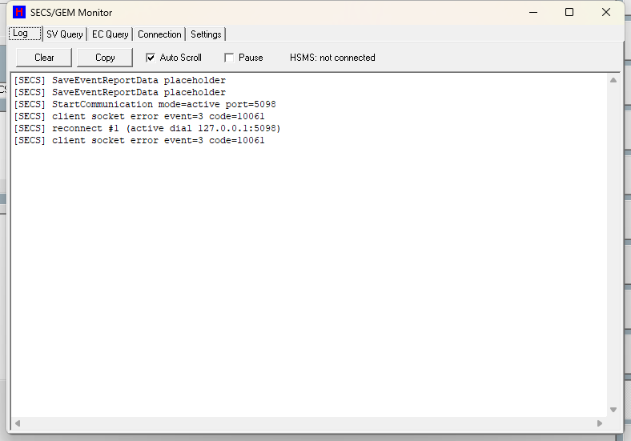

# 第 12 章　SECS/GEM 與 AMR/AGV

本章說明 HT160S 與工廠主機 (Host) 之間的 SECS/GEM 通訊介面，以及與無人搬運車 (AMR/AGV) 之間的 E87 站台協調機制。內容偏向整合者 (integrator) 層級：涵蓋 SECS/GEM 監控視窗的操作、連線設定、SV/EC 查詢與編輯、事件 (CEID) 回報，以及 AMR/AGV 的開關、Ready/Finish 交車握手、滿車/缺料通報 (CEID272)、START_AGV 指令與換車期間的 TrayArm 鎖定。

> ⚠️ 注意：SECS/GEM 為付費選配功能。未購買時主畫面不顯示 SECS 徽章、整個通訊堆疊不啟動。各客戶現場是否啟用，以及主機端實際使用的 SVID/ECID/CEID 對應表，請以整合者文件與現場設定為準。

---

## 12.1　功能總覽

HT160S 的主機通訊與無人車協調由兩個子系統構成：

- **SECS/GEM 介面 (主機通訊)**：依 SEMI SECS-II / GEM (HSMS-SS) 規範，讓主機可遠端查詢設備狀態 (SV)、查詢/設定設備常數 (EC)、下達主機指令 (Host Command) 並接收事件回報 (S6F11)。操作員端以主畫面的 **SECS 狀態徽章** 與「SECS/GEM Log 監控視窗」觀察與設定。
- **AMR/AGV 站台協調 (E87)**：在 SECS/GEM 連線下，將 9 個料站 (P1=Loader、P2=Empty、P3=Color、P4~P9=Auto1~Auto6) 的缺料/滿車狀態通報主機並完成交車握手 (Ready/Finish)。操作員端以主畫面的 **AMR 狀態徽章** 觀察，於維修畫面以 **Use AMR** 勾選開關啟用。

兩者皆由 GEM 引擎每秒更新一次驅動：SECS 負責訊息收送與狀態鏡像，AMR/AGV 協調器每秒推進一次交車握手。

> ⚠️ 注意：設備不會因 SECS 指令自動啟動機台動作。`LOTSTART` 僅註冊 Lot 並拉取 2D/Bin 資料，實際開機生產仍需操作員按下按鈕 (安全考量，避免主機指令在接收當下彈出對話框而卡住通訊)。

---

## 12.2　SECS/GEM 介面 (主機通訊)

### 12.2.1　主畫面 SECS 狀態徽章

主畫面右側功能徽章區有一個 **SECS** 徽章，由 GEM 引擎每秒更新，三種狀態：

| 顯示 | 顏色 | 意義 |
| --- | --- | --- |
| `OFF` | 灰 | 未連線 (HSMS 未建立 TCP) |
| `CONNECT` | 橄欖綠 | TCP 已連線但尚未完成 SELECT |
| `ONLINE` | 綠 | HSMS 已完成 SELECT |

點擊徽章即開啟「SECS/GEM Log 監控視窗」(滑鼠停留提示 `Open SECS/GEM Log`)。未購買 SECS/GEM 選配時整個徽章隱藏，無法開啟視窗。

> 圖 12-1 SECS/GEM Log 監控視窗。（擷取方式：確認已購買 SECS/GEM 選配後，於主畫面點擊右側 SECS 狀態徽章。）

### 12.2.2　監控視窗分頁

視窗為 **非強制式 (non-modal)** 開啟，以上方分頁切換五個分頁；為節省資源，只刷新目前可見的分頁。關閉視窗不影響底層通訊與徽章運作。

| 分頁 | 用途 |
| --- | --- |
| Log | 即時 SECS TX/RX 訊息追蹤 |
| SV Query | 唯讀 Status Variable 清單與即時值 |
| EC Query | Equipment Constant 表格，部分可由本機/主機編輯 |
| Connection | 唯讀顯示目前 HSMS 端點與連線狀態 |
| Settings | 編輯 SECS 主機連線設定 (存回機台設定檔) |

### 12.2.3　Log 分頁

| 畫面項目 | 類型 | 功能 |
| --- | --- | --- |
| HSMS 狀態顯示列 | 顯示 | 顯示目前 HSMS 狀態 (`not connected` / `CONNECTED` / `SELECTED`) |
| SECS 訊息顯示框 | 文字框 | 顯示 SECS 收送訊息追蹤；超過上限自動刪除最舊行 |
| Clear | 按鈕 | 清空訊息顯示內容 |
| Copy | 按鈕 | 全選並複製訊息文字到剪貼簿 |
| Auto Scroll | 勾選 | 勾選時新訊息自動捲動到底 |
| Pause | 勾選 | 勾選時暫停顯示新訊息 (凍結畫面，不影響底層通訊) |

**查看 SECS 收送訊息步驟：**

1. 切到 **Log** 分頁。
2. 觀察訊息顯示框的即時 TX/RX 追蹤與頂部 HSMS 狀態。
3. 需要凍結畫面排查時，勾選 **Pause**。
4. 以 **Clear** 清畫面、以 **Copy** 複製內容外送分析。

> ⚠️ 注意：**Pause** 僅凍結顯示，不影響底層 SECS 通訊。log 亦可依設定同時寫入磁碟 (見 12.2.7 的 LogToFile 設定)。

### 12.2.4　SV Query 分頁

**SV Query** 分頁為唯讀的 Status Variable 即時值表格，欄位為 `SVID / Name / Unit / Value`。每次刷新會先抓取即時機台資料再顯示。

### 12.2.5　EC Query 分頁

**EC Query** 分頁顯示 Equipment Constant 表格，欄位為 `ECID / Name / Unit / Value / Settable`。其中 `Settable=Yes` 僅限料盤幾何相關的 EC (ECID 2758–2763)，其餘為唯讀。

| 畫面項目 | 類型 | 功能 |
| --- | --- | --- |
| EC 表格 (列點選) | 表格 | 點選 EC 列；可設定者啟用編輯框與寫入鈕，不可設定者顯示 `Read-only EC (not host/GUI settable)` |
| EC 新值輸入框 | 編輯框 | 輸入選定料盤幾何 EC 的新值 |
| Write EC | 按鈕 | 寫入選定 EC (僅機台閒置時允許) |
| 選定 EC 顯示列 | 顯示 | 顯示目前選定的 EC |
| 寫入結果顯示列 | 顯示 | 顯示寫入結果 (`Write OK` / `Rejected: machine busy` / `Rejected: value invalid`) |
| EC 編輯區 | 面板 | EC 編輯區容器 |

**由本機編輯料盤幾何 EC 步驟：**

1. 確認機台閒置 (系統未啟動且機內無 IC)。
2. 切到 **EC Query** 分頁，點選 ECID 2758–2763 任一列。
3. 在 EC 新值輸入框輸入新值，按 **Write EC**。
4. 檢視寫入結果顯示列的結果。

> ⚠️ 注意：本機畫面寫入 EC 與主機端 S2F15/S2F16 共用同一道閘控 — 僅在機台閒置 (系統未啟動且機內無 IC) 時才允許。寫入成功會存回目前 recipe 的設定檔。非料盤幾何的 EC 一律唯讀。

### 12.2.6　Connection 分頁

唯讀顯示目前設定的 HSMS 端點與即時狀態：

| 畫面項目 | 顯示內容 |
| --- | --- |
| Address 顯示列 | Address (主機位址) |
| Port 顯示列 | Port |
| Device ID 顯示列 | Device ID |
| HSMS Mode 顯示列 | HSMS Mode (`Active(connect)` / `Passive(listen)`) |
| 連線狀態顯示列 | 即時連線狀態 (含重連倒數狀態文字) |

### 12.2.7　Settings 分頁與連線設定

Settings 分頁可編輯 SECS 主機連線設定並回寫到機台設定檔 `system\General.ini` 的 `[SECS]` 區段。

| 畫面項目 | 類型 | 功能 |
| --- | --- | --- |
| Enable GEM 勾選 | 勾選 | 勾選才啟用整個 GEM 堆疊 |
| Active Mode 勾選 | 勾選 | 勾選=Active 主動撥接 (client/host)，不勾=Passive 監聽 (server/equipment 預設)。Active 模式需填位址，否則拒絕儲存 |
| Host Address 輸入框 | 編輯框 | 主機位址 |
| Port 輸入框 | 編輯框 | Port (1–65535) |
| Device ID 輸入框 | 編輯框 | Device ID (0–65535) |
| Save | 按鈕 | 驗證後回寫連線設定；提示 `Saved. Restart ht160s.exe to apply` |
| Reload | 按鈕 | 從設定檔重新載入設定到編輯欄 |

**設定主機連線端點步驟：**

1. 切到 **Settings** 分頁。
2. 勾選 **Enable GEM** 啟用。
3. 選擇連線角色：**Passive** (監聽，設備預設，不勾 Active Mode)，或 **Active** (主動撥接，勾選 Active Mode 並填入主機 Address)。
4. 填入 **Port** (1–65535) 與 **Device ID** (0–65535)。
5. 按 **Save**。
6. 重新啟動 `ht160s.exe` 讓新端點生效。

> ⚠️ 注意：Settings 設定無熱套用，存檔後 **必須重啟 `ht160s.exe`** 才生效 (開機時才讀取新設定)。Active 模式未填 Address 會被拒絕儲存。

#### `[SECS]` 連線參數

| 參數 | 範圍/預設 | 說明 |
| --- | --- | --- |
| `Enable` | 預設 1 (啟用) | 是否啟用整個 GEM 通訊堆疊 (>0 啟用) |
| `Address` | 預設 127.0.0.1 | 主機位址 (Active 模式撥接目標) |
| `Port` | 預設 5098；有效 1–65535，越界回退 5098 | HSMS TCP 埠 |
| `DeviceID` | 預設 0；有效 0–65535 | HSMS Device ID |
| `ActiveMode` | 預設 0 (Passive 監聽) | 1=Active 主動撥接 (client/host) / 0=Passive 監聽 (server/equipment) |
| `ReconnectInterval` | 預設 5；<0 視為 0 | 自動重連嘗試間隔 (秒)，0=關閉 |
| `LinktestInterval` | 預設 10 | SELECTED 狀態下 Linktest 心跳間隔 (秒)，0=關閉 |
| `T6Timeout` | 預設 6 | 等待 Linktest.rsp 的 T6 逾時 (秒) |
| `LogToFile` | 預設 1 (寫入) | 是否將 SECS 通訊紀錄寫入磁碟 (`D:\HT160S_Log\SECS_GEM\yyyy_mm_dd`) |
| `LogLinktest` | 預設 0 (關) | 是否在 log 顯示例行 Linktest 收送 (避免洗版，預設關) |

### 12.2.8　料盤幾何 EC (可設定範圍)

僅以下料盤幾何 EC 為可寫 (主機/本機共用閘控，與 9045 Type1 對齊)，寫入成功存回目前 recipe 的 `setup.ini`：

| 參數 | 範圍/預設 | 說明 |
| --- | --- | --- |
| EC 2758 / 2759 | mm；FT_8；預設 0 | Tray X / Y Pitch (料盤 X/Y 間距)；存回 `setup.ini [TrayForm]` |
| EC 2760 / 2761 | mm；FT_8；預設 0 | Tray X / Y Start (料盤 X/Y 起始位置) |
| EC 2762 / 2763 | INT_4；預設 0 | Tray X / Y Division (料盤 X 行數 / Y 列數) |
| EC 1501 | ASCII；唯讀 | Recipe Name (目前 Setup File 名稱)；唯讀回報，不在可寫範圍 |

### 12.2.9　GEM 訊息分派與運作流程

開機與運作流程概要 (整合者參考)：

1. **開機**：系統檢查是否已購買 SECS/GEM 選配；未購買則整個通訊堆疊不啟動 (不開 socket、不顯示徽章)。
2. 讀取機台設定檔 `[SECS]` 全部連線參數。
3. 註冊全部 SV/EC/CEID/Report；啟動每秒更新 (1 秒一次)。
4. `Enable>0` 時設定重連/Linktest/T6 參數、選定 Active/Passive 模式、開啟 HSMS 連線。
5. **每秒更新**：依連線狀態 (已 SELECTED / 已 CONNECTED / 未連線) 將徽章設為 ONLINE/CONNECT/OFF；同時推進 E87/AGV 協調器。
6. **HSMS-SS 控制**：自動回應 Select/Linktest/Separate；Linktest 心跳 + T6 逾時偵測斷線並重連。
7. **主機主要訊息分派**：

   | 主機訊息 | 設備回應 | 用途 |
   | --- | --- | --- |
   | S1F3 | S1F4 | 查詢 SV (selected) |
   | S1F11 | S1F12 | 查詢 SV 名稱清單 |
   | S2F13 | S2F14 | 查詢 EC |
   | S2F15 | S2F16 | 寫入 EC |
   | S2F41 | S2F42 (HCACK) | Host Command |
   | S5F1 / S5F6 | — | 警報相關 |
   | S7Fx | — | Recipe 傳輸 |
   | S14F1 | S14F2 | 物件屬性查詢 |

8. **事件回報**：事件觸發時先把即時機台資料快照，再以 S6F11 送出 (僅 SELECTED 狀態)。
9. **控制狀態 (SV 66002)**：主機 `ONLINE_REMOTE`/`ONLINE` 設為 5 (Remote)、`ONLINE_LOCAL` 設為 4 (Local)。此為鏡像值，非真正 GEM 狀態機。

#### S2F41 主機指令 (Host Command)

主機以 S2F41 下達指令，設備回 S2F42 (HCACK)：

- `SET_LOT_INFO`、`LOTSTART`、`PAUSE`、`ONLINE_REMOTE`、`ONLINE_LOCAL`、`START_AGV`。
- `LOTSTART` / `SET_LOT_INFO` 在機台生產中或機內有 IC 時拒絕 (HCACK=4)。

> ⚠️ 注意：`LOTSTART` 只註冊 Lot 並 (非阻塞式) 拉取 2D/Bin 資料；機台啟動仍需操作員。這是安全關鍵設計，避免主機指令在接收當下彈出對話框而卡住通訊。

### 12.2.10　SECS 事件 (CEID) 一覽

設備在對應動作發生時以 S6F11 回報事件 (僅 SELECTED 時送出)。下表為操作/狀態類事件；AGV 相關事件 (CEID 272–275) 詳見 12.3。

| CEID | 事件 | 意義 |
| --- | --- | --- |
| 1 | HandlerStatus | Handler 換狀態 |
| 2 | RecipeChange | Recipe 變更 |
| 3 | ClearCount | 按下清除計數鈕 |
| 4 / 5 | PressStartWithoutIC / PressStartWithIC | 機內無/有 IC 時按 Start |
| 6–10 | PressPause / PressHome / PressOneCycle / PressCleanOut / PressTrayFeed | 按下對應功能鈕 |
| 11 / 12 | PressLotStart / PressLotEnd | 按下 Lot Start / Lot End |
| 13–16 | PressExit / PressRetry / PressSkip / PressAlarmReset | 按下對應鈕 |
| 17 / 18 | ShowAlarm / ReleaseAlarm | 警報出現 / 解除 |
| 19 / 20 | ShowMessage / ReleaseMessage | 訊息出現 / 解除 |
| 21–26 | ChangeUser / EnterSetup / EnterMaintenPage / EnterIOPage / EnterTeach / EnterSECSPage | 切換使用者層級 / 進入對應頁 |
| 27–29 | OneCycleOK / CleanOutOK / TrayFeedOK | 對應動作完成 |
| 30 | TimeEvent | 時間事件 |
| 31 | RealDummy | 切換 Real/Dummy 模式 |
| 272 | AGVSupplement | E87/AGV 補料事件 (見 12.3) |
| 273 | AGVLDUnLDStatus | AGV 取/放料狀態 (Ready，見 12.3) |
| 274 | AGVLDUnLDFinish | AGV 取/放料完成 (Finish，見 12.3) |
| 275 | AGVLdID | AGV carrier ID 回報 (見 12.3) |

### SVID/ECID band 對照（9045 對齊段 vs HT160 自訂段）

| 段 | ID | 語意 | 備註 |
| --- | --- | --- | --- |
| 9045 對齊（SVID） | 1001 / 1003 / 1021 / 1027 | Machine Model / Software Version / UPH / System Time | 與 HT9045 同號 |
| 9045 對齊（ECID） | 1501 | Recipe Name | HT160 為唯讀 |
| 9045 對齊（ECID） | 2758–2763 | Type1 Tray Pitch/Start/Division X&Y | S2F16 可寫（限停機）；Type2/3 預留 2771-2776 / 2784-2789 未註冊 |
| HT160 自訂（66000+） | 66000 / 66001 / 66002 | Run Mode / System Running / Control State | 66002 鏡像 4=Local / 5=Remote |
| HT160 自訂 | 66010 / 66011 | Alarm Active / Alarm Code | |
| HT160 自訂 | 66020 / 66021 | Total IC / Total Sorted | |
| HT160 自訂 | 66030 / 66031 / 66032 | Active Lot Count / Current Lot ID / Sort Mode | 66032 回「有效模式」（S1F3 查詢）：0/1/2 = 維護畫面 Sort Mode 選擇器的基礎模式（Normal／LotBin／LotPassFail），3 = By WhiteList 臨時覆蓋生效中（非選擇器第四項；Lot End 後回到基礎值） |
| AGV band（38xxx） | 38202–38245 | E87/AGV 站台資料 | 逐一定義見 12.3.9-2 |

> 註：Report 1 的 13 個 SV 即「4 個 9045 對齊 + 9 個 66000 band」混編（66032 不在 Report 1 內，僅供 S1F3）。與 KYEC 主機對接的最大架構差異：9045 的報告為 host-dynamic（S2F33/35/37 動態定義），HT160 為 equipment-static 固定 7 個 report。完整對照見 `docs/AGV/HT9045_vs_HT160_SECS_Diff_20260625.md`、現況介面合約見 `docs/SECS/HT160S_SECS_Comm_Examples.md`。

> 註：本程式未實作完整 E30 GEM 狀態機物件；控制狀態以 SV 66002 鏡像值（4=Local / 5=Remote）表示。警報介面：S5F1 事發即報、S5F5/S5F6 與 S5F7/S5F8 提供由警報登錄表（`mapAlarmCodeList`，SSOT）即時產生的完整警報目錄。

> 【待補：S7Fx recipe 傳輸的完整支援範圍，原始碼僅確認分派函式存在，未逐一展開；與客戶主機對接前需雙方確認。】

---

## 12.3　AMR / AGV 無人車站協調 (E87)

AMR/AGV 站台協調模組負責在 SECS/GEM 連線下將 9 個料站的缺料/滿車狀態通報主機並完成交車握手。它維護 P1–P9 靜態站台表、與 SVID 綁定的快照資料 (carrier id / 盤數 / 裝置數 / P 位元圖)，以及每站的握手狀態。

站台對應如下：

| P 站 | 模組 | 站索引 |
| --- | --- | --- |
| P1 | Loader | 0 |
| P2 | Empty | 1 |
| P3 | Color | 2 |
| P4 ~ P9 | Auto1 ~ Auto6 | 3 ~ 8 |

握手狀態依序為：閒置 → 已叫車 → 準備中 → 備妥可交車 → (完成後回) 閒置。

### 12.3.1　控制項

| 畫面項目 | 類型 | 功能 |
| --- | --- | --- |
| Use AMR 勾選 (維修畫面) | 勾選 | AMR/AGV 模式總開關；機台運轉中被鎖定不可改；勾選後立即生效 |
| AMR 徽章 (主畫面) | 圖示 | 依 AMR 開關顯示綠色 `ON` 或灰色 `OFF` |
| 模擬用每站滿盤門檻表 (主畫面，僅模擬版) | 表格 | 設定每站滿盤門檻；順序 0=Loader、1=Empty、2=Color、3..8=Auto1..6；存檔後持久化 |

### 12.3.2　啟用 AMR/AGV 模式

1. 進入 **維修畫面 (Maintenance)**。
2. 在 **機台停止狀態下** 勾選 **Use AMR**。
3. 系統啟用 AMR 模式並重整硬體設定狀態。
4. 主畫面 **AMR 徽章** 轉為綠色 `ON`。

> ⚠️ 注意：運轉中此選項被鎖定。只有在 SECS 連線為 **SELECTED** 且處於正常生產 (Normal) 模式時，才會真正發出 AGV 事件 (Normal／Clean Out 的機台行為本身不變)。

### 12.3.3　每秒 tick 與守門條件

AMR/AGV 協調器每秒推進一次「偵測叫車」與「握手服務」兩個步驟：

- AMR 模式關閉、或無自動輸出模組 → 直接返回。
- 連線非 SELECTED → 釋放所有鎖回閒置並返回。
- 非正常生產模式 → 不發起新的叫車。

### 12.3.4　Auto 滿車交車握手 (P4–P9)

1. Auto 輸出車裝滿 (模擬：車上盤數達到滿盤門檻；實機：該站滿盤感測器 ON)。
2. 偵測到滿車且該站握手＝閒置 → 鎖住該 Auto (TrayArm 停止對該車供盤)、發 **CEID272 AGVSupplement** (附滿車位元圖 SVID 38219)，狀態進入「已叫車」。
3. 主機/AMR 下達 S2F41 `START_AGV (cpName=AUTOx)` → 狀態進入「準備中」並再次鎖定 (冪等)。
4. 偵測到該車已收完所有盤、前段氣缸回到家位、無在途盤 → 發 **CEID273 AGVLDUnLDStatus (Ready)** (附狀態位元圖 SVID 38220)，狀態進入「備妥可交車」。
5. AMR 取走滿車 (實機以該站進料末端感測器 OFF＝無盤＝車已取走判定) → 發 **CEID274 AGVLDUnLDFinish** (附完成位元圖 SVID 38221)，清空車、重建堆疊角色、解除鎖，狀態回「閒置」，生產恢復。

> ⚠️ 注意：若滿車在 AGV 接手前被人工清空 (仍在「已叫車」狀態時)，則釋放鎖回到「閒置」。
>
> ⚠️ 注意：實機若該站進料末端感測器未接 (停用)，系統無法判定車已取走，握手會停在 Ready，生產停在該 Auto — 這是刻意的保守行為 (感測器尚未佈線時的安全設計)。

### 12.3.5　進料缺料補料握手 (P1–P3 Loader/Empty/Color)

1. 進料站缺料 (實機：進料末端感測器讀 OFF＝空、ON＝有盤)。
2. 偵測到進料缺料且握手＝閒置 → 發 **CEID272** (附滿車/補料位元圖 SVID 38219)，狀態進「已叫車」。
3. 主機/AMR 下 `START_AGV (cpName=Loader/Empty/Color)` → 狀態進「準備中」並凍結前段拆盤。
4. 偵測到前段堆疊氣缸都回到家位/未命令 → 發 **CEID273**，狀態進「備妥可交車」。
5. AMR 補滿料匣；偵測到補料完成 (實機：進料感測器讀到有盤 ON) → 發 **CEID274**、解凍前段拆盤，狀態回「閒置」。

> ⚠️ 注意：進料口感測器極性 ON＝有盤、OFF＝空。感測器停用時不發叫車。補料若在 AGV 接手前完成，則回「閒置」重新待命。

### 12.3.6　連線中斷回退

1. SECS 連線非 SELECTED 時，對所有非閒置的站 (P1–P9) 釋放鎖。
2. 所有握手狀態歸「閒置」。
3. Auto 滿車改由操作員提示視窗 (RETRY) 手動換車；連線斷開期間不發任何事件。

> ⚠️ 注意：離線行為與原始手動流程一致。只有連線為 SELECTED 時才會發 S6F11 事件。滿車提示要求操作員手動清空料車後按 **RETRY**；感測器仍 ON 時持續告警。

### 12.3.7　互鎖機制

> ⚠️ 注意：以下互鎖確保交車期間生產不疊盤、前段氣缸從閒置開始交車，並在斷線時安全回退。

- **TrayArm 供盤鎖**：滿車或交車進行中的 Auto 會被鎖定，使 TrayArm 停止把盤堆到該車。交車完成後解鎖。
- **Auto 排放鎖**：排放流程會跳過被鎖定的 Auto (前段氣缸維持家位，已在途的排放仍會完成)。
- **P1–P3 前段拆盤凍結**：交車準備時凍結 Loader/Empty/Color 前段拆盤，鎖定期間不啟動新的前段拆盤/供料。
- **Ready 條件需前段氣缸在家位**：Auto 站需前段升盤氣缸已回家位；進料站需前段升盤與分盤氣缸皆回家位，才會進入 Ready。
- **事件僅在 SELECTED 時送出**：連線中斷一律釋放鎖並回閒置，回退到操作員手動換車。
- **僅在正常生產模式** 才會觸發 AGVSupplement 叫車。
- **實機「車已取走」感測器** (該站進料末端感測器) 未接 (停用) 時無法判定，握手卡在 Ready (刻意的保守行為)。

### 12.3.8　AGV 設定參數

| 參數 | 範圍/預設 | 說明 |
| --- | --- | --- |
| AMR/AGV 模式總開關 (Use AMR 勾選) | bool；由維修畫面設定，持久化 | AMR/AGV 模式總開關；關閉時所有協調完全略過。同時切換 TrayArm 供料邏輯 (AMR 模式用固定 identity/cover/normal 堆疊順序) |
| 模擬用每站滿盤門檻 (模擬門檻表) | int 盤數；由主畫面模擬門檻表設定 | 模擬用每站滿盤/滿料匣門檻 (順序 0=Loader 1=Empty 2=Color 3..8=Auto1..6)；Auto 用於模擬滿車，Loader/Empty/Color 用於補滿堆疊。僅模擬版有效，實機改讀感測器 |
| 站台總數 / Auto 站數 | 9 / 6 (固定) | 站台總數 9、Auto 站數 6 |
| 每站綁定的 SVID | 38202~38245 (見下) | 每站綁定的 SVID |
| `START_AGV` 指令的 CP 名稱 | 字串；未知名稱回 HCACK=2 | S2F41 指令的 CP 名稱；有效站名 `Loader/Empty/Color/AUTO1..AUTO6` (大小寫不敏感)。特例 `LoaderTrayCount` 設定 P1 預期盤數 (SVID 38222) |

#### AGV SVID 綁定 (摘要)

每站綁定的 SVID (號碼非連續，Auto4–6 跳過保留區，故用顯式表)：

- CarrierID：38202–38207 + 38199–38201（2026-08-03 改號：Auto4–6 由 38208–38210 改為 **38199–38201**，舊號碼永不改用他義）
- TrayCount / DeviceCount
- BinSet：Auto 才有 (ASCII bin setting)
- 位元圖：38219=Supplement、38220=Status、38221=Finish

位元圖格式為 `"P1:0,...,Px:1,...,P9:0"` (只有目標站為 1，single-station rule)。

### 12.3.9　AGV 事件 (CEID 272–275)

| CEID | 事件 | 意義 | 後續 |
| --- | --- | --- | --- |
| 272 | AGVSupplement | 某站需要 AMR 服務：P4–P9=Auto 輸出車滿 (需取車)，P1–P3=進料缺料 (需補料)；附帶滿車/補料位元圖 (SVID 38219) | 主機/AMR 派車，後續以 START_AGV 進入握手 |
| 273 | AGVLDUnLDStatus (Ready) | 該站已備妥可交車 (Auto 已收完所有盤且前段氣缸在家位；進料站前段堆疊氣缸閒置)；附帶狀態位元圖 (SVID 38220) | AMR 執行裝/卸車 |
| 274 | AGVLDUnLDFinish | 交車完成 (Auto：車已被取走；進料：補料完成)；附帶完成位元圖 (SVID 38221)。完成後 Auto 清車解鎖、進料解凍補料，生產恢復 | 握手回「閒置」重新待命 |
| 275 | AGVLdID | AGV carrier ID 回報 (各站 carrier id) | — |

回退事件 (非 SECS 事件，操作員提示視窗)：

| 機制 | 意義 | 處理 |
| --- | --- | --- |
| 滿車操作員提示 (RETRY) | 連線中斷 (非 SELECTED) 時的回退：Auto 滿車彈出操作員提示要求手動換車，直到滿盤感測器讀 OFF | 操作員手動清空料車後按 RETRY；感測器仍 ON 持續告警 |

### 12.3.9-2　AGV SVID 38202–38245 完整對照

（依 AGV 通訊草案 `docs/AGV/HT160S_E87_AGV_Communication_Draft_20260527.md` §6/§6.1 與現行實作）

| SVID | 型別 | 名稱 | 語意 |
| --- | --- | --- | --- |
| 38202 | ASCII | Load Port Carrier ID | P1 Loader carrier ID |
| 38203 | ASCII | EmptyTray Carrier ID | P2（待客戶確認） |
| 38204 | ASCII | ColorTray Carrier ID | P3；現為 CEID275 身分盤 2D 上傳欄 |
| 38205–38207 | ASCII | Auto1–3 Carrier ID | P4–P6 |
| 38199–38201 | ASCII | Auto4–6 Carrier ID | P7–P9（2026-08-03 由 38208–38210 改號，對齊 HT-9011UC V3.33.899）|
| 38211–38218 | — | （未配置間隙） | |
| 38219 / 38220 / 38221 | ASCII | Supplement / LD-UnLD-Check / LD-UnLD-Finish bitmap | CEID272/273/274 各自的 `P1:0,...,Px:1,...,P9:0` 位元圖 |
| 38222 | INT4 | AMR Loader Tray Count | host `START_AGV` CP 灌入；**work-only**（表頭 cover/identity 盤由韌體依 `General.ini [AMR]` 另加） |
| 38223 / 38224 | INT4 | AMR Empty / Color Tray Count | **保留 0 不實作**（無 host CP、無計數硬體；9045 該二站亦零 SECS） |
| 38225–38227 / 38237–38239 | INT4 | AMR Auto1–3 / Auto4–6 Tray Count | 車上盤數簿記 |
| 38228–38230 | INT4 | AMR Loader/Empty/Color Device Count | **恆 0**：上料只交換盤數、不給 IC 數（契約，與 9045 對齊） |
| 38231–38233 / 38240–38242 | INT4 | AMR Auto1–3 / Auto4–6 Device Count | 車上 IC 數（卸盤時逐盤累計） |
| 38234–38236 / 38243–38245 | ASCII | AMR Auto1–3 / Auto4–6 Bin Setting | 見下註 |

> 註（Report 定義）：RPTID 2/3/4 = 各單一 bitmap（38219/38220/38221）分掛 CEID272/273/274；**RPTID 6** = 18 個 SV（TrayCount P1–P9 ＋ DeviceCount P1–P9）同掛 CEID272（叫車快照）與 CEID274（關帳實值），273 不掛；RPTID 7 = 僅 38204，掛 CEID275（身分盤 2D，Color 站 CCD 讀碼成功即發，空碼/暫代碼不上報）；RPTID 5（9 站 carrier ID）目前無 CEID 連結、備援保留。CEID274 發送前先快照 TrayCount/DeviceCount，發完才清車歸零（populate-then-send-then-reset）。

> 註（DeviceCount 現況）：舊版「固定 0」已於 2026-07-13 修正——Auto 卸盤時累計工作盤 IC 數供 SVID 38231-33/38240-42；上料側（38228-38230）依「上料只交換盤數、下料才給 IC 數」之契約**恆 0，為規格而非缺陷**。

> 註（BinSetting 格式，2026-07-15 接線）：告知 host/AMR 該 Auto 出料車裝載的分選等級。`Normal`＝純 bin 號（兼 Error/溢位站附 `,ERR`）；`By Lot+Bin`＝`LotID:Bin` 逗號串；`By Lot+PassFail`＝`LotID:PASS`/`LotID:FAIL`；`By WhiteList`（臨時覆蓋生效中，非第四種基礎模式）＝走 Normal 分支（純 bin 號）。不掛任何 report，僅供 S1F3 查詢，由 `ServiceAgv` 每 1 秒刷新。

> 註（CEID 跳號）：Auto1–6 卸盤完成事件為 {136,137,138,140,141,142}——**139 在 9045 CEID 空間已被占用**（`DoVisualSortLotStart`），HT160 為避免撞號刻意跳過。此 6 個 CEID 不掛 report（空 body，host 依 CEID 認事件）。另 Auto 車滿預告事件沿用 9045 保留號：Auto1–3=35/36/37、Auto4–6=148/149/150（掛 Report 1，與 CEID272 同時雙發）。

> 【待補（現場）：實機 car-taken 感測器（目前以 `SnAutoX_InputEnd` 的 OFF 代表車已取走，IO 位址 Lane0/IP2/Port1/Bit0~5）是否為最終正式接線——未接線時真機握手會停在 Ready 不會 Finish。】

> 註（定案）：缺料去彈跳計數**有實際邏輯**——握手服務以「連續逾時秒數超過設定的等待秒數」作為 watchdog，強制解鎖卡死的 PREP/READY 站。另有兩個只寫不讀的**遺留旗標**（僅清 0、全程式無讀取點），不影響行為。

> 註（定案）：叫車與握手的 RunMode 不對稱為**有意設計**：`PollAndCall`（發 CEID272）要求 `RunMode==Run_Normal`（只有正常生產才發起新呼叫）；`ServiceHandshake` 不檢查 RunMode（已在途的交車在其他模式如 CleanOut 仍推進到完成），唯 HOME 期間例外凍結（`Run_Home` 或未歸原時 return，2026-07-11 修正）。P1–P3 三個進料站（Loader/Empty/Color）在 `uAgvStation` 內走同一組 infeed 處理路徑。

---

## 12.4　現場注意事項

> ⚠️ 注意：以下為現場部署/操作時須特別留意之事項。

- SECS/GEM 為付費選配；各客戶現場是否啟用需現場確認。
- Settings 分頁編輯後 **必須重啟 `ht160s.exe`** 才生效，無熱套用。
- SECS 相關畫面的所有標籤均為英文（唯一中文僅出現在 IO 監看頁的圖例）。
