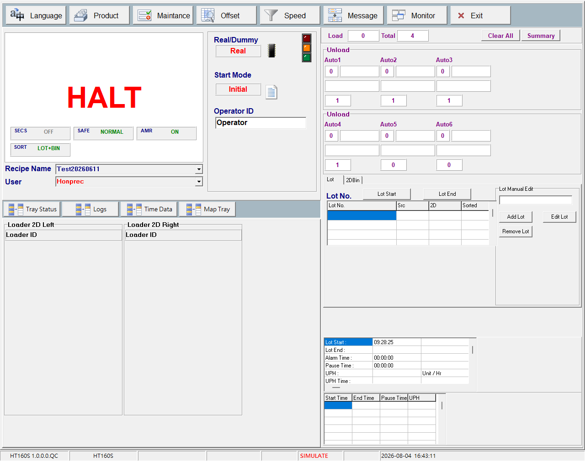
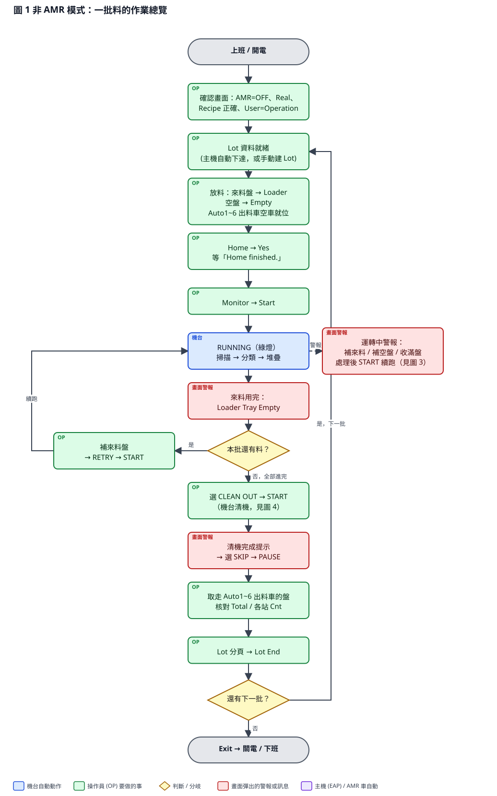
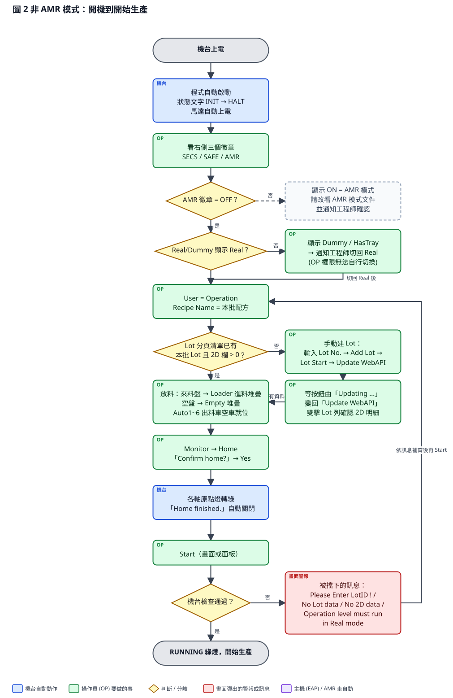
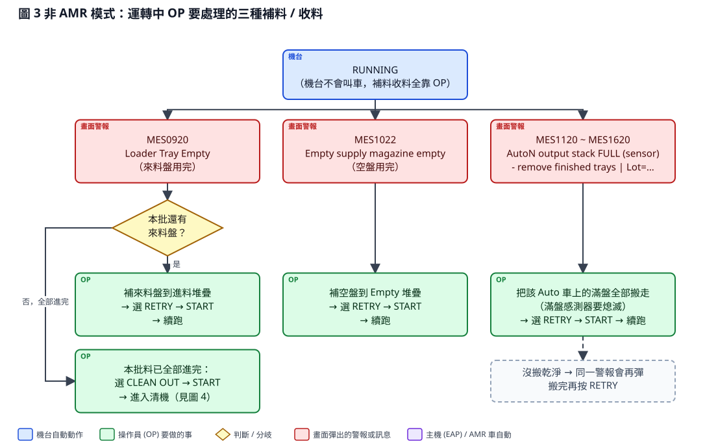
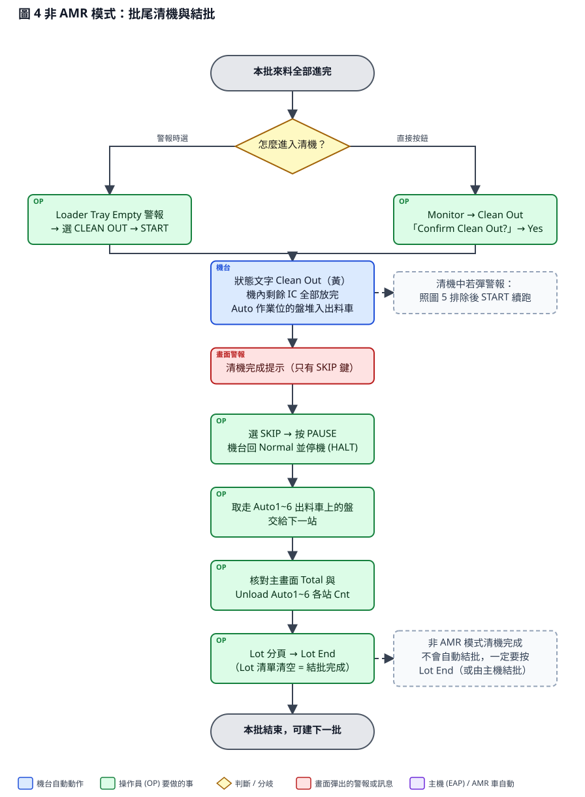
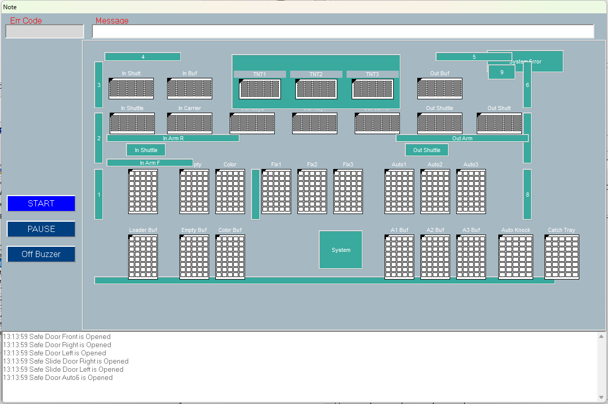
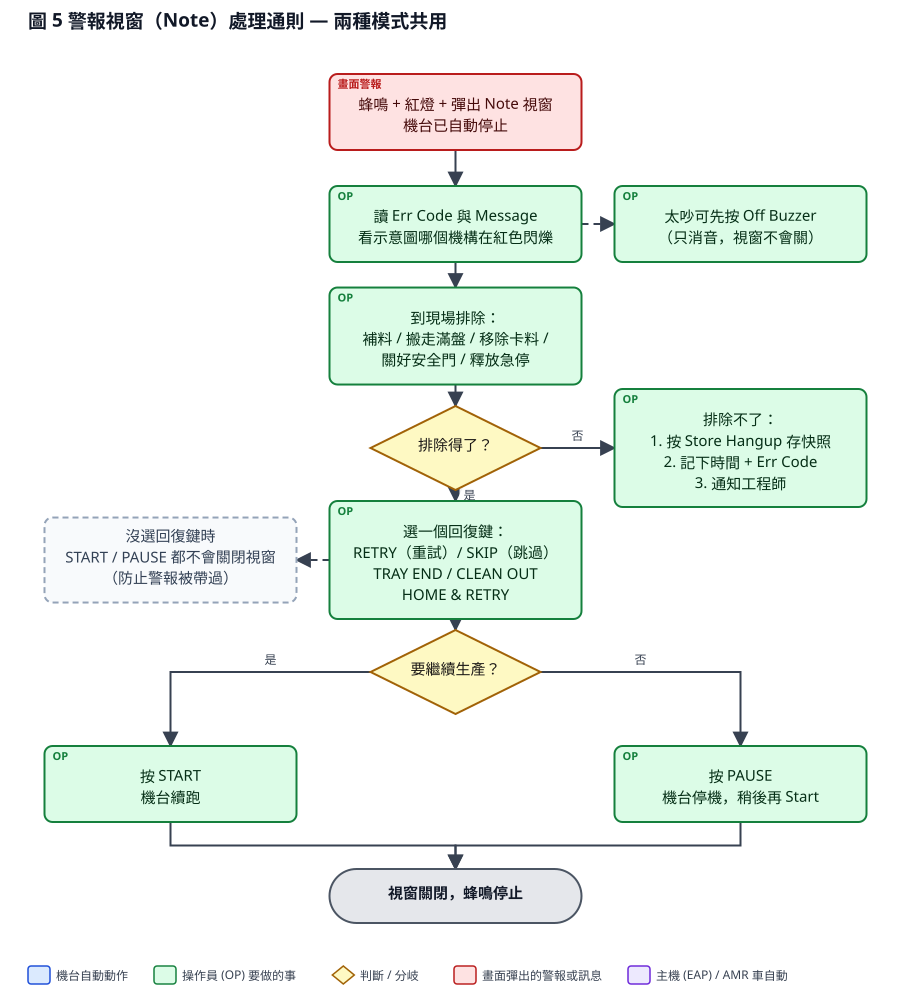

# HT160S 操作員（OP）操作流程 — 非 AMR 模式（人工上下料）

| 項目 | 內容 |
| --- | --- |
| 文件編號 | HT160S-OP-001 |
| 版本 / 日期 | v1.0 草稿 / 2026-09-15 |
| 適用機台 | 京元竹南 HT160S（KYEC-01 ~ 03） |
| 適用模式 | 主畫面 **AMR 徽章 = OFF**（來料、空盤、出料車全部由人工搬運） |
| 程式版本 | HT160S_Program_BCB_V1.0.0.0 |
| 對象 | 現場操作員（OP）。Teach / Offset / Speed / Maintance 等工程畫面不在本文件範圍 |
| 編製 | 鴻勁精密 Hon Precision RD |

> 本文件為現場快速版（依程式現況與工程手冊 `docs/manual/` 整理）。畫面按鈕名稱一律用螢幕上的原文（英文）。如畫面已切成中文，對照第 1.4 節的中英對照表。

---

## 1. 開始前先認識畫面

### 1.1 主畫面

| 位置 | 你要看的東西 | 正常情況 |
| --- | --- | --- |
| 上方功能列 | Language / Product / Maintance / Offset / Speed / Message / **Monitor** / Exit | OP 只用 **Monitor**（進運轉控制頁）與 **Exit**（關程式） |
| Recipe Name | 目前配方 | 必須是本批指定配方；**運轉中不能換** |
| User | 權限 | **Operation**（不需密碼） |
| Real/Dummy | 運轉模式 | 必須顯示 **Real**。顯示 Dummy / HasTray 時 OP 按 Start 會被拒絕，請找工程師 |
| 右側三個徽章 | SECS / SAFE / AMR | SECS：有連主機時 ONLINE（綠）；SAFE：NORMAL（綠）；**AMR：OFF（灰）** ← 本文件的前提 |
| 機台狀態文字 + 塔燈 | RUNNING 綠 / PAUSE、HALT 黃 / 紅 = 警報、安全門、急停 | 見 1.3 |
| Load / Total | 上料數 / 已放入出料盤總數 | 結批時核對用 |
| Unload Auto1~6 面板 | 每站 Bin / Lot / ID / Cnt | 看哪一站在收什麼 Bin、收了幾顆 |

### 1.2 運轉控制頁（按 Monitor 進入，按 Return 回主畫面）

| 按鈕 | 用途 | 備註 |
| --- | --- | --- |
| **Home** | 全機回原點 | 會問「Confirm home?」→ Yes |
| **Start** | 開始 / 續跑生產 | 未回原點會自動先回原點再生產 |
| **Pause** | 暫停（減速停止） | 再按 Start 即續跑 |
| **One Cycle** | 單循環（放完一顆就停） | 一般生產不用 |
| **Clean Out** | 清機：把機內剩餘 IC 全部放完、盤堆入出料車 | 會問「Confirm Clean Out?」 |
| **Store Hangup** | 存機台狀態快照給工程師分析 | 異常時先按這個再通知工程師 |

面板實體鍵（START / PAUSE / HOME / ONE CYCLE / CLEAN OUT、警報回復鍵 RETRY / SKIP / ALARM RESET 等）與畫面按鈕效果相同。

### 1.3 塔燈與狀態文字

| 塔燈 | 狀態文字 | 意思 | OP 動作 |
| --- | --- | --- | --- |
| 綠 | RUNNING | 正常生產 | 巡檢即可 |
| 黃 | Clean Out | 清機中 | 等待完成提示 |
| 黃 | PAUSE / HALT | 停機（PAUSE = 機內還有 IC） | 按 Start 續跑 |
| 黃閃 | HOMING | 回原點中 | 等待 |
| 紅 + 蜂鳴 | （彈出警報視窗） | 有警報 | 依第 6 節處理 |
| 紅 | LOCK / EMG / MOTOR OFF / SAFE DOOR / AIR | 安全鎖 / 急停 / 馬達斷電 / 安全門開 / 氣壓不足 | 排除該條件後狀態自動恢復，再 Start |

### 1.4 Lot 分頁（建批、結批）

| 畫面文字（英 / 中） | 用途 |
| --- | --- |
| Lot No. | 輸入 Lot 編號 |
| Add Lot / 新增 Lot | 把 Lot No. 加入清單 |
| Edit Lot / Remove Lot | 修改、移除清單列 |
| Update WebAPI / 更新 WebAPI 資料 | 向廠內系統下載該批 2D/Bin 資料（按下後按鈕顯示 Updating ...，變回原字樣即完成） |
| Lot Start / Lot 啟動 | 把清單的 Lot 設為作用中，開批 |
| Lot End / Lot 結束 | 結批（清單清空） |
| 清單欄位 Lot No. / Src / 2D / Sorted | Src = 資料來源；**2D = 已載入的 2D 筆數（必須 > 0 才能 Start）**；Sorted = 已分類數 |

> 提示：雙擊 Lot 列可看該批 2D 明細。

---

## 2. 一批料的作業總覽

---

## 3. 開機到開始生產

### 3.1 逐步說明

| 步 | 動作 | 你會看到 / 注意 |
| --- | --- | --- |
| 1 | 機台上電 | 程式自動啟動，狀態 INIT → HALT，馬達自動上電（若沒上電，按面板 Power On） |
| 2 | 看右側三個徽章 | **AMR 必須是 OFF**。若是 ON，代表機台在 AMR 模式，請改看 AMR 模式文件並通知工程師 |
| 3 | 看 Real/Dummy | 必須顯示 **Real**。不是的話找工程師切換（OP 權限不能自己切） |
| 4 | User 選 Operation；確認 Recipe Name | 換配方要停機且由領班 / 工程師決定 |
| 5 | Lot 資料 | **A. 主機自動下達**（SECS 徽章 ONLINE）：Lot 分頁清單會自動出現本批，2D 欄自動變成 > 0，OP 只需確認。 **B. 手動**：Lot No. 輸入 → Add Lot → Lot Start → Update WebAPI → 等按鈕變回「Update WebAPI」→ 雙擊 Lot 列確認有 2D 明細 |
| 6 | 放料 | 來料盤放入 Loader 進料堆疊（左 = Loader1、右 = Loader2）；空盤放入 Empty 空盤堆疊；Auto1~6 出料車確認是空車並就位。**非 AMR 模式不會用到 Color（身分盤）區，可留空** |
| 7 | Monitor → Home → 「Confirm home?」Yes | 回原點監看畫面各軸原點燈轉綠，顯示 Home finished. 後自動關閉 |
| 8 | Start（畫面或面板） | 狀態 RUNNING、綠燈。機台開始：Loader 取盤 → CCD 掃描 → 分類臂放 IC 到 Auto → 滿盤堆入出料車 |

### 3.2 Start 被擋下時的訊息

| 訊息 | 意思 | 處置 |
| --- | --- | --- |
| Please Enter LotID ! | 沒有 Lot 編號 | Lot 分頁輸入 Lot No. 並 Add Lot |
| No Lot data : add at least one Lot before Start ! | Lot 清單是空的 | Add Lot → Lot Start |
| No 2D data : load lot 2D/Bin data before Start ! | 2D 資料還沒下載 | Lot Start 後按 Update WebAPI，等 2D 欄 > 0 |
| Lot "xxx" has no 2D data loaded yet. | 這一批沒有 2D | 同上，針對該批 |
| Operation level must run in Real mode. … | 目前是 Dummy / HasTray | 請工程師切回 Real |
| Confirm home? | 尚未回原點 | 按 Yes，回原點完成後自動續跑 |

---

## 4. 運轉中：OP 要處理的三件事

非 AMR 模式下，**機台不會叫車**，所有補料與收料都由人做。機台用警報視窗提醒你，處理完選回復鍵再按 START 即可續跑。

| 情境 | 畫面訊息（Err Code / Message） | 你要做的 | 然後 |
| --- | --- | --- | --- |
| 來料盤用完 | **MES0920** Loader Tray Empty | 本批還有料：補來料盤到進料堆疊 | 選 **RETRY** → START |
| 來料盤用完（本批已全部進完） | 同上 | 不補料 | 選 **CLEAN OUT** → START（進入清機，見第 5 節） |
| 空盤用完 | **MES1022** Empty supply magazine empty | 補空盤到 Empty 堆疊 | 選 **RETRY** → START |
| 某站出料堆疊滿 | **MES1120 ~ MES1620** AutoN output stack FULL (sensor) - remove finished trays \| Lot=… | 把該 Auto 車上的滿盤全部搬走（訊息會告訴你是哪一批），直到滿盤感測器熄滅 | 選 **RETRY** → START。沒搬乾淨同一警報會再彈 |

### 4.1 運轉中巡檢重點

- 塔燈綠 = 正常；黃 = 暫停或清機；紅 + 蜂鳴 = 看畫面。
- 主畫面 Tray Status 分頁的 Loader 2D Left / Right 盤面顯示目前掃描與分類進度。
- Unload Auto1~6 面板：Cnt 在增加代表該站正常收料。
- 暫停：按 Pause，機台減速停止；再按 Start 續跑。

### 4.2 運轉中不要做的事

- 不要打開安全門（會停機並彈 Safety Door Open，關門後選 RETRY → START）。
- 不要按急停（急停後需釋放急停 → 重新 Home → Start）。
- 不要換 Recipe、不要按 Clear All、不要切 Real/Dummy、不要進 Maintance 改設定。
- 不要在機台動作中用手伸進 Auto 站或 Loader 站取放盤；要搬盤請先 Pause。

---

## 5. 批尾：清機與結批

| 步 | 動作 | 說明 |
| --- | --- | --- |
| 1 | 進入清機 | 兩種方式：(a) 來料用完的 Loader Tray Empty 警報選 **CLEAN OUT** → START；(b) Monitor → **Clean Out** → 「Confirm Clean Out?」Yes |
| 2 | 等機台清機 | 狀態文字 Clean Out（黃）。機台把機內剩餘 IC 全部放完、各 Auto 作業位的盤堆入出料車、空盤回收 |
| 3 | 清機完成提示 | 彈出只有 **SKIP** 鍵的提示 → 選 SKIP → 按 **PAUSE**。機台回一般模式並停機（HALT） |
| 4 | 收料 | 把 Auto1~6 出料車上的盤全部取走交給下一站 |
| 5 | 核對 | 主畫面 Total 與 Unload Auto1~6 各站 Cnt |
| 6 | 結批 | Lot 分頁 → **Lot End**。Lot 清單清空 = 結批完成 |

> **注意：非 AMR 模式下清機完成不會自動結批**，一定要按 Lot End（或由主機結批）。沒結批就建下一批，資料會混在一起。

---

## 6. 警報視窗（Note）處理通則

1. 蜂鳴 + 紅燈 + 彈出 Note 視窗時，機台已自動停止。
2. 讀 **Err Code** 與 **Message**；機台俯視示意圖上紅色閃爍的就是出事的機構。
3. 太吵可先按 **Off Buzzer**（只消音，視窗不會關）。
4. 到現場排除（補料、搬走滿盤、移除卡料、關好安全門、釋放急停）。
5. 選一個回復鍵，再按 **START**（續跑）或 **PAUSE**（停機）。

| 回復鍵 | 意思 |
| --- | --- |
| RETRY | 重試剛才失敗的動作（最常用） |
| SKIP | 跳過這顆 / 這個動作 |
| TRAY END | 這一盤結束 |
| CLEAN OUT | 進入清機 |
| HOME & RETRY | 先回原點再重試 |

> **沒選回復鍵時，START / PAUSE 都不會關閉視窗**（防止警報被帶過）。純提示訊息（沒有回復鍵）可直接關閉。

### 6.1 常見警報與處置

| 訊息 | 原因 | 處置 |
| --- | --- | --- |
| Safety Door Open | 安全門開 | 關門 → RETRY → START |
| Emergency Stop | 急停被按 | 釋放急停 → RETRY → 重新 Home → Start |
| Air Pressure Low | 氣壓不足 | 檢查氣源 → RETRY → START |
| Motor Alarm / 伺服警報 | 馬達異常 | 通知工程師（可能需要馬達電源重置） |
| SUCxxxx 吸嘴真空錯誤 | 吸不起 IC 或 IC 掉落 | 檢查該吸嘴下方 IC 位置 → RETRY；連續發生通知工程師 |
| WAR0475 2D code not found in any lot : <碼> | 讀到的 2D 不在本批工單內 | RETRY 重拍；仍不行選 SKIP（該顆進 Error 流道）並通知領班 |
| Top CCD Connect not ready / API not ready | 相機連線異常 | RETRY；仍不行通知工程師 |
| AutoN Feed Tray Miss / Push Tray Miss | Auto 站盤子沒到位 | 檢查該站盤子是否放正 → RETRY |
| Loader Tray has IC, please remove | 排空盤時盤上還有 IC | 取走 IC → RETRY |

### 6.2 排除不了怎麼辦

1. 按 **Store Hangup** 存機台狀態快照（檔案會存到 D:\HT160S_StateRecord\ 並自動開啟資料夾）。
2. 記下時間、Err Code、Message。
3. 通知工程師。不要重複亂按回復鍵。

---

## 7. 暫停、急停、關機

| 情境 | 步驟 |
| --- | --- |
| 暫停 | Pause → 機台減速停止 → 再按 Start 續跑 |
| 急停後復歸 | 釋放急停 → 警報選 RETRY → START → Home → Start |
| 換班交接 | 記錄目前 Lot、Load / Total 數、有無未處理警報 |
| 關機 | 確認已清機完成、Lot End 已按、機內無 IC → 上方功能列 **Exit** → 關電 |

---

## 8. 一頁對照卡

| 狀況 | 動作 |
| --- | --- |
| 要開始生產 | AMR=OFF、Real、Recipe 對、Lot 有 2D → 放料 → Home → Start |
| Loader Tray Empty，還有料 | 補來料盤 → RETRY → START |
| Loader Tray Empty，本批進完 | CLEAN OUT → START |
| Empty supply magazine empty | 補空盤 → RETRY → START |
| AutoN output stack FULL | 搬走該站滿盤（感測器熄滅）→ RETRY → START |
| 清機完成提示 | SKIP → PAUSE → 收料 → 核對 → Lot End |
| 任何 Note 警報 | 排除 → 選回復鍵 → START 或 PAUSE |
| 排除不了 | Store Hangup → 記錄 → 通知工程師 |
| 主機要 Lot 資料但清單沒出現 | Lot No. → Add Lot → Lot Start → Update WebAPI |

---

## 附錄 名詞

| 名詞 | 意思 |
| --- | --- |
| Lot / 批 | 一張工單；機台用 Lot 編號查 2D 對照表 |
| 2D | 每顆 IC 上的二維條碼；機台靠它查 Bin 與 Lot |
| Bin / 流道 | 分類等級；每個 Bin 對應一個 Auto 出料站 |
| Auto1~6 | 六個出料站，各有一台出料車（堆疊車） |
| Loader | 進料站（左 Loader1、右 Loader2），來料盤放這裡 |
| Empty | 空盤供應站 |
| Color | 身分盤（2D 標籤盤）供應站，只有 AMR 模式使用 |
| Clean Out / 清機 | 把機內剩餘 IC 全部放完、盤堆入出料車 |
| Home / 回原點 | 所有軸回機械原點，每次開機或急停後必做 |
| Note | 警報視窗 |
