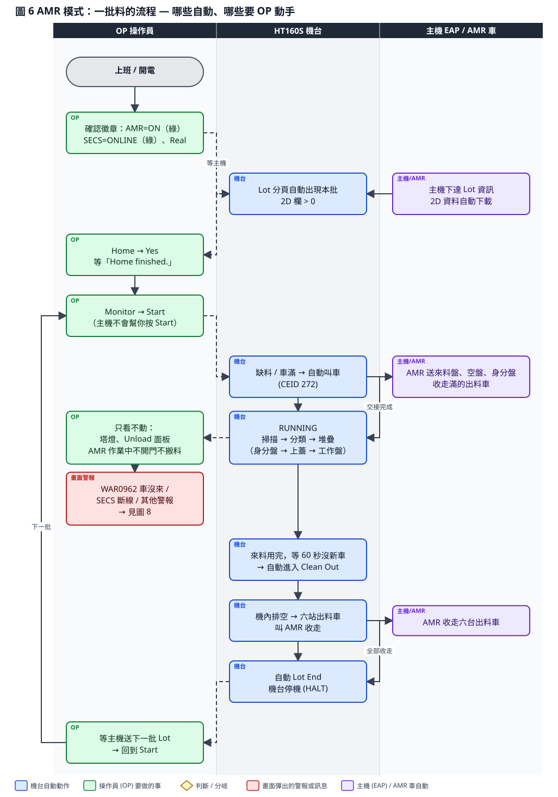
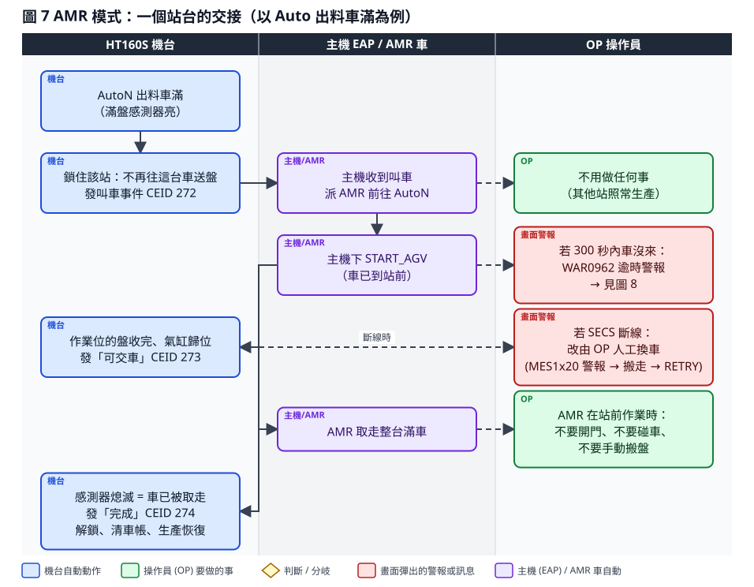
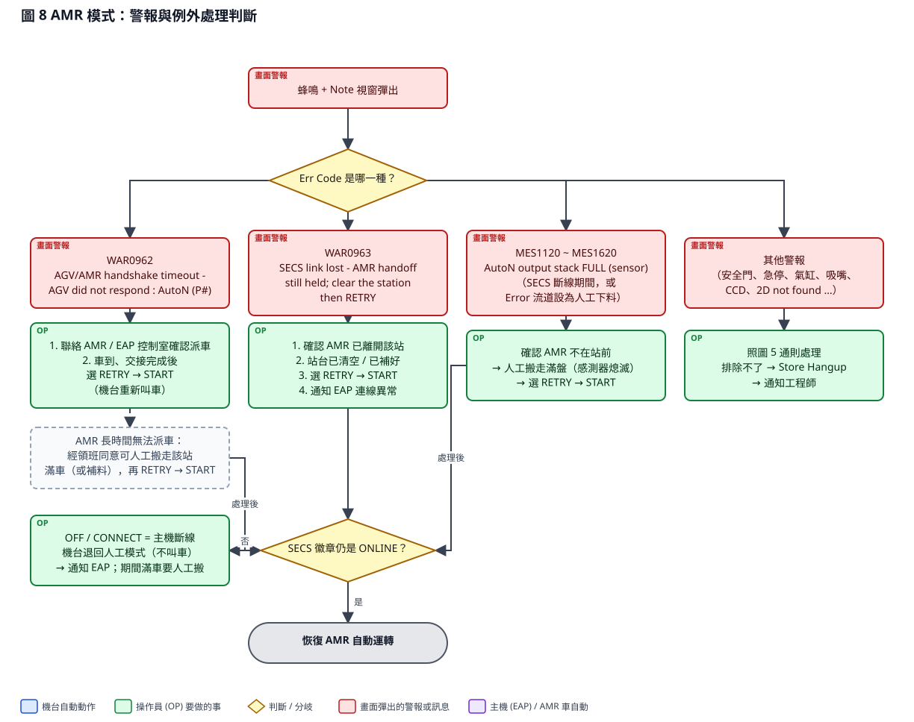

# HT160S 操作員（OP）操作說明 — AMR 模式（無人搬運車自動上下料）

| 項目 | 內容 |
| --- | --- |
| 文件編號 | HT160S-OP-002 |
| 版本 / 日期 | v1.0 草稿 / 2026-09-15 |
| 適用機台 | 京元竹南 HT160S（KYEC-01 ~ 03） |
| 適用模式 | 主畫面 **AMR 徽章 = ON（綠）** 且 **SECS 徽章 = ONLINE（綠）** |
| 程式版本 | HT160S_Program_BCB_V1.0.0.0 |
| 對象 | 現場操作員（OP）。AMR 模式的開關與參數由工程師設定，OP 不需操作 |
| 編製 | 鴻勁精密 Hon Precision RD |

> 本文件只講 **AMR 模式下 OP 要做什麼、不要做什麼**。畫面認識、警報視窗通則、Home / Start / Pause 等基本操作與「非 AMR 模式」文件（HT160S-OP-001）相同，本文不重複。

---

## 1. AMR 模式是什麼

AMR 模式下，機台透過 SECS 連線把「缺料」與「出料車滿」告訴主機（EAP），主機派無人搬運車（AMR）來補料、收車。九個站台如下：

| 站 | 位置 | AMR 送什麼 / 收什麼 | 京元現場設定 |
| --- | --- | --- | --- |
| P1 | Loader 進料站 | 送來料盤 | **由主機主動排程送料**，機台不叫車 |
| P2 | Empty 空盤站 | 送空盤（工作盤、上蓋盤） | 缺料時機台叫車 |
| P3 | Color 身分盤站 | 送身分盤（帶 2D 標籤） | 缺料時機台叫車 |
| P4 ~ P9 | Auto1 ~ Auto6 出料站 | 收走滿的出料車 | 車滿時機台叫車；批尾清機時六台車全部叫走 |

每台出料車的疊法由機台自動控制：**第 1 片身分盤 → 第 2 片上蓋盤 → 之後才是裝 IC 的工作盤**。身分盤來自 Color 站、上蓋盤與工作盤來自 Empty 站。

### 1.1 與非 AMR 模式的差別

| 事項 | 非 AMR 模式 | AMR 模式 |
| --- | --- | --- |
| 補來料盤 | OP 手動 | 主機排程 AMR 送 |
| 補空盤 / 身分盤 | OP 手動（不用身分盤） | AMR 送 |
| 出料車滿 | 彈警報，OP 搬走 | 機台叫車，AMR 收走，**不彈警報** |
| 批尾清機 | OP 選 CLEAN OUT 或按 Clean Out | 來料用完等 60 秒沒新車 → **自動**清機 |
| 結批 Lot End | OP 按 Lot End | 六台出料車被收走後 **自動** Lot End |
| 按 Start | OP | **仍然是 OP**（主機不會幫你按） |
| OP 主要工作 | 補料、收料、結批 | 開批按 Start、看顧、處理例外 |

### 1.2 開機時先確認的三件事

| 看哪裡 | 必須是 | 不是的話 |
| --- | --- | --- |
| 主畫面 AMR 徽章 | **ON（綠）** | OFF = 非 AMR 模式，改看 HT160S-OP-001；要切換請工程師到 Maintance → Hardware Setup 勾 **Use AMR**（Lot 執行中鎖定不能改） |
| 主畫面 SECS 徽章 | **ONLINE（綠）** | OFF / CONNECT = 沒連上主機，機台會退回人工模式（不叫車、車滿彈警報要人搬）→ 通知 EAP |
| Real/Dummy | **Real** | 請工程師切回 Real |

---

## 2. 一批料的流程：哪些自動、哪些要 OP 動手

### 2.1 OP 職責清單（依階段）

**A. 開批前**

1. 確認 AMR = ON、SECS = ONLINE、Real、Recipe Name 正確、User = Operation。
2. 等主機下達 Lot：Lot 分頁清單自動出現本批，**2D 欄 > 0**。（主機沒送到 → 通知 EAP；緊急時可照 HT160S-OP-001 第 3.1 節手動建 Lot）
3. 確認 Auto1~6 站都有空的出料車就位（AMR 放的）。
4. Monitor → Home → Yes，等 Home finished.。
5. Monitor → **Start**。主機只送 Lot 資料，**不會幫你啟動機台**。

**B. 運轉中（只看不動）**

- 塔燈綠 = 正常。缺料、車滿機台會自己叫車，畫面不會彈警報。
- **AMR 在站前作業時：不要開安全門、不要碰車、不要用手放盤或搬盤。**
- 不要手動放盤到 Loader / Empty / Color / Auto 任何站（會破壞身分盤 → 上蓋 → 工作盤的順序與車帳）。
- 看 Unload Auto1~6 面板：ID 欄是該站目前工作盤的 2D、Cnt 是已放顆數。

**C. 警報**：見第 4 節。

**D. 批尾（全自動）**

1. 來料用完，機台等 60 秒（現場設定值）沒有新車 → 自動進入 Clean Out（狀態文字 Clean Out、黃燈）。
2. 機內排空後，六個 Auto 站的出料車叫 AMR 收走。
3. 六台車全部收走 → 機台自動 Lot End → 停機（HALT）。
4. **不要自己把出料車搬走**；AMR 若 300 秒沒來會彈 WAR0962，照第 4 節處理。

**E. 下一批**：等主機送下一批 Lot → 回到 A.4 / A.5。

---

## 3. 一個站台的交接長什麼樣

以 Auto 出料車滿為例，OP 全程不需動作：

| 步 | 機台 | 主機 / AMR | OP 看到 |
| --- | --- | --- | --- |
| 1 | 該站車滿 → 鎖住該站、發叫車事件 | 主機派車 | 該站 Cnt 不再增加，其他站照常 |
| 2 | — | 車到站前，主機下 START_AGV | — |
| 3 | 作業位盤收完、氣缸歸位 → 發「可交車」 | AMR 取走整台滿車 | AMR 在該站作業 |
| 4 | 感測器熄滅 → 發「完成」→ 解鎖、清車帳 | 放上空車 | 該站恢復收盤，Cnt 從 0 開始 |

Empty（P2）、Color（P3）補料同理：機台發缺料叫車 → AMR 補滿 → 機台偵測到有盤 → 完成。

---

## 4. 警報與例外處理

| 畫面訊息 | 意思 | OP 動作 |
| --- | --- | --- |
| **WAR0962** AGV/AMR handshake timeout - AGV did not respond : AutoN (P#) / Empty (P2) / Color (P3) | 該站叫車後 300 秒內 AMR 沒完成交接（車沒來、或主機沒派車） | 1. 聯絡 AMR / EAP 控制室確認派車。 2. 車到並交接完成後（或確認會再派）選 **RETRY** → START，機台會重新叫車。 3. AMR 長時間無法派車：經領班同意可人工搬走該站滿車（或補料），再 RETRY → START |
| **WAR0963** SECS link lost - AMR handoff still held; clear the station then RETRY | 交接進行中 SECS 斷線 | 1. 確認 AMR 已離開該站。 2. 站台已清空 / 已補好。 3. 選 **RETRY** → START。 4. 通知 EAP 連線異常 |
| SECS 徽章變 OFF / CONNECT | 主機斷線 | 機台自動退回人工模式：不叫車，車滿會彈 MES1x20 要人搬。通知 EAP；恢復 ONLINE 後自動回 AMR 模式 |
| **MES1120 ~ MES1620** AutoN output stack FULL (sensor) - remove finished trays \| Lot=… trays=N ICs=M | (a) SECS 斷線期間車滿；(b) Error 流道被設定為人工下料 | 確認 AMR 不在站前 → 人工搬走滿盤（感測器熄滅）→ 選 **RETRY** → START |
| **MES1022** Empty supply magazine empty / **MES1421** Color supply tray is not ready | Empty / Color 缺料且等待窗口過了 AMR 還沒補 | 聯絡 AMR；補好後選 RETRY → START |
| **MES0920** Loader Tray Empty | AMR 模式下少見（正常來料用完會自動清機）。彈出代表自動清機條件不成立（例如某站正在交接） | 還有車要來：RETRY → START；本批確定結束：CLEAN OUT → START；並回報工程師 |
| **WAR0475** 2D code not found in any lot : <碼> | 讀到不在工單內的 2D | RETRY 重拍；仍不行選 SKIP（該顆進 Error 流道）並通知領班 |
| 其他警報（安全門、急停、氣缸、吸嘴、CCD …） | 與非 AMR 模式相同 | 照 HT160S-OP-001 第 6 節通則：排除 → 選回復鍵 → START / PAUSE；排除不了 → Store Hangup → 通知工程師 |

> 回復鍵沒選時 START / PAUSE 不會關閉警報視窗。WAR0962 / WAR0963 只有 RETRY 一個回復鍵。

---

## 5. AMR 模式禁止事項

| 不要做 | 原因 |
| --- | --- |
| 手動放盤到 Loader / Empty / Color / Auto 任何站 | 車帳與身分盤順序會錯，主機收到的盤數、IC 數會錯 |
| AMR 在站前作業時開門、碰車、搬盤 | 交接中斷、人車碰撞 |
| 清機完成後自己把出料車搬走 | 機台在等 AMR 收車才會結批；人搬走雖然也會放行，但主機不會收到收車紀錄 |
| Lot 執行中改 Use AMR、改 Sort Mode、改 Auto 啟用 | 畫面已鎖定；需要改請先結批並由工程師操作 |
| 隨意按 Lot End | 手動 Lot End 是緊急覆寫，會讓車上的料跨批。需領班同意 |
| 在 Note 警報未處理時反覆按 START | 沒選回復鍵不會關；WAR0962 要先確認 AMR 狀況再 RETRY |

---

## 6. 一頁對照卡

| 狀況 | 動作 |
| --- | --- |
| 開批 | AMR=ON、SECS=ONLINE、Real → 等主機 Lot（2D > 0）→ Home → **Start** |
| 運轉中 | 只看不動；AMR 作業中不開門不搬料 |
| 車滿 / 缺料 | 不用做，機台自動叫車 |
| WAR0962 車沒來 | 聯絡 AMR/EAP → 交接完成後 RETRY → START |
| WAR0963 斷線持鎖 | 確認 AMR 已離開、站台清空 → RETRY → START → 通知 EAP |
| SECS 不是 ONLINE | 通知 EAP；期間車滿彈 MES1x20 要人工搬 → RETRY → START |
| 批尾 | 全自動（自動清機 → AMR 收六台車 → 自動 Lot End）；等主機下一批 |
| 任何其他警報 | 排除 → 選回復鍵 → START / PAUSE；排除不了 → Store Hangup → 通知工程師 |

---

## 附錄 現場設定值（工程師參考，OP 不需修改）

| 設定 | 現場值 | 意義 |
| --- | --- | --- |
| Use AMR | 勾選 | AMR 模式總開關（Maintance → Hardware Setup） |
| AmrFeedWaitSec | 60 秒 | 來料用完後等新車的窗口，超過即自動 Clean Out |
| AgvTimeoutSec | 300 秒 | 叫車後等 AMR 完成交接的逾時 → WAR0962 |
| LoaderCallsAmr | 0 | Loader（P1）不叫車，由主機排程送料 |
| ErrorLaneCallsAmr | 1 | Error 流道車滿也叫 AMR（設 0 則改人工下料 MES1x20） |
| 出料車疊法 | 身分盤 1 + 上蓋 1 + 工作盤 | 每台車開頭兩片不裝 IC |
