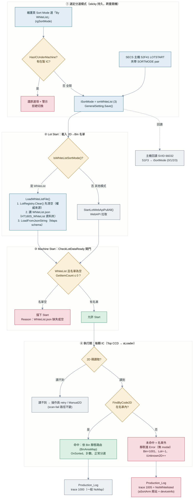
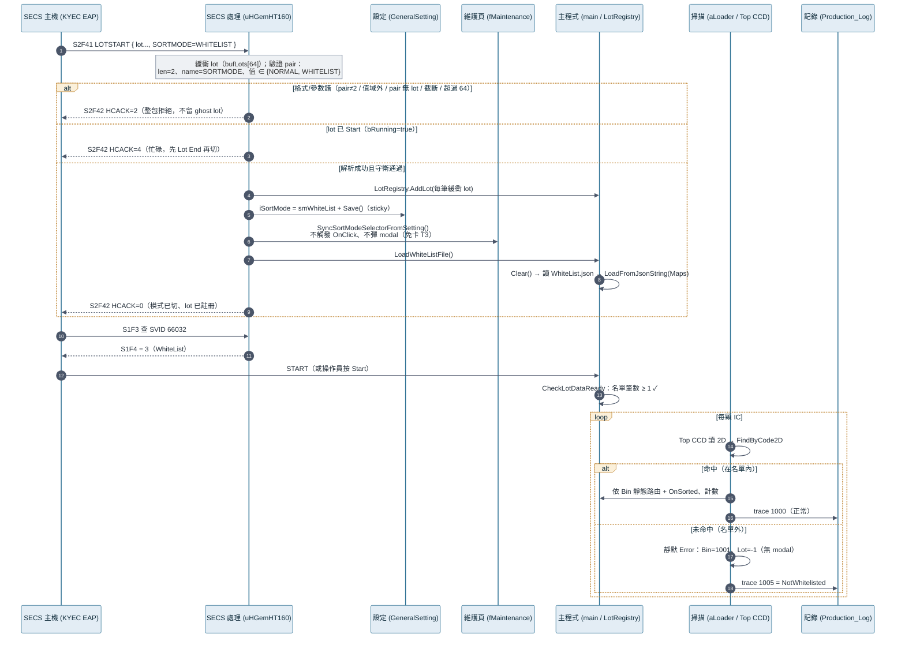

# WhiteList 分選模式 — 流程圖與泳道圖

| 項目 | 內容 |
|---|---|
| 日期 | 2026-07-17 |
| 分支 | `feat/iosetview-172-refactor` |
| 對應實作 | Phase 1 `a46b7e9`（2026-07-15）＋ Phase 2 `4466cac`（2026-07-16） |
| 計畫 SSOT | `docs/plan/whitelist-sortmode-plan-20260714.md` |
| 完成報告 | `docs/plan/whitelist-phase2-report-20260716.md` |
| 渲染 HTML | `docs/plan/whitelist-sortmode-diagrams-20260717.html`（mermaid CDN） |

> 本文件是「說明用」圖解，圖以 mermaid 描述（GitHub 原生渲染 / `.html` 版用 CDN 渲染）。
> 功能語意與邊界以上述 SSOT 計畫與完成報告為準。

---

## 0. 一句話

白名單模式（`smWhiteList=3`，第 4 種分選模式）＝把 2D→Bin 的資料來源從「WebAPI 拉取」換成「讀本地 `WhiteList.json`」，其餘完全走 Normal 靜態路由。**只有名單內的 IC 可被分類；名單外＝正常拒收（靜默進 Error，不彈 modal）。**

核心模型（WebAPI-substitution）：WhiteList 模式在 Lot Start 時改呼叫 `LoadWhiteListFile()` 灌 `LotRegistry`（重用同一支 `LoadFromJsonString`、`"Maps"` schema），不觸發 WebAPI。掃描端 `FindByCode2D` 命中即照檔裡 Bin 走靜態 `BinAreaMap` 分選；未命中走 miss 分支靜默 Error。

三個切入點：① 切模式（維護頁 radio / SECS `LOTSTART` 夾帶 `SORTMODE`）② Lot Start 載名單 ③ 執行期每顆 IC 命中／未命中判定。

---

## 1. 流程圖 · 白名單分選生命週期

**顏色圖例**：藍＝切換/載入、琥珀＝判斷閘門、綠＝命中（名單內正常分選）、紅＝拒收/名單外、灰＝I/O·記錄·回讀。

---

## 2. 泳道圖 · 主機驅動的切換與分選

---

## 3. 四種分選模式對照

| 面向 | Normal | Lot+Bin | Lot+PassFail | WhiteList（新） |
|---|---|---|---|---|
| enum | `smNormal=0` | `smLotBin=1` | `smLotPassFail=2` | `smWhiteList=3` |
| 路由方式 | 靜態 BinAreaMap | 動態綁定 | 動態綁定 | **靜態 BinAreaMap（同 Normal）** |
| 2D→Bin 來源 | WebAPI | WebAPI | WebAPI | **本地 WhiteList.json** |
| WebAPI 拉取 | 觸發 | 觸發 | 觸發 | **抑制** |
| 未命中／名單外 IC | WAR0475 modal→操作員 | 同左 | 同左 | **靜默 Error（無 modal）** |
| Production_Log trace | `1000` | `1000` | `1000` | `1005 NotWhitelisted` |
| `IsDynamicBindingMode()` | false | true | true | **false** |

---

## 4. SECS `LOTSTART` · `SORTMODE` 回覆對照（HCACK）

電文：`S2F41 LOTSTART` 內層 lot 清單可夾帶至多一個 `L[2]{ A"SORTMODE", A值 }`，值域 `NORMAL | WHITELIST`（大小寫不敏感）。不帶 pair＝維持目前模式（sticky）。切換與 Lot Start 綁定，且套模式在 2D 載入決策**之前**。

| HCACK | 意義 | 觸發條件 |
|---|---|---|
| `0` | 接受：模式已切、lot 已註冊 | 清單解析成功且守衛通過 |
| `1` | 電文清單格式錯 | 外層非預期 LIST |
| `2` | 參數錯（整包拒絕） | pair 長度≠2 / name 非 SORTMODE / 值域外 / **pair 無 lot** / 清單截斷 / 超過容量(64) / 型別不符 |
| `4` | 設備忙（整包拒絕） | 外層守衛 `SystemStart \|\| HasICUnderMachine`，**或** pair 存在且 `bRunning==true`（lot 已開始） |

主機回讀：`S1F3` 查 SVID **66032**（INT_4）→ `S1F4` 回目前 `iSortMode`（`0=Normal / 1=LotBin / 2=LotPassFail / 3=WhiteList`）。

---

## 5. 涉及檔案與職責

| 層 | 檔案 | 職責 |
|---|---|---|
| 設定 | `GeneralSetting.h/.cpp` | enum `smWhiteList=3`、`IsWhiteListSortMode()`、clamp 上界放寬 |
| UI | `maintenance.h/.cpp/.dfm` | 第 4 radio「By WhiteList」、clamp、`HasICUnderMachine` 守衛、`SyncSortModeSelectorFromSetting()` |
| 載入 | `main.cpp` | `LoadWhiteListFile()`（Clear→讀檔→parse）、WebAPI 抑制 2 站、`CheckLotDataReady` 閘門 |
| 掃描 | `aLoader.cpp` | 未命中分支：WhiteList 模式靜默 Error（重用 Bin 1001） |
| 追溯 | `aSortArm.cpp` + `deviceinfo.cpp` | trace `1005`（兩站點）＋映射 `NotWhitelisted` |
| SECS | `SecsGem/uHGemHT160.cpp` | LOTSTART `SORTMODE` pair 緩衝式解析、SVID 66032、UI 同步 |

---

## 6. 模擬器測試（HT160S_SECS_Simulator）

`D:\AI_Area\Tool\HT160S_SECS_Simulator` host 模擬器（`code/ht160s_presets.py`）已加兩個測試按鈕：

- **`S2F41 LOTSTART +WhiteList`**：Lot Start 並切白名單模式（LOTSTART 尾端夾帶 `L[2]{SORTMODE,WHITELIST}`）。機台改讀本地 `WhiteList.json`。
- **`S2F41 LOTSTART +Normal`**：Lot Start 並切回一般模式（夾帶 `L[2]{SORTMODE,NORMAL}`）。

`lots` 欄填 1 個 Lot（空＝`SIMU_LOT_A`，須對齊白名單檔 `LotNumber`）。切換後按 `S1F3`（`svid` 欄填 `66032`）回讀，白名單=3、一般=0。

**白名單檔規格**：`HT160S_WhiteList\WhiteList.json`，`"Maps"` schema（`LotNumber` / `Items[Code2D, Bin]`）；`LotNumber` 須對齊 host 宣告的真實 Lot ID、碼 byte-exact、不得重複。名單＝資格非額度（同碼重複投料不攔）。

---

## 7. 現況與待辦

- **現況**：Phase 1（`a46b7e9`）＋ Phase 2（`4466cac`）皆 SHIPPED、compile-clean、對抗式複驗 0 confirmed。
- **待辦**：① StateRecord JSON 4-way 具名標籤（延後，1 行三元；host 已可用 SVID 66032 讀）② KYEC 客戶規格書 ③ 上機 host round-trip 驗證（見報告 §8）。
